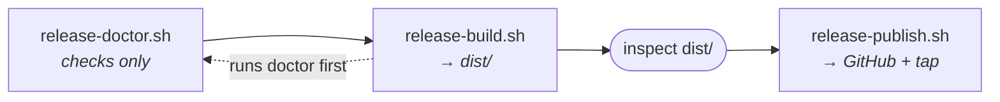

# Releasing Modaliser

The operator runbook for shipping a Modaliser version to the Homebrew cask.
This is the canonical home for release mechanics — the scripts carry the
*reasoning* for individual guards in comments, this page carries the
*procedure*.

Releases are cut by hand from a maintainer's machine. There is no CI in this
repository, so every check below is something a person runs.

## The pipeline



Three scripts, run in order. `release-build.sh` invokes `release-doctor.sh`
itself as its first step, so a misconfigured machine fails fast instead of
mid-toolchain. Running the doctor standalone beforehand is still worthwhile —
it is pure checks and installs nothing.

## Prerequisites

```bash
./scripts/release-doctor.sh
```

It verifies, and names the remediation command for anything missing:

| Requirement | Why |
|---|---|
| `xcode-select` developer dir | Swift toolchain |
| `swift` on PATH | builds the binary |
| `codesign` | signs the `.app` |
| `sips`, `iconutil` | generates `AppIcon.icns` from `Resources/AppIcon.png` |
| `gh`, authenticated | creates the GitHub Release |
| Homebrew tap clone | receives the rendered cask |

The tap clone defaults to `~/Development/homebrew-taps` and is overridable
with `MODALISER_TAP_DIR`. It must be a real git checkout of the
[`linkuistics/homebrew-taps`](https://github.com/Linkuistics/homebrew-taps)
repository — `release-publish.sh` commits and pushes into it.

## 1. Tag the release

**The tag is the single source of truth for the version.** `release-build.sh`
refuses to run unless the working tree is clean and `HEAD` is exactly a tagged
commit.

```bash
swift test                            # 1157 tests, 95 suites — must be green
./scripts/check-portable-surface.sh   # no (lispkit …)/(modaliser …-native) in lib/modaliser
./scripts/check-decision-free.sh      # no authored keys or labels in lib/modaliser
git tag -a v4.3.0 -m "Release v4.3.0"
```

Nothing runs those checks for you; a release is the last point at which they
are free to run.

Do **not** hand-edit the version in `Info.plist`. The repo's copy is a
template — `release-build.sh` stamps `CFBundleShortVersionString` and
`CFBundleVersion` from the tag into the *bundled* plist. Before that stamp
existed the two drifted apart on every release up to v2.7.0.

## 2. Build the artifacts

```bash
./scripts/release-build.sh
```

This wipes and repopulates `dist/`:

| Artifact | Contents |
|---|---|
| `modaliser-v<ver>-aarch64-apple-darwin.tar.xz` | `Modaliser.app`, `README.md`, `LICENSE`, packed flat |
| `modaliser.rb` | the cask, rendered from `scripts/templates/modaliser.rb.tmpl` |

Under the hood it calls `build-app.sh`, which enforces the packaging
invariant that matters most: the bundle is wiped before assembly and the
build **fails** unless the bundled `Scheme/` tree matches
`Sources/Modaliser/Scheme/` exactly (ADR-0019). `SysSync` mirrors that tree
verbatim into every user's `~/.config/modaliser/sys/scheme/`, so drift here
would go stale in every install.

Two release-only steps then run, in this order and for this reason:

1. **Stamp the version** into `Contents/Info.plist`.
2. **Re-sign ad-hoc** (`codesign --force --sign -`).

`build-app.sh` signs with the local "Modaliser Dev" certificate when present,
which is meaningless on anyone else's machine — hence the re-sign. It must
come *after* the stamp, because a signature seals `Info.plist` and editing
the plist afterwards would invalidate it.

Because the artifact is ad-hoc signed rather than Developer ID signed, the
downloaded bundle inherits `com.apple.quarantine` and Gatekeeper would refuse
to launch it. The cask's `postflight` strips that xattr at install time.

**Inspect `dist/` before continuing.** This is the last step that touches only
the local machine.

## 3. Publish

```bash
./scripts/release-publish.sh
```

In order:

1. Pushes the branch (or, under jj, the bookmark) and the tag to `origin`.
2. `gh release create v<ver>` on `Linkuistics/Modaliser`, uploading the tarball.
3. Copies `modaliser.rb` into `$MODALISER_TAP_DIR/Casks/`, commits, pushes.

Two guards are worth knowing about, because both protect against a release
that silently points at the wrong commit:

- **The branch and tag are pushed before `gh release create` runs.** Without
  that, `gh` creates a lightweight tag from origin's default-branch tip, which
  differs from the local annotated tag whenever there are unpushed commits.
- **A pre-existing remote tag that disagrees with the local one aborts the
  run** rather than being force-moved.

### Under Jujutsu

This repository is often driven through `jj`, which keeps git `HEAD` detached
by design — branch identity lives in a bookmark, not in `HEAD`. `git
symbolic-ref HEAD` therefore finds nothing and a plain branch push cannot run.
`release-publish.sh` detects a jj repo and pushes the bookmark pointing at the
released commit instead.

If it stops with `no jj bookmark points at the released commit`, set one:

```bash
jj bookmark set main -r @-
```

Tags stay on git in both modes: `jj` creates only lightweight tags and
`jj git push` does not push tags at all.

## 4. Verify

```bash
brew update && brew install --cask linkuistics/taps/modaliser
```

Then confirm the installed bundle reports the version you tagged:

```bash
defaults read /Applications/Modaliser.app/Contents/Info.plist CFBundleShortVersionString
```

## Troubleshooting

| Symptom | Cause |
|---|---|
| `working tree is dirty` | commit or stash; the build refuses to release uncommitted state |
| `HEAD is not a tagged commit` | `git tag -a v<x.y.z> -m …` first |
| `bundled Scheme tree is not a faithful image` | SPM dropped a resource, or a merge-copy regression in `build-app.sh` — do not ship past it (ADR-0019) |
| `artifact version mismatch` | `dist/` is stale; re-run `release-build.sh` |
| `remote tag … differs from local` | someone else pushed that tag; resolve by hand |
| `no jj bookmark points at the released commit` | `jj bookmark set <name> -r @-` |
| Gatekeeper blocks the installed app | the cask `postflight` xattr strip did not run — reinstall via the cask rather than unpacking the tarball manually |

## What the cask uninstalls

`uninstall` quits `dev.antony.Modaliser`. `zap` additionally trashes
`~/.config/modaliser` (including the user's own `config.scm`),
`~/Library/Logs/Modaliser`, and the app's preferences and saved state. Only
`brew uninstall --zap` removes the config; a plain uninstall leaves it.
