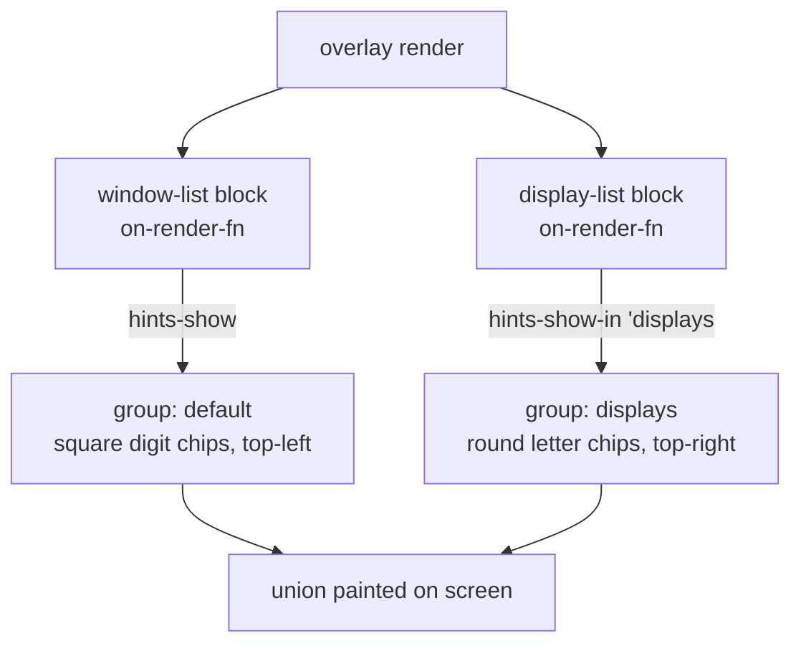

# Move and focus windows across displays

Modaliser's Windows menu (`w`) paints two chip families at once:

- **Window chips** — square, digit-labelled, top-left of each window. Type the
  digit to focus that window.
- **Display chips** — round, letter-labelled, top-right of each display. Type
  the letter to **move** the focused window there; type **Shift+letter** to
  **focus** that display (so macOS Space / Mission-Control keys act on it).

A moved window keeps its size and position *as a fraction of the display's
visible area*: a window filling the left third of one display lands in the left
third of the target, even when the displays differ in size or aspect ratio.

## Wiring

The bundled default config wires this into the `w` sub-screen:

```scheme
(import (modaliser dsl)
        (prefix (modaliser window-actions)  window:)
        (prefix (modaliser display-actions) display:))

(open "w" "Windows"
  (window:list-block 'chips? #t)
  (display:display-list-block 'chips? #t))   ; default labels h j k l n o
```

Override the chip letters or corner:

```scheme
(display:display-list-block 'chips? #t 'labels '("a" "s" "d" "f") 'corner 'top-right)
```

## How the two chip families coexist

`hints-show` is replace-all per group: the two painters write into separate
hint groups, so neither clobbers the other. Leaving the menu clears both.



## Styling

Display chips read teal (`.chip.display` in `base.css`), distinct from the
dodgerblue window chips (`.chip`). Override either in
`~/.config/modaliser/theme.css`. The round corner is computed by the painter
(`corner-radius = size / 2`), not from CSS.
