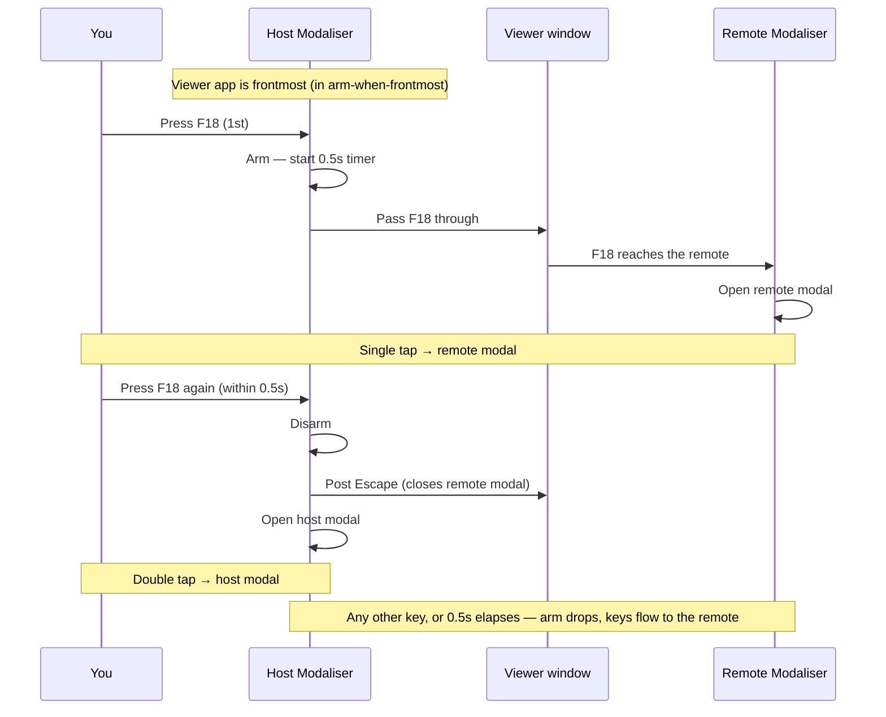

# How to use Modaliser over a remote desktop

When you screen-share or remote into another Mac (Jump Desktop, VNC,
RDP) that *also* runs Modaliser, both instances see the same trigger
keys. Press F18 and the host's Modaliser would normally grab it — you
would never reach the remote's Modaliser. The `arm-when-frontmost`
mechanism resolves this.

## Setup

In `config.scm`, list the remote-viewer bundle IDs in `set-leaders!`:

```scheme
(set-leaders! 'global-keycode F18
              'local-keycode  F17
              'arm-when-frontmost '("com.p5sys.jump.mac.viewer"))
```

`arm-when-frontmost` is applied to **both** the global (F18) and local
(F17) leaders — which is what you want, so that both leaders are
reachable through the viewer. (For per-scope control, call
`set-global-leader!` / `set-local-leader!` separately.)

`arm-when-frontmost` takes bundle IDs of remote-desktop *viewer* apps.
Find a viewer's bundle ID with:

```
osascript -e 'id of app "Jump Desktop"'
```

Optionally tune the double-tap window (default 0.5 s) with:

```scheme
(set-arm-delay! 0.4)
```

## How it works

When the frontmost app is in `arm-when-frontmost`, the leader key
follows a pass-and-arm sequence rather than opening the host modal
immediately.

- **First F18 press** — the host's Modaliser does *not* open its
  modal. It "arms" (starts a 0.5 s timer) and passes F18 straight
  through to the viewer window — so the keystroke reaches the *remote*
  machine, whose Modaliser opens *its* modal.
- **Second F18 press within the arm window** — the host posts an
  Escape to the viewer (closing the remote modal the first press
  opened), and *then* opens the *host's* modal.
- **Any other key, or the timer expiring** — the arm is dropped; keys
  flow normally to the remote.

So: **single tap drives the remote; double tap drives the host.**



## Why it's designed this way

When you are remoted in, the thing you are looking at and working in
is the *remote*. So the cheap, single action targets the remote;
reaching the host — the less common intent — costs one extra tap. The
host's Escape-post means the first (pass-through) tap leaves no stray
modal open on the remote when you actually wanted the host.

## Caveats

- The double-tap must land inside the arm window (default 0.5 s; tune
  with `set-arm-delay!`).
- Pressing any non-leader key cancels the arm.
- Both machines must register a leader on the *same* keycode —
  otherwise the single-tap pass-through reaches the remote but matches
  no leader there, so the remote modal never opens.
- The mechanism is keyed on the *viewer app's* bundle ID being
  frontmost — a viewer running windowed still works as long as it is
  the frontmost app.

## Related

- [reference/dsl.md](../reference/dsl.md) — `set-leaders!` signature
  and keyword set.
- [add-a-per-app-tree.md](add-a-per-app-tree.md) — per-app trees,
  including how to find bundle IDs.
