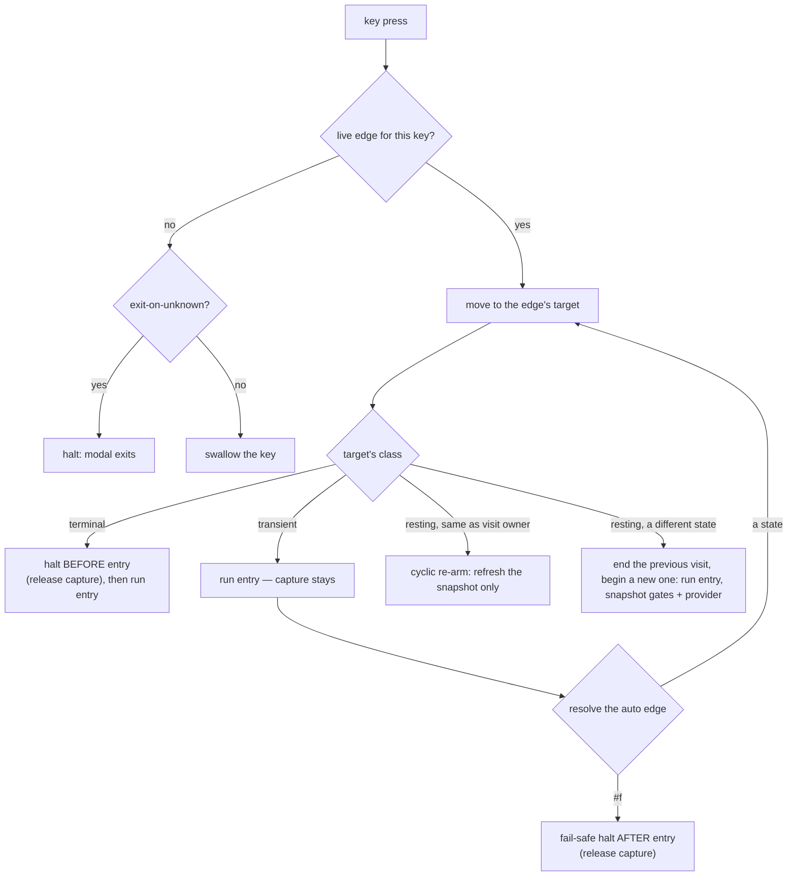

# State machine

How Modaliser's modal dispatch works: an **explicit FSM graph** — states
and labelled edges as first-class data — run by a step engine, with a
compatibility façade deriving the overlay's `(node, path)` contract from
it. The graph model and step engine are
[`(modaliser fsm)`](../../Sources/Modaliser/Scheme/lib/modaliser/fsm.sld);
the façade that lowers layout-spec trees into the graph and drives
dispatch through it is
[`(modaliser state-machine)`](../../Sources/Modaliser/Scheme/lib/modaliser/state-machine.sld).
This page is the conceptual companion to both. See
[ADR-0015](../adr/0015-explicit-fsm-graph.md) for why the model is shaped
this way, and [docs/specs/fsm-graph.md](../specs/fsm-graph.md) for the
full settled design this page tracks.

## The graph: states and edges

A **state** carries an id (a readable symbol or string), an optional
label, a presentation **payload** (the lowered layout node the overlay
renders — see "Lowering and the façade" below), four **action slots**
(`entry`, `exit`, `show`, `hide`), an optional edge **provider**, and
its outgoing edges.

An **edge** is labelled by its trigger:

| Trigger | Meaning |
|---|---|
| a key string (e.g. `"h"`) | an ordinary dispatch key |
| `'up` | the backspace edge — implicit to a state's lowering parent, or an explicit outward edge (e.g. the herdr entry node's edge out to iTerm, [ADR-0013](../adr/0013-nested-context-entry-points.md)) |
| `'auto` | the post-action edge — what a leaf's `'next` lowers to |

and carries a target (a state id, or a 0-arg procedure resolved at fire
time — a **dynamic edge**), an optional **gate** (a 0-arg predicate; the
edge is only live while it passes), and an optional **call** marking
(pushes a return frame when followed — see
[Backspace and the return stack](#backspace-and-the-return-stack)). A
state may not carry both key edges and an `'auto` edge — it cannot be
simultaneously resting and transient.

Behaviour slots (the four action slots, a gate, a provider) take
**procedures** — lambda literals anywhere — with an optional naming
wrapper for display. The whole graph is printable and queryable
(`fsm-graph->alist` / `fsm-print`, `fsm.sld`) for tooling and future
renderers; only closure bodies stay opaque.

### State classes are derived, never declared

| Class | Derivation | Meaning |
|---|---|---|
| **Resting** | has key edges | awaits further input |
| **Transient** | has an `'auto` edge | a command: its entry action runs, then the auto edge is followed |
| **Terminal** | neither | the machine halts here — capture releases *before* the entry action runs |

Nothing about a node's transitions is ever buried in an action body —
every edge is data an inspector could read (CONTEXT.md "State class").

## The step: how a key press moves the machine



The engine's configuration is `(current state, return stack)` — an RTN,
not a pure FSM (CONTEXT.md "FSM graph"). A **visit** spans from the
machine coming to rest in a resting state until it rests elsewhere or
halts — the unit presentation and snapshots belong to
(CONTEXT.md "Visit"). A transient excursion that returns to its own
visit owner on a cyclic auto edge *continues* the visit: `entry`/`show`
do not re-fire, only the snapshot refreshes, so **edge gates** and
**edge providers** — a resting state's optional per-visit source of
extra edges and synthetic states (jump-label targets, narrowing prefix
states) — track live content across repeated presses. Gates and
providers run once per landing, at visit start and again on each cyclic
re-arm, never on every keypress (CONTEXT.md "Edge gate" / "Edge
provider"). The herdr entry node's jump space is the first shipped
consumer: its `'provider` (`herdr-jump-provider`, `(modaliser muxes
herdr)`) gathers each visit's live jump targets and lowers them to
per-visit key edges and narrowing prefix states — see
[terminal-pane-aware-tree.md](../how-to/terminal-pane-aware-tree.md#worked-example-the-herdr-nested-entry-point).

(For the actual implementation, see `move-to!`, `fsm-step!`,
`fsm-step-back!`, `fsm-activate!`, `fsm-halt!` in `fsm.sld`, and
`modal-handle-key`, `modal-step-back`, `modal-enter`, `modal-exit` in
`state-machine.sld`, which replay the matching overlay/hook side effects
around each of those calls.)

## The `'next` edge and Terminal nodes

A command or range-command leaf's only transition mechanism is its
declared **`'next`** property — unchanged at the DSL layer since before
the graph refactor. Declaring it lowers the leaf to a state carrying one
**auto edge**; omitting it lowers the leaf to a **Terminal** state with
no outgoing edge at all.

- **No `'next`** → the leaf is **Terminal**. Dispatch releases modal key
  capture (`modal-exit`) **before** running the action, so the action
  may freely hand the keyboard to something outside Modaliser — a native
  dialog, an external prompt, a chooser. Terminality is static, knowable
  from the graph alone — never from what an action's body happens to do.
- **`'next` present** → the leaf lowers to a **transient** state: capture
  stays live through the action, and afterward the engine follows the
  auto edge. `'next` takes one of three shapes:

  | `'next` value | Edge kind | Effect |
  |---|---|---|
  | `'self` | **cyclic** | Re-arm in place: the visit continues at the same owner (only descending into a group would move it), so nothing changes except a snapshot refresh. No return-stack push. |
  | a registered tree's id (symbol) | **cross**, and a **call** edge | Push a return frame, switch to the target state — the FSM's own edge-following, not a separate primitive a config calls. |
  | a 0-arg procedure | **dynamic**, and also a **call** edge | Resolved at fire time to a symbol or `#f` (e.g. a façade's "whichever backend is frontmost"). The *existence* of the edge is still static — a procedure-valued `'next` is never Terminal, even where it resolves to `#f`. A return frame pushes whenever it resolves to a real target — cross edges always push, whether the target was static or resolved at fire time. If it resolves to `#f`, the engine halts *after* the action already ran instead (fail-safe: it never releases capture wrongly, only declines to release early). |

The overlay paints a `↻` marker on any cell carrying `'next`, regardless
of which of the three shapes it is.

```scheme
(key "h" "Left" (keystroke '(cmd alt) "left")
  'next 'iterm-panes-focus)
```

First press: `h` fires the focus-move keystroke *and* crosses into the
`'iterm-panes-focus` Walk. Subsequent `h j k l` presses keep moving
panes without another leader.

## Walk — a collection of cyclic members

A **Walk** is a registered collection whose member leaves cycle back to
it via `'next 'self` (CONTEXT.md). Being a Walk is **derived**, not
declared: `(node-walk? node)` is true iff `node` has at least one direct
command/range-command child declaring `'next 'self` — the same
structural test the engine itself makes at the graph level (`walk-root?`
in `fsm.sld`, used by backspace). There is no group-level or tree-level
flag — a `group` / `screen` / `open` accepts nothing like an old
`'sticky` keyword at all.

```scheme
(register-tree! 'iterm-panes-focus
  'exit-on-unknown #t
  (key "h" "Left"  (λ () (focus-pane! 'left))  'next 'self)
  (key "j" "Down"  (λ () (focus-pane! 'down))  'next 'self)
  (key "k" "Up"    (λ () (focus-pane! 'up))    'next 'self)
  (key "l" "Right" (λ () (focus-pane! 'right)) 'next 'self))
```

Firing `h` re-arms the same collection instead of exiting, so `h j h h`
chains four pane-focus moves on one leader press.

**Walk-root overlay timing.** A tree whose root is a Walk shows the
overlay *immediately* on entry (no delay) — the overlay is the mode
indicator, so the user must always know they're inside one. Transient
trees use the configured delay (`set-overlay-delay!`).

**Authoring a Walk.** The `(walk MODE-ID DISPLAY-NAME key…)` DSL form
(see [dsl.md](dsl.md#walk-mode-id-display-name-key)) packages the whole
pattern in one call: it registers the mode tree with each member
decorated `'next 'self`, and returns a splice of the same keys
decorated `'next MODE-ID` for you to drop at the entry point(s) — one
key list, no duplication.

## Backspace and the return stack

Backspace (`fsm-step-back!`) is **one rule**: follow the current visit
owner's `'up` edge if it's live; else pop the **return stack**; else — a
Walk root halts (it always has a conceptual "outside" to back out of),
any other root no-ops (nothing to back into). Escape is unrelated to
this rule: it halts from any depth and clears the stack unconditionally
— a full teardown regardless of how deeply stacked the modes are.

The **return stack** (`fsm-return-stack`, surfaced to configs as
`modal-stack`) holds visit-owner state ids, most-recently-pushed first.
It grows only on a **call edge** — a cross or dynamic `'next` pushes the
caller before switching into a real target — and shrinks only when
backspace pops it. A cyclic edge (`'next 'self`) never pushes, however
many times it fires.

Used by the iTerm tree: pressing `h` from the dynamic-pane tree fires
the focus-left keystroke and — because it carries `'next
'iterm-panes-focus` — pushes the dynamic tree onto the stack while
crossing into the Walk. Backspace from the focus mode returns to the
dynamic tree.

`modal-stack` (`(modal-stack-empty?)`) is a *derived* read of
`fsm-return-stack`, refreshed after every step; it is cleared as a side
effect of `(modal-exit)` — Escape unwinds all stacked callers in one
shot.

## `'exit-on-unknown`

By default the modal is **forgiving**: an unrecognised key is
swallowed without exiting. This avoids accidental dismissal from
typos in a deep tree.

A group can opt back into dismissal:

```scheme
(group "p" "Pane" 'exit-on-unknown #t
  (key "h" "Left" … 'next 'self) (key "j" "Down" … 'next 'self) …)
```

`'exit-on-unknown` is inherited along the path: if *any* ancestor
group (or the current group) has it set, an unknown key exits the
modal. Useful for Walks (focus-movement modes) where the user's next
typing should reach the underlying app rather than forcing an
explicit Escape. Inheritance is resolved once, at lowering — each
state is stamped with its own effective policy — rather than walked
live on every keypress; the engine (`fsm-step!`) enforces it directly
off that stamp.

## Activation: the entry table

A leader press resolves through the graph's **entry table**
(CONTEXT.md "Entry table" / "Entry point") rather than a direct
scope lookup: `(screen 'scope …)` auto-registers an entry row for its
scope, so the entry table enumerates exactly the leader-activatable
scopes. A plain scope's row is ungated (always passes); a bundle-id/suffix
variant's row (via the [suffix hook](../how-to/terminal-pane-aware-tree.md))
is gated on that variant's own suffix currently matching, and stamped as
a **scope refinement** of its base. Among entries whose gate currently
passes, the **most specific** wins — specificity is derived, never
hand-ranked: an explicit scope refinement outranks its base, or
up-edge containment (a nested entry point outranks its container)
decides; ties fall to declaration order. Up-edge containment is what
ranks the herdr entry node above the plain iTerm node whenever both
pass ([ADR-0013](../adr/0013-nested-context-entry-points.md)):
`register-tree-up-edge!` stamps the nested root's outward edge and
`register-tree-entry-gated!` registers its detection-gated row —
`(screen scope 'auto-entry #f …)` on that call suppresses the automatic
bundle-id/suffix row `screen` would otherwise add. Any state id is also
directly activatable programmatically (`fsm-activate!`), bypassing the
entry table entirely — this is what `modal-enter` uses once it already
has a tree in hand.

## Hook gating: `on-enter` / `on-leave`

Group hooks fire only when the overlay is actually visible. The
gating matters because of the overlay delay:

| Scenario | `on-enter` fires? | `on-leave` fires? |
|---|---|---|
| User presses leader, then `w` before the delay elapses | No (overlay never showed) | No |
| User presses leader, waits, then `w` after overlay is up | Yes (for descended group) | Yes (for parent group) |
| Modal exits while overlay is hidden (fast path-through) | — | No |
| Modal exits while overlay is open | — | Yes (for current node) |

This guarantees `on-leave` always pairs with an `on-enter` that
actually fired. The pane-chip overlays in `(modaliser apps iterm)` rely
on this: `on-enter` paints chips, `on-leave` clears them, and a quick
muscle-memory press through the mode never flashes chips.

A group's `on-enter`/`on-leave` lower onto its resting state's `show`/
`hide` action slots (CONTEXT.md "Action slots") — the graph's
presentation-paired half of a visit, distinct from `entry`/`exit`, which
fire unconditionally at the visit's boundaries regardless of whether the
overlay ever displays it.

## Unconditional hooks: `'entry` / `'exit`

A group (and, by extension, `register-tree!`, `screen`, and `open` — see
[dsl.md](dsl.md#group-k-l-keyword-value-children)) accepts an optional
`'entry`/`'exit` keyword pair, authoring the *other* half of a resting
state's action slots: unlike `'on-enter`/`'on-leave` (gated onto
`show`/`hide`, fired only once/if the overlay's delayed show elapses),
`'entry` fires synchronously at Visit come-to-rest — including
`fsm-activate!` at leader press — and `'exit` at Visit end (navigate-away
or `modal-exit`), **both regardless of whether the overlay ever
displays**. This is the escape hatch for hooks that must not wait out
`modal-overlay-delay` — e.g. a jump-space's chip paint/clear, the
primary fast-jump aid (jump-chip-paint-bypasses-overlay-delay-k46):

```scheme
(group "j" "Jump"
  'entry paint-jump-chips!
  'exit  clear-jump-chips!
  …)
```

Author-only: a `screen`/`open`'s embedded live-list block hooks
(`on-enter-fn`/`on-leave-fn`) compose only onto the gated `on-enter`/
`on-leave` pair, never onto `entry`/`exit` — blocks are presentation, so
their hooks belong on the pair that shares that timing contract.

`'entry`/`'exit` lower straight onto the resulting state's `entry`/`exit`
slots — the same slots a command/range-command leaf's own body already
occupies (a leaf has no separate hook keyword; its action *is* its
`entry`). No engine change was needed to add this authoring surface: the
step engine already fires `entry`/`exit` unconditionally at the intended
instants (`fsm.sld`'s `move-to!`/`end-old-visit!`) — `'on-enter`/
`'on-leave` were simply the only keywords wired to reach them, via the
presentation-gated `show`/`hide` detour.

## Edge providers: `'provider`

A group (and, by extension, `register-tree!` and `screen` — see
[dsl.md](dsl.md#group-k-l-keyword-value-children)) accepts an optional
`'provider` keyword: a 0-arg procedure lowered straight onto the resulting
state's `'provider` slot (`fsm.sld`, dsl-provider-wiring-k24). Unlike
`'on-enter`/`'on-leave`, which are presentation-gated onto `show`/`hide`, a
provider fires unconditionally at come-to-rest — its contributed edges and
synthetic states are what dispatch itself consults, whether or not the
overlay is showing.

```scheme
(group "j" "Jump"
  'provider (lambda ()
              (list (cons 'edges (jump-target-edges))
                    (cons 'states (jump-target-states))))
  (key "b" "Back to blocked" jump-to-next-blocked))
```

The provider re-runs every time its state comes to rest (Visit start, and
on each cyclic re-arm) — see CONTEXT.md "Edge provider" and
[docs/specs/fsm-graph.md](../specs/fsm-graph.md) "Runtime semantics" for
the full contract (the returned alist's `'edges` / `'states` keys, and how
they fold into the Visit's live snapshot). `open` does not (yet) expose
`'provider` — drop to the lower-level `group` form directly if a sub-drill
ever needs one.

## Dispatch precedence inside a group

Precedence among a group's children is resolved **once, at lowering**
— not walked live on every keypress:

1. **Literal keys win over ranges.** A `(key "5" "Special" …)` sibling
   shadows the `"5"` slot of a `(keys '("1" ..) …)` range. Declaration
   order is walked, but a literal match wins; a range match only
   commits if no literal match exists for that key.
2. **First-range wins.** If multiple ranges include the same key,
   declaration order picks the winner.
3. **Panels are transparent.** `(panel "X" (key …) …)` flattens
   in dispatch — typing a child key dispatches as if the children
   were direct group siblings. Panels only affect overlay
   rendering, not key paths.

The winner of that precedence becomes one key edge per distinct trigger
string on the group's lowered state — a fixed part of the graph, not a
per-press decision.

```scheme
(screen 'global
  (panel "Apps"
    (key "b" "Browser" (λ () (launch-app "Safari"))))
  …)
```

Typing `b` from the global root fires the browser binding — the
`panel` wrapper is invisible to dispatch.

## Lowering and the façade

`register-tree!` (and the layout forms — `screen`, `open`, `walk` — that
call it) lowers the operational node-tree into `(modaliser fsm)` states
and edges as it registers: a group becomes a resting state with an
implicit `'up` edge to its lowering parent and one key edge per distinct
dispatch trigger; a command or range-command leaf becomes a transient or
Terminal state per [above](#the-next-edge-and-terminal-nodes); a
selector always lowers Terminal (opening the chooser *is* its entry
action). Every state's payload carries the *original* node alist —
`display-name`, panel-grid renderer markers and all — so
`modal-root-node`/`modal-current-node` get their carried presentation
values for free. A state's id is its scope string (the tree root) or its
parent's id plus `"/"` plus its own dispatch key, so the up-edge chain
from any descendant always terminates at its own tree's root, never
crossing into another tree (a cross edge is a **call**, tracked on the
return stack, not an up edge).

Since this cutover, that graph **is** what dispatch runs on — lowering
is no longer a passive shadow. `(modaliser state-machine)` keeps every
exported name from before the refactor, each now **derived** from the
engine's configuration (`fsm-current-state` / `fsm-return-stack`) after
every `fsm-step!` / `fsm-step-back!` / `fsm-activate!` / `fsm-halt!`,
rather than mutated by hand-rolled tree-walking:
`modal-current-path` reads the up-edge chain, `modal-root-node` /
`modal-current-node` return the carried presentation payloads,
`modal-stack` mirrors `fsm-return-stack`. The overlay's `(node, path)`
contract is unchanged. Callers that pass a raw inline tree straight to
`modal-enter` (tests do this) are lowered on the fly if it isn't
registered yet, so bypassing `register-tree!` still works.

## Modal state inspection

For configs that need to introspect modal state from a hook or action —
every value below is derived from the engine's configuration, not
independently tracked:

| Export (from `(modaliser state-machine)`) | Meaning |
|---|---|
| `modal-active?` | `#t` while a modal is up. |
| `modal-current-node` | The presentation payload of the node the user is currently navigated to. |
| `modal-root-node` | The presentation payload of the current tree's root. |
| `modal-current-path` | List of keys followed from the root, derived from the up-edge chain. |
| `(modal-stack-empty?)` | Procedural — `#t` iff no callers are stacked (`fsm-return-stack` is empty). |
| `(modal-root-segments)` | Procedural — current breadcrumb root segments. |
| `(overlay-open?)` | Procedural — `#t` iff the overlay is visible. |

The procedural forms exist because LispKit snapshots mutable
variable imports at compile time; closures that need to see live
mutations must call through a procedure. See the comments around
`overlay-open?` in `state-machine.sld` for the full rule.

## See also

- [dsl.md](dsl.md) — the surface forms that lower into the states the
  engine dispatches.
- [renderer-protocol.md](renderer-protocol.md) — how overlays consume
  the current node and path.
- [how-to/walk-mode.md](../how-to/walk-mode.md) — recipe for
  building a Walk focus-movement mode.
- [how-to/terminal-pane-aware-tree.md](../how-to/terminal-pane-aware-tree.md)
  — the suffix hook and entry-table scope refinement in practice.
