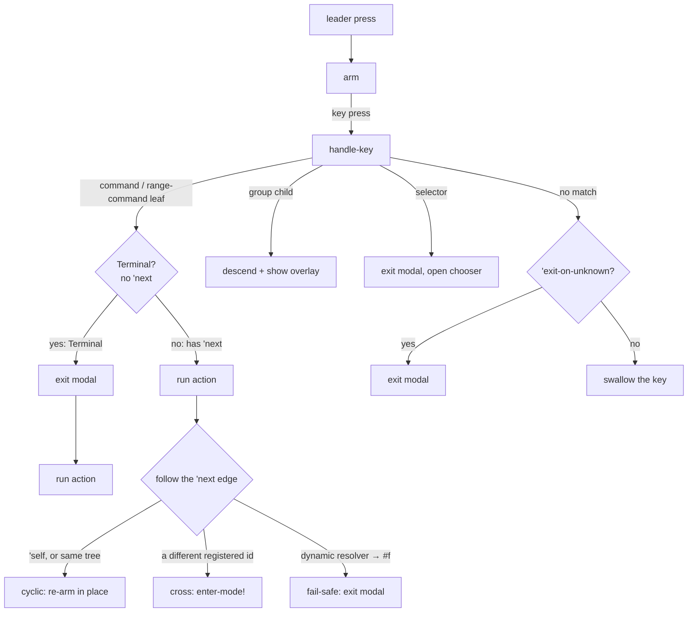

# State machine

How the modal moves through a command tree: lifecycle, the `'next` edge,
Terminal-node capture release, hook gating, dispatch precedence. The
canonical implementation is
[`state-machine.sld`](../../Sources/Modaliser/Scheme/lib/modaliser/state-machine.sld);
this page is the conceptual companion. See
[ADR-0015](../adr/0015-navigation-graph-next-edges-terminal-release.md)
for why the model is shaped this way.

## Modal lifecycle



(For the actual implementation, see `modal-handle-key`,
`modal-step-back`, `modal-enter`, `modal-exit`, `follow-next!` in
`state-machine.sld`.)

### Arm

`(set-leaders! …)` registers the leader keycodes with the native
hotkey system. When a leader fires, `(modal-enter tree leader-kc)`
becomes the active context:

- `modal-active?` is set to `#t`.
- The catch-all key handler is registered, so every keypress while
  the modal is up is routed through `modal-handle-key` rather than
  reaching the focused app.
- A delayed overlay-show is scheduled (or shown immediately when the
  tree root is a **Walk** — see below).

### Dispatch

`modal-handle-key char` looks up the child of the current node bound
to `char`:

| Child kind | Behaviour |
|---|---|
| Command | **Terminal** (no `'next`): exit the modal, *then* run `(action)`. **Non-terminal** (`'next` present): run `(action)`, then follow the edge — cyclic (`'self`, or a symbol naming the current tree) re-arms in place; cross (a different registered tree's id) calls `(enter-mode! target)`; a dynamic resolver that returns `#f` falls back to exit. |
| Range command (from `keys` / `key-range`) | Run `(action char)`. Same Terminal/`'next` cleanup as command. |
| Group | Fire `on-leave` for the leaving node, descend (push `char` onto `modal-current-path`), fire `on-enter` for the new node, refresh overlay. |
| Selector | An instance of the Terminal rule: exit the modal (the chooser owns input focus), then open the chooser. |
| (no match) | If any ancestor (or current group) has `'exit-on-unknown #t`, exit the modal. Otherwise swallow the key. |

### Exit

`(modal-exit)` is idempotent:

- Fires `on-leave` for the current node (only if the overlay was
  visible).
- Cancels any pending delayed overlay-show.
- Hides the overlay and unregisters the catch-all key handler.
- Clears `modal-stack` — Escape from any depth is a full teardown
  regardless of how deeply stacked the modes are.

`(modal-step-back)` is the navigational sibling — retreats one level
along `modal-current-path`. At the root:

- If `modal-stack` is non-empty, pop the caller context (there's
  always somewhere to pop back to, regardless of whether this root is
  a Walk).
- Else, if this root is a **Walk** (`node-walk?`), exit the modal — a
  Walk entered directly still has a conceptual "outside" to back out
  of.
- Else (a plain transient launcher, no caller), it's a no-op.

## The `'next` edge and Terminal nodes

A command or range-command leaf's only transition mechanism is its
declared **`'next`** property (ADR-0015) — the navigation tree is a
*static graph*: a node's outgoing edges are declared on the leaf
itself, never buried inside an action body.

- **No `'next`** → the leaf is **Terminal**: it has no outgoing edge.
  Dispatch releases modal key capture (`modal-exit`) **before** running
  the action, so the action may freely hand the keyboard to something
  outside Modaliser — a native dialog, an external prompt, a chooser.
  Terminality is static, knowable from the tree alone — never from what
  an action's body happens to do.
- **`'next` present** → the leaf is non-Terminal: capture stays live
  through the action, and afterward dispatch follows the edge. `'next`
  takes one of three shapes:

  | `'next` value | Edge kind | Effect |
  |---|---|---|
  | `'self` | **cyclic** | Re-arm in place: `modal-current-node`/`path` don't move (only descending into a group would), so nothing changes except an overlay refresh. No `modal-stack` push. |
  | a registered tree's id (symbol) | **cross** | `(enter-mode! target)` — push the caller context, switch into the target tree. Same mechanics as the framework-internal `enter-mode!` primitive. |
  | a 0-arg procedure | **dynamic** | Resolved at fire time to a symbol or `#f` (e.g. a façade's "whichever backend is frontmost"). The *existence* of the edge is still static — a procedure-valued `'next` is never Terminal, even where it resolves to `#f`. If it resolves to `#f`, dispatch falls back to a normal exit (fail-safe: the design never releases capture wrongly, it can only decline to release early). |

The overlay paints a `↻` marker on any cell carrying `'next`,
regardless of which of the three shapes it is.

```scheme
(key "h" "Left" (keystroke '(cmd alt) "left")
  'next 'iterm-panes-focus)
```

First press: `h` fires the focus-move keystroke *and* crosses into the
`'iterm-panes-focus` Walk. Subsequent `h j k l` presses keep moving
panes without another leader.

## Walk — a collection of cyclic members

A **Walk** is a registered collection whose member leaves cycle back to
it via `'next 'self` (CONTEXT.md). Unlike the old `'sticky` flag,
being a Walk is **derived**, not declared: `(node-walk? node)` is true
iff `node` has at least one direct command/range-command child
declaring `'next 'self`. There is no group-level or tree-level flag —
a `group` / `screen` / `open` no longer accepts anything like the old
`'sticky` keyword at all.

```scheme
(register-tree! 'iterm-panes-focus
  'exit-on-unknown #t
  (key "h" "Left"  (λ () (focus-pane! 'left))  'next 'self)
  (key "j" "Down"  (λ () (focus-pane! 'down))  'next 'self)
  (key "k" "Up"    (λ () (focus-pane! 'up))    'next 'self)
  (key "l" "Right" (λ () (focus-pane! 'right)) 'next 'self))
```

Firing `h` re-arms the same collection instead of exiting, so `h j h h`
chains four pane-focus moves on one leader press.

**Walk-root overlay timing.** A tree whose root is a Walk shows the
overlay *immediately* on entry (no delay) — the overlay is the mode
indicator, so the user must always know they're inside one. Transient
trees use the configured delay (`set-overlay-delay!`).

**Authoring a Walk.** The `(walk MODE-ID DISPLAY-NAME key…)` DSL form
(see [dsl.md](dsl.md#walk-mode-id-display-name-key)) packages the whole
pattern in one call: it registers the mode tree with each member
decorated `'next 'self`, and returns a splice of the same keys
decorated `'next MODE-ID` for you to drop at the entry point(s) — one
key list, no duplication.

## The mode stack (`modal-stack`)

`(enter-mode! id)` is the **cross-edge primitive** dispatch calls
internally to follow a cross `'next` edge — it pushes the current
modal context onto `modal-stack` and switches the modal root to the
new tree. It is **not** config-facing (ADR-0015): a config declares a
cross edge via `'next` on `(key …)`; it must not call `(enter-mode!
…)` from inside an action body. Backspace at the root of the new tree
pops `modal-stack` back to the caller.

Used by the iTerm tree: pressing `h` from the dynamic-pane tree fires
the focus-left keystroke and — because it carries `'next
'iterm-panes-focus` — pushes the dynamic tree onto the stack while
crossing into the Walk. Backspace from the focus mode returns to the
dynamic tree.

`modal-stack` is cleared by `(modal-exit)` — Escape unwinds all
stacked callers in one shot.

## `'exit-on-unknown`

By default the modal is **forgiving**: an unrecognised key is
swallowed without exiting. This avoids accidental dismissal from
typos in a deep tree.

A group can opt back into dismissal:

```scheme
(group "p" "Pane" 'exit-on-unknown #t
  (key "h" "Left" … 'next 'self) (key "j" "Down" … 'next 'self) …)
```

`'exit-on-unknown` is inherited along the path: if *any* ancestor
group (or the current group) has it set, an unknown key exits the
modal. Useful for Walks (focus-movement modes) where the user's next
typing should reach the underlying app rather than forcing an
explicit Escape.

## Hook gating: `on-enter` / `on-leave`

Group hooks fire only when the overlay is actually visible. The
gating matters because of the overlay delay:

| Scenario | `on-enter` fires? | `on-leave` fires? |
|---|---|---|
| User presses leader, then `w` before the delay elapses | No (overlay never showed) | No |
| User presses leader, waits, then `w` after overlay is up | Yes (for descended group) | Yes (for parent group) |
| Modal exits while overlay is hidden (fast path-through) | — | No |
| Modal exits while overlay is open | — | Yes (for current node) |

This guarantees `on-leave` always pairs with an `on-enter` that
actually fired. The pane-chip overlays in `(modaliser apps iterm)` rely
on this: `on-enter` paints chips, `on-leave` clears them, and a quick
muscle-memory press through the mode never flashes chips.

## Dispatch precedence inside a group

`find-child` walks the group's children with these rules:

1. **Literal keys win over ranges.** A `(key "5" "Special" …)` sibling
   shadows the `"5"` slot of a `(keys '("1" ..) …)` range. Walking is
   in declaration order, but a literal match returns immediately; a
   range match only commits if no literal match is found.
2. **First-range wins.** If multiple ranges include the same key,
   declaration order picks the winner.
3. **Panels are transparent.** `(panel "X" (key …) …)` flattens
   in dispatch — typing a child key dispatches as if the children
   were direct group siblings. Panels only affect overlay
   rendering, not key paths.

```scheme
(screen 'global
  (panel "Apps"
    (key "b" "Browser" (λ () (launch-app "Safari"))))
  …)
```

Typing `b` from the global root fires the browser binding — the
`panel` wrapper is invisible to dispatch.

## Modal state inspection

For configs that need to introspect modal state from a hook or action:

| Export (from `(modaliser state-machine)`) | Meaning |
|---|---|
| `modal-active?` | `#t` while a modal is up. |
| `modal-current-node` | The node the user is currently navigated to. |
| `modal-root-node` | The tree root. |
| `modal-current-path` | List of keys followed from the root. |
| `(modal-stack-empty?)` | Procedural — `#t` iff no callers are stacked. |
| `(modal-root-segments)` | Procedural — current breadcrumb root segments. |
| `(overlay-open?)` | Procedural — `#t` iff the overlay is visible. |

The procedural forms exist because LispKit snapshots mutable
variable imports at compile time; closures that need to see live
mutations must call through a procedure. See the comments around
`overlay-open?` in `state-machine.sld` for the full rule.

## See also

- [dsl.md](dsl.md) — the surface forms that produce nodes the state
  machine dispatches.
- [renderer-protocol.md](renderer-protocol.md) — how overlays consume
  the current node and path.
- [how-to/walk-mode.md](../how-to/walk-mode.md) — recipe for
  building a Walk focus-movement mode.
