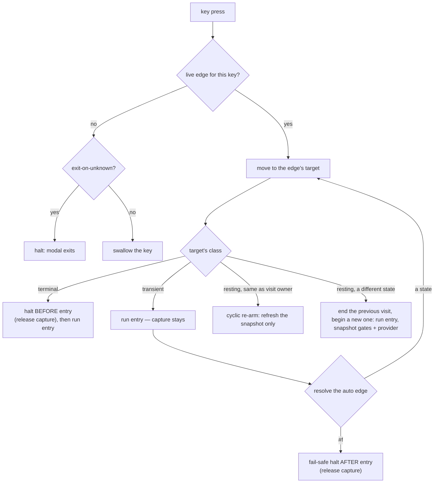

# State machine

How Modaliser's modal dispatch works: an **explicit FSM graph** — states
and labelled edges as first-class data — run by a step engine, with a
modal façade deriving the overlay's `(node, path)` contract from the
engine's configuration. All of it — graph model, step engine, the pure
lower function, and the façade — lives in one library,
[`(modaliser fsm)`](../../Sources/Modaliser/Scheme/lib/modaliser/fsm.sld).
This page is its conceptual companion. See
[ADR-0015](../adr/0015-explicit-fsm-graph.md) for why the model is shaped
this way, and [docs/specs/fsm-graph.md](../specs/fsm-graph.md) for the
full settled design this page tracks.

## The graph: states and edges

A **state** carries an id (a readable symbol or string), an optional
label, a presentation **payload** (the lowered layout node the overlay
renders — see "Lowering and the façade" below), four **action slots**
(`entry`, `exit`, `show`, `hide`), an optional edge **provider**, and
its outgoing edges.

An **edge** is labelled by its trigger:

| Trigger | Meaning |
|---|---|
| a key string (e.g. `"h"`) | an ordinary dispatch key |
| `'up` | the backspace edge — implicit to a state's lowering parent, or an explicit outward edge (e.g. the herdr entry node's edge out to iTerm, [ADR-0013](../adr/0013-nested-context-entry-points.md)) |
| `'auto` | the post-action edge — what a leaf's `'next` lowers to |

and carries a target (a state id, or a 0-arg procedure resolved at fire
time — a **dynamic edge**), an optional **gate** (a 0-arg predicate; the
edge is only live while it passes), and an optional **call** marking
(pushes a return frame when followed — see
[Backspace and the return stack](#backspace-and-the-return-stack)). A
state may not carry both key edges and an `'auto` edge — it cannot be
simultaneously resting and transient.

Behaviour slots (the four action slots, a gate, a provider) take
**procedures** — lambda literals anywhere — with an optional naming
wrapper for display. The whole graph is printable and queryable
(`fsm-graph->alist` / `fsm-print`, `fsm.sld`) for tooling and future
renderers; only closure bodies stay opaque.

### State classes are derived, never declared

| Class | Derivation | Meaning |
|---|---|---|
| **Resting** | has key edges | awaits further input |
| **Transient** | has an `'auto` edge | a command: its entry action runs, then the auto edge is followed |
| **Terminal** | neither | the machine halts here — capture releases *before* the entry action runs |

Nothing about a node's transitions is ever buried in an action body —
every edge is data an inspector could read (CONTEXT.md "State class").

## The step: how a key press moves the machine


```mermaid
flowchart TD
    A[key press] --> B{live edge for this key?}
    B -->|no| C{exit-on-unknown?}
    C -->|yes| D[halt: modal exits]
    C -->|no| E[swallow the key]
    B -->|yes| F[move to the edge's target]
    F --> G{target's class}
    G -->|terminal| H["halt BEFORE entry\n(release capture), then run entry"]
    G -->|transient| I[run entry — capture stays]
    I --> J{resolve the auto edge}
    J -->|a state| F
    J -->|#f| K["fail-safe halt AFTER entry\n(release capture)"]
    G -->|resting, same as visit owner| L[cyclic re-arm: refresh the snapshot only]
    G -->|resting, a different state| M[end the previous visit, begin a new one: run entry, snapshot gates + provider]
```

The engine's configuration is `(current state, return stack)` — an RTN,
not a pure FSM (CONTEXT.md "FSM graph"). A **visit** spans from the
machine coming to rest in a resting state until it rests elsewhere or
halts — the unit presentation and snapshots belong to
(CONTEXT.md "Visit"). A transient excursion that returns to its own
visit owner on a cyclic auto edge *continues* the visit: `entry`/`show`
do not re-fire, only the snapshot refreshes, so **edge gates** and
**edge providers** — a resting state's optional per-visit source of
extra edges and synthetic states (jump-label targets, narrowing prefix
states) — track live content across repeated presses. Gates and
providers run once per landing, at visit start and again on each cyclic
re-arm, never on every keypress (CONTEXT.md "Edge gate" / "Edge
provider"). The herdr entry node's jump space is the first shipped
consumer: its `'provider` (`herdr-jump-provider`, `(modaliser muxes
herdr)`) gathers each visit's live jump targets and lowers them to
per-visit key edges and narrowing prefix states — see
[terminal-pane-aware-tree.md](../how-to/terminal-pane-aware-tree.md#worked-example-herdr).

(For the actual implementation, see `move-to!`, `fsm-step!`,
`fsm-step-back!`, `fsm-activate!`, `fsm-halt!` for the step engine, and
`modal-handle-key`, `modal-step-back`, `modal-activate!`, `modal-exit`
for the façade that replays the matching overlay/hook side effects
around each of those calls — all in `fsm.sld`.)

## The `'next` edge and Terminal nodes

A command or range-command leaf's only transition mechanism is its
declared **`'next`** property — unchanged at the DSL layer since before
the graph refactor. Declaring it lowers the leaf to a state carrying one
**auto edge**; omitting it lowers the leaf to a **Terminal** state with
no outgoing edge at all.

- **No `'next`** → the leaf is **Terminal**. Dispatch releases modal key
  capture (`modal-exit`) **before** running the action, so the action
  may freely hand the keyboard to something outside Modaliser — a native
  dialog, an external prompt, a chooser. Terminality is static, knowable
  from the graph alone — never from what an action's body happens to do.
- **`'next` present** → the leaf lowers to a **transient** state: capture
  stays live through the action, and afterward the engine follows the
  auto edge. `'next` takes one of three shapes:

  | `'next` value | Edge kind | Effect |
  |---|---|---|
  | `'self` | **cyclic** | Re-arm in place: the visit continues at the same owner (only descending into a group would move it), so nothing changes except a snapshot refresh. No return-stack push. |
  | the scope id of a tree in the configuration (symbol) | **cross**, and a **call** edge | Push a return frame, switch to the target state — the FSM's own edge-following, not a separate primitive a config calls. |
  | a 0-arg procedure | **dynamic**, and also a **call** edge | Resolved at fire time to a symbol or `#f` (e.g. a façade's "whichever backend is frontmost"). The *existence* of the edge is still static — a procedure-valued `'next` is never Terminal, even where it resolves to `#f`. A return frame pushes whenever it resolves to a real target — cross edges always push, whether the target was static or resolved at fire time. If it resolves to `#f`, the engine halts *after* the action already ran instead (fail-safe: it never releases capture wrongly, only declines to release early). |

The overlay paints a `↻` marker on any cell carrying `'next`, regardless
of which of the three shapes it is.

```scheme
(key "h" "Left" (keystroke '(cmd alt) "left")
  'next 'iterm-panes-focus)
```

First press: `h` fires the focus-move keystroke *and* crosses into the
`'iterm-panes-focus` Walk. Subsequent `h j k l` presses keep moving
panes without another leader.

## Walk — a collection of cyclic members

A **Walk** is a collection in the configuration's tree set whose member
leaves cycle back to it via `'next 'self` (CONTEXT.md). Being a Walk is
**derived**, not
declared: `(node-walk? node)` is true iff `node` has at least one direct
command/range-command child declaring `'next 'self` — the same
structural test the engine itself makes at the graph level (`walk-root?`
in `fsm.sld`, used by backspace). There is no group-level or tree-level
flag — a `group` / `screen` / `open` accepts nothing like an old
`'sticky` keyword at all.

```scheme
(tree 'iterm-panes-focus
  (tree-root 'iterm-panes-focus
    'exit-on-unknown #t
    (key "h" "Left"  (λ () (focus-pane! 'left))  'next 'self)
    (key "j" "Down"  (λ () (focus-pane! 'down))  'next 'self)
    (key "k" "Up"    (λ () (focus-pane! 'up))    'next 'self)
    (key "l" "Right" (λ () (focus-pane! 'right)) 'next 'self)))
```

Firing `h` re-arms the same collection instead of exiting, so `h j h h`
chains four pane-focus moves on one leader press.

**Walk-root overlay timing.** A tree whose root is a Walk shows the
overlay *immediately* on entry (no delay) — the overlay is the mode
indicator, so the user must always know they're inside one. Transient
trees use the configured delay (the `overlay-delay` setting).

**Authoring a Walk.** The `(walk MODE-ID DISPLAY-NAME key…)` DSL form
(see [dsl.md](dsl.md#walk-mode-id-display-name-order-keysdeclared-key)) packages the whole
pattern in one call: it returns a splice of the keys decorated
`'next MODE-ID` for you to drop at the entry point(s), carrying the
mode tree — the same keys decorated `'next 'self` — inside it for the
`configuration` merge to hoist into the tree set. One key list, no
duplication.

## Backspace and the return stack

Backspace (`fsm-step-back!`) is **one rule**: follow the current visit
owner's `'up` edge if it's live; else pop the **return stack**; else — a
Walk root halts (it always has a conceptual "outside" to back out of),
any other root no-ops (nothing to back into). Escape is unrelated to
this rule: it halts from any depth and clears the stack unconditionally
— a full teardown regardless of how deeply stacked the modes are.

The **return stack** (`fsm-return-stack`, surfaced to configs as
`modal-stack`) holds visit-owner state ids, most-recently-pushed first.
It grows only on a **call edge** — a cross or dynamic `'next` pushes the
caller before switching into a real target — and shrinks only when
backspace pops it. A cyclic edge (`'next 'self`) never pushes, however
many times it fires.

Used by the iTerm tree: pressing `h` from the dynamic-pane tree fires
the focus-left keystroke and — because it carries `'next
'iterm-panes-focus` — pushes the dynamic tree onto the stack while
crossing into the Walk. Backspace from the focus mode returns to the
dynamic tree.

`modal-stack` (`(modal-stack-empty?)`) is a *derived* read of
`fsm-return-stack`, refreshed after every step; it is cleared as a side
effect of `(modal-exit)` — Escape unwinds all stacked callers in one
shot.

## `'exit-on-unknown`

By default the modal is **forgiving**: an unrecognised key is
swallowed without exiting. This avoids accidental dismissal from
typos in a deep tree.

A group can opt back into dismissal:

```scheme
(group "p" "Pane" 'exit-on-unknown #t
  (key "h" "Left" … 'next 'self) (key "j" "Down" … 'next 'self) …)
```

`'exit-on-unknown` is inherited along the path: if *any* ancestor
group (or the current group) has it set, an unknown key exits the
modal. Useful for Walks (focus-movement modes) where the user's next
typing should reach the underlying app rather than forcing an
explicit Escape. Inheritance is resolved once, at lowering — each
state is stamped with its own effective policy — rather than walked
live on every keypress; the engine (`fsm-step!`) enforces it directly
off that stamp.

## Activation: screen set + context map

A leader press resolves through **`resolve-activation`**
(`(modaliser activation)`) — a pure function of leader kind, frontmost
bundle-id, the live detection chain, and the installed configuration
value (CONTEXT.md "Entry point";
[configuration-value spec](../specs/configuration-value.md)). A
`'global` press lands on the `'global` tree. A `'local` press looks the
frontmost bundle-id up in the value's tree set, falling back to
`'global`; when that screen is **terminal-like** and the chain contains
mapped contexts, activation lands in the **innermost mapped** context's
tree instead, with the **return stack seeded** one frame per outer
context — the chain itself is the containment order, so nothing ranks
entries and no activation registry exists
([ADR-0013](../adr/0013-nested-context-entry-points.md)). The graph
carries no entry rows at all: activation is resolved *outside* the
graph, then `modal-activate!` enters the resolved root with the seeded
stack. Programmatic entry by scope symbol routes through the same
resolution (`resolve-direct-activation`), seeding outward frames when
the live chain contains that context — otherwise the stack is empty and
backspace at the root is honestly a no-op.

## Hook gating: `on-enter` / `on-leave`

Group hooks fire only when the overlay is actually visible. The
gating matters because of the overlay delay:

| Scenario | `on-enter` fires? | `on-leave` fires? |
|---|---|---|
| User presses leader, then `w` before the delay elapses | No (overlay never showed) | No |
| User presses leader, waits, then `w` after overlay is up | Yes (for descended group) | Yes (for parent group) |
| Modal exits while overlay is hidden (fast path-through) | — | No |
| Modal exits while overlay is open | — | Yes (for current node) |

This guarantees `on-leave` always pairs with an `on-enter` that
actually fired. The pane-chip overlays in `(modaliser apps iterm)` rely
on this: `on-enter` paints chips, `on-leave` clears them, and a quick
muscle-memory press through the mode never flashes chips.

A group's `on-enter`/`on-leave` lower onto its resting state's `show`/
`hide` action slots (CONTEXT.md "Action slots") — the graph's
presentation-paired half of a visit, distinct from `entry`/`exit`, which
fire unconditionally at the visit's boundaries regardless of whether the
overlay ever displays it.

What *calls* them at runtime, though, is the **façade**, not those slots.
`run-on-enter` / `run-on-leave` (`fsm.sld`) read `'on-enter` / `'on-leave`
off whatever alist `modal-current-node` resolves to — the state's carried
payload — at the two moments the overlay starts and stops showing the
node. The engine's own `show`/`hide` slots fire only when a host signals
`fsm-mark-displayed!`, and no host does; they are exercised by tests
alone. Lowering keeps them populated so the slot model stays complete, but
hook *behaviour* lives in the façade's two runners. That is also why the
reason below reaches `'on-leave` and not `hide`: `hide` is always fired
with no arguments.

### The exit reason

`'on-leave` may declare **one argument**. If it does, it receives a symbol
saying why the visit ended:

| Reason | When |
|---|---|
| `'navigate` | The modal moved elsewhere and stayed up — a descent, a cross edge, a backspace pop. The default. |
| `'confirm` | Return exited the modal (with no [selection cursor](dsl.md#live-lists--the-selection-cursor) to activate). |
| `'cancel` | Escape; the leader key pressed again (the modal's catch-all sees it before any hotkey); a key that maps to no character and nothing else consumed (an arrow with no selection cursor active); or an unknown key under [`'exit-on-unknown`](#exit-on-unknown). |
| `'exit` | The modal ended some other way — a Terminal leaf fired, backspace halted a Walk root, or `(modal-exit)` was called with no reason. |

Every authoring surface that takes `'on-leave` reaches it: `group`,
`tree-root`, `screen`, and `open` all funnel through the same
`run-on-leave`. (The `walk` form takes no hooks of its own — it builds
its mode root internally; author the root with `tree-root`, or use a
plain `group` of `'next 'self` members, when you need one.) A nullary
`'on-leave` is unaffected — both spellings are valid and there is nothing
to opt into. Block hook fns (`'on-leave-fn`, see
[renderer-protocol.md](renderer-protocol.md#block-hooks)) are **always**
called with no arguments; no reason reaches them.

The shipped `Recent Tabs` Walk in `default-config.scm` is the worked
example — Return commits Dia's tab switcher, anything else cancels it
(the keystroke protocol is in
[libraries.md](libraries.md#modaliser-input)):

```scheme
(group "r" "Recent Tabs"
  'exit-on-unknown #t
  'on-enter (λ () (send-key-down "ctrl") (dia:tab-step))
  'on-leave (λ (reason)
              (unless (eq? reason 'confirm) (send-keystroke "escape"))
              (send-key-up "ctrl")))         ; release on every exit path
```

**How the arity is decided.** R7RS has no portable way to ask a procedure
how many arguments it accepts, so `(modaliser fsm)` does not ask: it ships
a predicate cell answering "assume nullary", and `root.scm` installs the
real check (`procedure-arity-includes?`, a LispKit primitive) at boot via
`set-on-leave-accepts-reason!`. Same host-installs-the-capability shape as
the Shell and HTTP seams
([ADR-0023](../adr/0023-native-reach-is-host-installed.md)), reached for a
different reason — [portability](portability.md#semantic-constraints-beyond-imports),
not quarantine.

That difference has one practical consequence. Those seams are *inert*
until installed: every call degrades to a value the caller already
handles. This predicate's default does **not** degrade — under it a 1-arg
`'on-leave` is called with zero arguments, raising `function expects 1
argument, but received 0 arguments`. The app never sees that (`root.scm`
installs the predicate before any config is loaded), but a bare
`SchemeEngine()` under `swift test` never runs `root.scm`, so a test
driving a reason-aware hook must install the predicate itself:

```scheme
(set-on-leave-accepts-reason! (lambda (t) (procedure-arity-includes? t 1)))
```

## Unconditional hooks: `'entry` / `'exit`

A group (and, by extension, `tree-root`, `screen`, and `open` — see
[dsl.md](dsl.md#group-k-l-keyword-value--children)) accepts an optional
`'entry`/`'exit` keyword pair, authoring the *other* half of a resting
state's action slots: unlike `'on-enter`/`'on-leave` (gated onto
`show`/`hide`, fired only once/if the overlay's delayed show elapses),
`'entry` fires synchronously at Visit come-to-rest — including
`fsm-activate!` at leader press — and `'exit` at Visit end (navigate-away
or `modal-exit`), **both regardless of whether the overlay ever
displays**. This is the escape hatch for hooks that must not wait out
`modal-overlay-delay` — a non-visual side effect that has to be armed the
moment the mode is entered, whether or not the user ever sees it:

```scheme
(group "j" "Jump"
  'entry suspend-app-auto-refresh!
  'exit  resume-app-auto-refresh!
  …)
```

Reach for it only when the hook is *not* presentation. Anything the user
sees belongs on `'on-enter`/`'on-leave`, so that it appears with the
overlay rather than flashing ahead of it — herdr's jump chips were the
one exception and stopped being one at
defer-chips-to-overlay-k33, leaving the shipped tree with no
`'entry`/`'exit` group hook at all.

Author-only: a `screen`/`open`'s embedded live-list block hooks
(`on-enter-fn`/`on-leave-fn`) fire from `run-on-enter`/`run-on-leave`
alongside the gated `on-enter`/`on-leave` pair, never from `entry`/
`exit` — blocks are presentation, so their hooks belong on the pair that
shares that timing contract.

`'entry`/`'exit` lower straight onto the resulting state's `entry`/`exit`
slots — the same slots a command/range-command leaf's own body already
occupies (a leaf has no separate hook keyword; its action *is* its
`entry`). No engine change was needed to add this authoring surface: the
step engine already fires `entry`/`exit` unconditionally at the intended
instants (`fsm.sld`'s `move-to!`/`end-old-visit!`) — `'on-enter`/
`'on-leave` were simply the only keywords wired to reach them, via the
presentation-gated `show`/`hide` detour.

### Both slots take an optional argument

Like `'on-leave` [above](#the-exit-reason), each of this pair may declare
**one argument** — and, because these are the engine's own slots, the
engine passes it directly:

| Slot | Argument | Values |
|---|---|---|
| `'entry` | the **arriving key** | The dispatch key string that led here (`"1"`, `"h"`, …), or `#f` when no keypress did: leader activation, an auto-edge hop, a backspace return-stack pop. |
| `'exit` | the **leaving reason** | The same four symbols `'on-leave` receives — `'navigate`, `'confirm`, `'cancel`, `'exit` — from the same events. |

The arriving key earns its place on a state several edges can reach: a
provider's synthetic target shared by every jump label reads it to learn
*which* label fired. It is the same value the range-command leaf machinery
forwards to a `keys` / `key-range` action.

Arity is decided the same way, by one host-installed predicate
(`set-fsm-accepts-arg!`, installed in `root.scm` beside the `'on-leave`
one) — a pure arity check, indifferent to which slot it guards. Its
uninstalled default carries the same caveat: a 1-arg `'entry` or `'exit`
raises an argument-count error in an engine that never ran `root.scm`, so
a test exercising one installs the predicate itself.

Note the asymmetry with `'on-leave`, which is *also* fired with a reason
but from an entirely different place — the façade, off the carried
payload, only if the overlay showed
([above](#hook-gating-on-enter--on-leave)). A node carrying both hooks
sees `'exit` on every visit end and `'on-leave` only on the displayed
ones; the reason value agrees across the two.

## Edge providers: `'provider`

A group (and, by extension, `tree-root` and `screen` — see
[dsl.md](dsl.md#group-k-l-keyword-value--children)) accepts an optional
`'provider` keyword: a 0-arg procedure lowered straight onto the resulting
state's `'provider` slot (`fsm.sld`, dsl-provider-wiring-k24). Unlike
`'on-enter`/`'on-leave`, which are presentation-gated onto `show`/`hide`, a
provider fires unconditionally at come-to-rest — its contributed edges and
synthetic states are what dispatch itself consults, whether or not the
overlay is showing.

```scheme
(group "j" "Jump"
  'provider (lambda ()
              (list (cons 'edges (jump-target-edges))
                    (cons 'states (jump-target-states))))
  (key "b" "Back to blocked" jump-to-next-blocked))
```

The provider re-runs every time its state comes to rest (Visit start, and
on each cyclic re-arm) — see CONTEXT.md "Edge provider" and
[docs/specs/fsm-graph.md](../specs/fsm-graph.md) "Runtime semantics" for
the full contract (the returned alist's `'edges` / `'states` keys, and how
they fold into the Visit's live snapshot). `open` does not (yet) expose
`'provider` — drop to the lower-level `group` form directly if a sub-drill
ever needs one.

## Dispatch precedence inside a group

Precedence among a group's children is resolved **once, at lowering**
— not walked live on every keypress:

1. **Literal keys win over ranges.** A `(key "5" "Special" …)` sibling
   shadows the `"5"` slot of a `(keys '("1" ..) …)` range. Declaration
   order is walked, but a literal match wins; a range match only
   commits if no literal match exists for that key.
2. **First-range wins.** If multiple ranges include the same key,
   declaration order picks the winner.
3. **Panels are transparent.** `(panel "X" (key …) …)` never becomes a
   node: its rows *are* direct children of the enclosing group, and the
   panel survives only in that group's display value. So typing a child
   key dispatches exactly as if no panel had been written — panels affect
   overlay rendering only, never key paths.

The winner of that precedence becomes one key edge per distinct trigger
string on the group's lowered state — a fixed part of the graph, not a
per-press decision.

```scheme
(screen 'global
  (panel "Apps"
    (key "b" "Browser" (λ () (launch-app "Safari"))))
  …)
```

Typing `b` from the global root fires the browser binding — the
`panel` wrapper is invisible to dispatch.

## Lowering and the façade

**`lower-configuration`** is the pure lower function
([ADR-0018](../adr/0018-configuration-as-one-explicit-value.md)): it
takes a merged configuration value and returns a **fresh, closed
graph** — every tree in the value's tree set (contributed and
walk-hoisted alike) lowers through one internal walk (`lower-node!`,
its sole caller). A group becomes a resting state with an
implicit `'up` edge to its lowering parent and one key edge per distinct
dispatch trigger; a command or range-command leaf becomes a transient or
Terminal state per [above](#the-next-edge-and-terminal-nodes); a
selector always lowers Terminal (opening the chooser *is* its entry
action). Every state's payload carries the *original* node alist — its
`'display` entry, the whole Display value, included — so
`modal-root-node`/`modal-current-node` get their carried presentation
values for free. A state's id is its scope string (the tree root) or its
parent's id plus `"/"` plus its own dispatch key, so the up-edge chain
from any descendant always terminates at its own tree's root, never
crossing into another tree (a cross edge is a **call**, tracked on the
return stack, not an up edge).

The result is validated **closed over its authored references** — key-
edge targets, `'next` cross/call ids, up-edges must all resolve, as
load-time errors naming the offending ids. Providers' visit-scoped
synthetic states and dynamic `'next` resolvers stay outside static
closure (the two deliberate runtime carve-outs). Installing the lowered
graph is the Handoff's business (`modaliser:start!`,
[dsl.md](dsl.md#modaliserstart-config)); the installed graph **is**
what dispatch runs on.

The **modal façade** — the modal-* names the overlay and configs read —
is **derived** from the engine's configuration (`fsm-current-state` /
`fsm-return-stack`) after
every `fsm-step!` / `fsm-step-back!` / `fsm-activate!` / `fsm-halt!`,
rather than mutated by hand-rolled tree-walking:
`modal-current-path` reads the up-edge chain, `modal-root-node` /
`modal-current-node` return the carried presentation payloads,
`modal-stack` mirrors `fsm-return-stack`.

## Modal state inspection

For configs that need to introspect modal state from a hook or action —
every value below is derived from the engine's configuration, not
independently tracked:

| Export (from `(modaliser fsm)`) | Meaning |
|---|---|
| `modal-active?` | `#t` while a modal is up. |
| `modal-current-node` | The presentation payload of the node the user is currently navigated to. |
| `modal-root-node` | The presentation payload of the current tree's root. |
| `modal-current-path` | List of keys followed from the root, derived from the up-edge chain. |
| `(modal-stack-empty?)` | Procedural — `#t` iff no callers are stacked (`fsm-return-stack` is empty). |
| `(modal-root-segments)` | Procedural — current breadcrumb root segments. |
| `(overlay-open?)` | Procedural — `#t` iff the overlay is visible. |

The procedural forms exist because LispKit snapshots mutable
variable imports at compile time; closures that need to see live
mutations must call through a procedure. See the comments around
`overlay-open?` in `fsm.sld` for the full rule.

## See also

- [dsl.md](dsl.md) — the surface forms that lower into the states the
  engine dispatches.
- [renderer-protocol.md](renderer-protocol.md) — how overlays consume
  the current node and path.
- [how-to/walk-mode.md](../how-to/walk-mode.md) — recipe for
  building a Walk focus-movement mode.
- [how-to/terminal-pane-aware-tree.md](../how-to/terminal-pane-aware-tree.md)
  — the Terminal context map and chain-seeded activation in practice.
