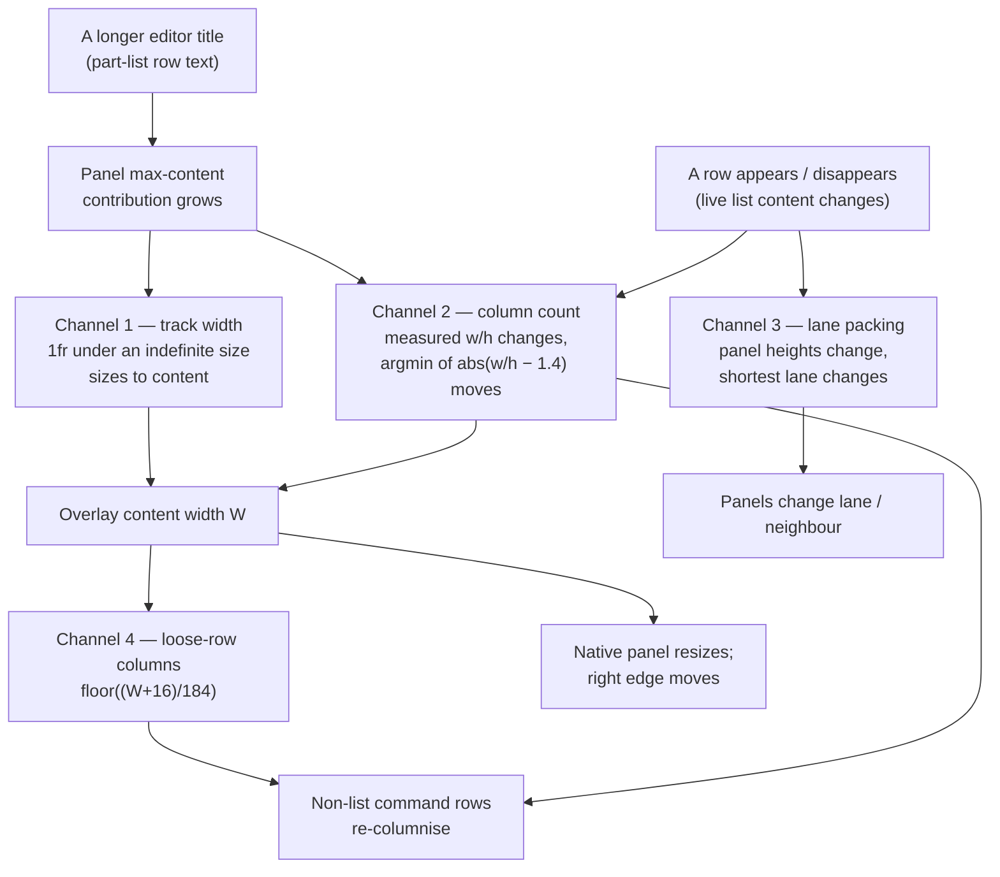

# Layout control for the Modaliser overlay — survey (a)

Exploratory research for `configuration-exploration`. External sources consulted
**2026-09-10**. The inspected revision is **`e004bd3`** — this grove's own
parent commit, not the `main` bookmark, which is behind it at `8f4c30f4`. The
only difference between them is Grove and documentation.

This is a survey, not a decision. It proposes nothing as accepted, authorises no
implementation, and rewrites no ADR. Where it recommends, it recommends
*provisionally* and names what would change the recommendation.

**Corrected in place 2026-09-10** by `configuration-design-k5`: §9's illustrative
`(panel …)` forms used bare key strings, which the sugar does not accept; §4.1's
`@supports` claim was a repo-wide count that its own publication invalidates; and
§4.3 is new — the `.panel-span-wide` comment's clamping assumption is contradicted
by the primary placement algorithm. Findings and recommendation are unchanged.

## 0. How to read the evidence

Four kinds of claim appear below, marked wherever they could be confused:

| Mark | Meaning |
|---|---|
| **[src]** | Read directly out of this repository at the revision above. File and line given. |
| **[spec]** / **[doc]** | A dated primary external source, linked at the claim. |
| **[inf]** | A derivation from **[src]** plus **[spec]**. An inference, not a verified fact — no observation supports it. |
| **[gap]** | Not established. No primary source was found, or the check needs a runtime this task may not use. |

Nothing here was measured. No app was launched, no overlay rendered, no width
recorded, no browser probed. Every statement about what the user *sees* is
**[inf]**, and §11 lists the unresolved empirical questions rather than
attempting them.

External sources are paraphrased; short quotations are used only where the exact
wording carries the claim.

---

## 1. The layout controls that exist today

### 1.1 Where layout can be said at all

Layout lives in exactly one place: the node's **Display value**, one disjoint
`'display` entry, resolved by the pure `resolve-display` and only *serialised*
by the overlay (ADR-0011). Dispatch never reads it. That separation is the
single best thing about the present design, and every option in §9 preserves it.

**[src]** `Sources/Modaliser/Scheme/lib/modaliser/display-dsl.sld:10-24` gives
the value's whole shape:

```
((display-name . STR) (cols . N) (layout . masonry|grid) (order . keys|declared)
 (embed . (KEY …)) (loose . (REF …)) (panels . (PANEL …)))
PANEL = ((label . STR|#f) (span . narrow|wide|full) [(order . …)] (rows . (REF …)))
REF   = (key . "c") | (block . ID)
```

### 1.2 The complete authored vocabulary

That is the entire layout language. Eight knobs, five of them geometric:

| Knob | Values | Scope | What it actually controls |
|---|---|---|---|
| `cols` | positive integer | screen / open | Hard-pins the grid track count; **skips measurement entirely** **[src]** `ui/overlay.js:211-215` |
| `layout` | `masonry` \| `grid` | screen / open | `masonry` → CSS default (`display: grid-lanes`); `grid` → `data-layout="grid"` → `display: grid; grid-auto-flow: dense` **[src]** `base.css:378-392` |
| `span` | `narrow` \| `wide` \| `full` | panel | `grid-column: span 1 / span 2 / 1 / -1` **[src]** `base.css:399-401` |
| `order` | `keys` \| `declared` | screen/open default, panel override | Row order *within* a panel; presentation only **[src]** `display-dsl.sld:302-305` |
| `loose` | ordered refs | screen / open | Membership and order of the header-less region above the grid |
| `panels` | ordered panel clauses | screen / open | Membership and **grid order** — not position |
| `embed` | key strings | screen / open | Renders an edge target as an in-place section card in the same grid |
| `display-name` | string | tree root | Breadcrumb only |

Three consequences, all **[src]**:

1. **Grouping into peer panels is free, and costs no key path.** A panel exists
   only in the Display value, referencing the node's rows by key; nothing
   panel-shaped joins the dispatch children (ADR-0011; CONTEXT.md, *Panel*).
   So splitting a screen's loose rows across several panels leaves every key
   exactly where it was. This is the mechanism the VS Code scenario needs, and
   it already works — §9.
2. **There is no position.** No row, no column, no area, no adjacency. A panel
   is placed by the packer; `span` is the only lever on where it lands, and it
   is a width hint, not a coordinate.
3. **Panels do not nest, and one panel holds at most one block.** Nesting raises
   at construction — *"panels cannot nest — a panel groups rows"*
   (`dsl.sld:684-685`); a second block raises at construction
   (`dsl.sld:681-683`) and again at resolve (`display-dsl.sld:262-263`). The
   rendered structure is always rows first, then the block
   (`display-dsl.sld:250-268`, `ui/overlay.js:401-417`), whatever the authored
   interleaving. The only nesting form is `open`, which is a real `group`: it
   navigates, so it *does* add a dispatch prefix.

### 1.3 What the renderer does with it

**[src]** `ui/overlay.js:143-224`. Each render:

- `.panel-loose` — the loose region, appended **first** so its blocks
  contribute to the overlay's width, but its rows columnised **last**.
- `.panel-grid` — panel cards and embed-section cards in one grid.
- Then the grid is either pinned (`cols`) or **balanced by measurement**.
- Then `layoutLooseColumns` reads the settled width and columnises the loose
  row-runs.

There is one fast path — `restylePanelGridActiveSection` — and it applies only
when the *same* display root is re-pushed with a different active section
**[src]** `ui/overlay.js:150-157`. Its own comment records that a same-state
*content* refresh (it names "a cyclic re-arm refreshing a live list") **falls
through to the full rebuild**, which re-runs the balance.

**[gap]** The source establishes that this rebuild path exists and what it does;
it does not establish when — or whether — such a refresh is actually pushed
while an overlay is on screen. Whether a user can see a re-columnisation they
did not trigger is an open empirical question (§11, P5), not a finding.

### 1.4 The aspect-balance policy, exactly

**[src]** `ui/overlay.js:227-292`.

```
PANEL_GRID_TARGET_RATIO = 1.4      // "a fixed JS policy constant
                                   //  (the user declined exposing it)"
maxFit  = floor((760 + 10) / (184 + 10))            = 3
demand  = Σ over panels: full→0, wide→2, narrow→1
maxCols = max(1, min(maxFit, demand || 1))
for c in 1..maxCols:  pin --panel-grid-cols = c
                      read grid.offsetWidth/offsetHeight   // forces sync layout
                      keep argmin |w/h − 1.4|
```

Three properties matter downstream:

- It is **measured, not predicted** — deliberately, so span placement and lane
  packing come out right for free. The cost is that *every* input to the
  rendered size is an input to the column count.
- The target `1.4` is not authorable. The code comment records that as a
  decision the user already made once.
- It re-runs on `document.fonts.ready` when the bundled faces have not settled
  (`ui/overlay.js:279-290`), so a cold start may legitimately compute one count
  and then another.

`layoutLooseColumns` (`ui/overlay.js:345-377`) then derives the loose region's
column count from the *settled* overlay width `W`:
`fit = floor((W + 16) / (168 + 16))`, capped per run by its own row count, and
pins each run to `W` px.

---

## 2. Why the layout moves when a list gets wider

The user reports that layout changes with list widths, and separately confirmed
the desired behaviour: **keep groups stable; wrap or truncate titles.** This
section is the mechanism, and it is the load-bearing part of the survey.

### 2.1 Four coupling channels, not one



**Channel 1 — track width is content-driven, by specification.**
`.overlay { width: max-content }` **[src]** `base.css:176`, so the grid's inline
size is *indefinite*. [CSS Grid Level 1][grid1] **[spec]** provides that when
available space is infinite — which is the case for an indefinite grid-container
width — flexible tracks are *"sized to their contents while retaining their
respective proportions."* With `minmax(184px, 1fr)` **[src]**
`base.css:380-382`, the widest panel therefore sets the shared track width, up
to the `max-width: 760px` cap **[src]** `base.css:385`.

Under the masonry default this is stronger. For lane layout,
[CSS Grid Level 3][grid3] **[spec]** (Editor's Draft, 2 September 2026) has
every automatically-positioned item contribute to a track's intrinsic size
*"regardless of whether they are ultimately placed in that track."* **[inf]** So
in `layout: masonry` — the default — one wide panel widens **every** track, not
merely its own.

**Channel 2 — column count is content-driven, by design.** §1.4. The balance
measures the real layout; a content change is a measurement change is a
different argmin. Nothing about this is a bug; it is the policy working.

**Channel 3 — lane packing is height-driven.** [WebKit's introduction][lanes]
**[doc]** describes each item taking the lane that gets it *"the furthest
ahead"*. A list that gains or loses a row changes its card's height and so which
lane the *next* card takes. [CSS Grid 3][grid3] cautions that lane layout can
switch direction *"in a seemingly arbitrary manner"* and points at
`reading-flow` as the mitigation; WebKit notes that too high a tolerance gives
*"an awkward experience jumping up and down the layout."*

**Channel 4 — the loose rows inherit all of it.** `layoutLooseColumns` derives
its count from `W`, which the panel grid establishes. **[inf]** This is the
channel that matches the complaint most precisely: a longer editor title can
change how the *non-list command rows* are arranged, though those rows did not
change at all.

### 2.2 What is already stable

Worth stating plainly, because it narrows the design problem:

- **`'cols N` with `'layout 'grid` already gives content-independent
  *placement*.** With the count pinned, measurement is skipped **[src]**
  `ui/overlay.js:211-213`; with `display: grid; grid-auto-flow: dense` **[src]**
  `base.css:390-393`, placement is a function of declaration order and spans
  only. **[inf]** Groups would then keep their cells across content changes.
  This appears authorable today with a two-keyword edit and no new machinery.
- What that does **not** give is stable *geometry*: channel 1 survives, so the
  tracks (all of them, equally) still widen with content up to 760px, and the
  overlay still grows. Whether the user's "groups stay in place" means cells or
  pixels is a question only they can settle (§11, U1).

### 2.3 The truncation policy exists and cannot engage

**[src]** `base.css:309-318`:

```css
/* Labels never wrap (spec §7 hard requirement): a long title truncates
 * with an ellipsis rather than reflowing the row. */
.entry-label { min-width: 0; overflow: hidden; text-overflow: ellipsis;
               white-space: nowrap; }
```

The block renderers repeat the pattern (`part-list.css:36-38`, `:54-56`;
`herdr-list.css`, `display-list.css`).

**[inf]** `text-overflow` can only fire against a definite width. `min-width: 0`
*permits* shrinking; nothing *forces* it. In the max-content regime of channel 1
the track simply grows to the label's max-content size, so below the 760px cap
the ellipsis never engages and a long path widens the panel instead of being
cut. Above the cap the grid is clamped, tracks are forced, and the same rules
suddenly do work.

If that reading is right — and §11, P2 is the check that settles it — then **the
overflow half of the user's requirement needs no new CSS at all**. It needs a
definite width somewhere above the label, which is the same thing channels 1, 2
and 4 need. That is the most useful finding here, and also the one most worth
trying to disprove.

---

## 3. The native panel, and "available space"

The overlay is a `WKWebView` in a non-activating `NSPanel`. **[src]**
`ui/overlay.scm:82-83, 1050-1062`: created at **340 × 400**, transparent,
floating. **[src]** `WebViewManager.swift:82-87`: with no `x`/`y` given, the
origin is centred on `NSScreen.main.visibleFrame` **using the 340px creation
width**. **[src]** `WebViewManager.swift:199-211` and `:219-225`: the page posts
`{type:"resize", width, height}` from a `ResizeObserver` on `.overlay`
(`ui/overlay.js:7-24`), and `resizePanel` applies it — height keeping the top
edge fixed, **width growing rightward with `origin.x` unchanged**.

Three things follow.

- **The window is a function of the content, and the viewport is a function of
  the window.** The WebView fills the panel's content view
  (`WebViewManager.swift:71-72`). A viewport media query would therefore be
  measuring the width the content just asked for. **[inf]** `@media
  (max-width: …)` is structurally unusable for *screen*-width responsiveness
  here — not unsupported, circular.
- **Nothing clamps to the display.** No code path compares the resized frame to
  `visibleFrame`; `NSScreen` appears in `WebViewManager` only at `:82-87`. The
  practical bound on width is CSS (`--panel-grid-max-width: 760px`, plus the
  loose blocks' own width), not the screen.
- **The overlay is never re-centred.** **[inf]** Centring is computed once at
  340px and the panel then extends rightward. Whether that is visible or
  objectionable is **[gap]** — it needs a screenshot, which this task may not
  take.

**Consequence for the "available display width" question:** the overlay today
has *no channel at all* through which the display's size reaches CSS. Adding one
is cheap (a custom property or `data-*` attribute set from `NSScreen` at show
time) but it is genuinely new surface. Note also that once a definite width
exists, container queries are already available across the whole supported range
(§4.2), so per-panel responsiveness would not need viewport queries even then.

---

## 4. Deployment: `grid-lanes`, Safari 26.4, and a missing fallback

The brief asks for cited deployment support and forbids inferring it from a
source comment. The comment says *"display: grid-lanes, Safari 26.4+"* **[src]**
`base.css:364`. It is correct, and it is not the whole story.

**[doc]** Apple's [Safari 26.4 release notes][safari264] — released 24 March
2026, version 26.4 (20624.1.16) — list *"Added support for CSS `display:
grid-lanes`"* and, separately, support for `flow-tolerance` in Grid Lanes. The
same page's overview states that Safari 26.4 is available for macOS 26.4, macOS
Sequoia and macOS Sonoma (and the corresponding iOS, iPadOS and visionOS
releases).

**[src]** Modaliser's floor is macOS 14 Sonoma: `Package.swift:6`
(`platforms: [.macOS(.v14)]`), `Info.plist:23-24`
(`LSMinimumSystemVersion 14.0`), `README.md:15`.

So the *floor OS* can reach a WebKit with Grid Lanes — Sonoma is on Safari
26.4's list. What that does not establish is that every machine at the floor
*has* it. A Sonoma install that has not taken the March 2026 update is on an
older WebKit, and the repository bounds the OS, never the WebKit.

**[inf]** WKWebView tracks the system WebKit rather than shipping its own. The
supporting evidence available here is structural: the Safari 26.4 release notes
carry their own *WKWebView* section listing WKWebView fixes in that release, so
WKWebView changes ride the same train. **[gap]** I found no Apple sentence
stating outright that WKWebView receives new CSS features on the Safari
schedule; the honest position is high-confidence inference, and §11, P1 is the
probe that would replace it with a fact.

### 4.1 The fallback the stylesheet does not have

**[doc]** WebKit's own guidance, in [*When will CSS Grid Lanes
arrive?*][whenlanes], is to declare `display` twice — `display: grid` first,
then `display: grid-lanes` — because a browser lacking the newer value
*"ignores that line of code"* and keeps the grid. The post also documents
`@supports (display: grid-lanes)` and its negation for larger fallbacks.

**[src]** `base.css:378-386` declares `display: grid-lanes` **once**, with no
preceding `display: grid` and no `@supports` guard on that rule; the whole
stylesheet contains no `@supports` at-rule, and neither does any other stylesheet
under `Sources/`. State it that way rather than as a tree-wide count of the
string: this document and the shared context now discuss `@supports`, so a
repository-wide grep matches them and would read as a contradiction. The
structural fact is what binds — no `.panel-grid` fallback exists — and it is not
a fact that a count can invalidate. `Tests/ModaliserTests/OverlayIntegrationTests.swift:348`
refers in passing to "the masonry `@supports` note"; that test comment is stale,
and the guard it names does not exist.

**[inf]** On a WebKit without Grid Lanes the declaration is dropped at parse
time, so `.panel-grid` keeps the UA `display: block` for a `div`. Grid sizing
(`grid-template-columns`, `gap`, `align-items`) and every `.panel-span-*` rule
then do not apply, and the cards stack as full-width blocks. The JS balance
still runs and still measures; since the measurement no longer varies with
`--panel-grid-cols`, it settles on 1 harmlessly.

An asymmetry falls out: **a screen authoring `'layout 'grid` is unaffected**,
because `.panel-grid[data-layout="grid"]` declares `display: grid` **[src]**
`base.css:390-393`. Only the *default* is fragile.

Adding `display: grid;` above `display: grid-lanes;` is a one-line,
spec-endorsed change that restores an aligned grid wherever the lane packer is
missing. This survey changes no code.

### 4.2 What else is already available on the whole range

**[doc]** WebKit's [Safari 16.0 feature post][safari16] (September 2022) records
container size queries, container query units (`cqw`, `cqh`, `cqi`, `cqb`,
`cqmin`, `cqmax`) and subgrid as shipping. Safari 16 predates the macOS 14
floor, so **[inf]** container queries, container units and subgrid are usable
without a fallback story, while Grid Lanes is the one modern primitive that
needs one.

### 4.3 What a `span` does when the arrangement narrows

**[src]** `base.css:395-401` carries a comment asserting the clamping behaviour:

```css
/* span → column span. `wide` is 2 tracks; `full` spans the whole row
 * regardless of track count. A narrow grid (1–2 tracks) clamps these via the
 * grid itself — a span of 2 in a 1-track grid still occupies the single
 * track. */
```

**That is not what the specification says, and the comment is not evidence.**
[CSS Grid Level 1][grid1] **[spec]**, step 2 of the grid item placement
algorithm (*Determine the columns in the implicit grid*), directs the opposite:
where the largest span among the items lacking a definite column position
exceeds the implicit grid's width, columns are **added** to the end of that grid
until the span fits. Panels are never explicitly positioned — `span` emits only
`grid-column: span 1|2` **[src]** — so they are exactly the unpositioned items
that clause governs.

**[inf]** So with `'cols 1` and any `'span 'wide` panel present, the grid does
not clamp to one track: it grows an **implicit** second column. That column is
sized by `grid-auto-columns`, which is unset here and therefore `auto` — *not*
the `minmax(var(--panel-min-width, 184px), 1fr)` of the explicit track **[src]**
`base.css:380-382`. The result is a two-column grid with mismatched track sizing,
reached by authoring a one-column screen. `'span 'full` is unaffected:
`grid-column: 1 / -1` is a definite placement against the explicit grid.

Three things follow, and the third is the one a design must answer.

- The comment's *conclusion* may still hold in the default `display: grid-lanes`
  path, where [CSS Grid 3][grid3] governs placement rather than Grid 1's
  algorithm. **[gap]** — not established here either way.
- It cannot hold under `'layout 'grid`, which is exactly the mode §2.2 recommends
  for stable placement. The two interact.
- **A design owes an explicit rule.** Three are available: *normalise* (clamp the
  span to the track count when resolving the display value, so the CSS never sees
  an over-wide span), *reject* (raise at construction when a panel's span exceeds
  the authored `cols`), or *place responsively* (state that a span is a maximum
  and let the arrangement reduce it). Each implies a different validation
  obligation, and choosing between them is a design decision this survey does not
  make. §11, P6 is the probe that would settle which is describing reality.

---

## 5. Grid, flow and lanes, defined by behaviour

The brief asks for behavioural definitions rather than property names. Three
behaviours, distinguished by *what determines an item's position*:

| Behaviour | Position determined by | Row/line heights | Stability under a content change |
|---|---|---|---|
| **Grid** (aligned) | Track coordinates: explicit placement, or auto-placement over a fixed track count | Shared across a row track | **Placement stable** — a taller item grows its row; everything keeps its cell. Sizes move, membership does not. |
| **Flow** (line-broken) | Sequence plus a wrap rule: fill the line, break, continue | Per line, tallest item wins | **Placement conditionally stable** — order is preserved, but the break point depends on cumulative width, so one wider item can push a later item onto the next line. |
| **Lanes** (masonry) | Running height per lane: an item goes where it ends up furthest ahead | None — lanes are independent | **Placement unstable by construction** — it is the definition of the algorithm that a height change re-selects lanes. |

[CSS Grid 3][grid3] **[spec]** makes the third row precise: an
automatically-placed item resolves its grid-axis position by taking the tracks
whose running position leaves it earliest. Its `flow-tolerance` property sets
the threshold below which two tracks count as the same height, so items fill in
order instead of chasing small differences; `normal` resolves to `1em` in lane
layout. That is deliberate hysteresis against exactly this instability, and it
is evidence the instability is understood as inherent rather than incidental.

**[inf]** Read against the user's stated requirement — *keep groups stable* —
this table is close to decisive. Lanes and stability are in tension by
definition. Flow trades a weaker guarantee (order preserved, break point not)
for density. Only aligned grid gives placement that a content change cannot
move. Modaliser currently defaults to the one behaviour that cannot offer the
guarantee the user asked for.

Modaliser has **no flow behaviour** today: `layout` accepts only `masonry` and
`grid` **[src]** `display-dsl.sld:297-299`. The nearest thing is the loose
region's row-runs, which *are* a flow of equal-width cells **[src]**
`base.css:526-529` — a fixed renderer behaviour, not an authorable one.

---

## 6. The sizing vocabulary

The brief asks for min / preferred / max. Three mature vocabularies, and CSS's
own:

| System | Vocabulary | Notes |
|---|---|---|
| **GTK 4** | *minimum* and *natural* | **[doc]** [GtkWidget][gtk] defines minimum as the size below which a widget may not be allocated, and natural as *"the amount of content that a widget prefers to display in normal conditions"*. No maximum: a widget may be allocated above or below its natural size. |
| **Textual** | `grid-columns` accepting `1fr`, `auto`, fixed, `%` | **[doc]** [Textual's layout guide][textual] defines `auto` as *"calculate an optimal size based on the content"* — content-driven sizing is **per-track and opt-in**, not the ambient default. Values repeat to fill the track list. |
| **which-key.nvim** | `layout.width = { min = 20 }`, `spacing = 3` | **[doc]** [documented][wknvim] as *"min and max width of the columns"*: min/max on the column, nothing on the item. |
| **CSS** | `min-content`, `max-content`, `fit-content`, `fr`, plus `min-width`/`max-width` | **[spec]** [CSS Sizing 3][sizing3] (ED, 4 September 2026) defines `fit-content` as `clamp(min-content, stretch-fit, max-content)` when available space is definite. |

Two observations for the design.

- **The useful triple sits on the *track*, not the item.** All four systems put
  the sizing knob on the container's tracks or columns. Modaliser has exactly
  one such knob, `--panel-min-width`, and it is a theme variable, not an
  authored one **[src]** `base.css:381-382`.
- **The decisive question is not which triple but who supplies the definite
  size.** CSS's `fit-content` is only defined against definite available space
  **[spec]**; GTK's allocation presupposes a container with a size to allocate.
  Modaliser's grid has no definite size, only a `max-width`, which is why §2 has
  four coupling channels rather than none. **[inf]** A layout vocabulary layered
  on an indefinite width would inherit every one of them.

---

## 7. The rest of the required surface

**Nested groupings.** Not expressible without navigation (§1.2). Note carefully
what this does and does not block: the VS Code scenario asks for the non-list
commands to be *split into separate groups* and the editor list to sit *with*
its previous/next controls. Both are **peer** groupings, and peer panels already
express them without touching a key path (§9). Nesting — a visual group inside a
visual group — is an extension nobody has asked for; it is a design option, not
a requirement, and §9 treats it as such.

**Semantic order vs. visual packing.** Cleanly separated already, and worth
protecting. Dispatch is key-addressed and order-independent; `'order` chooses
`keys` (a shared canonical sort, `sort-rows`, exported so the panel and list
paths cannot disagree **[src]** `display-dsl.sld:100-119`) or `declared`; the
loose region is always declared **[src]** `display-dsl.sld:206-217`.
[which-key.nvim][wknvim] is the richer prior art — a *list* of sort strategies
applied in turn (`local`, `order`, `group`, `alphanum`, `mod`) — but Modaliser's
binary is honest and the extra complexity is not currently earned.

**Overflow.** §2.3: the policy is written, the regime prevents it from firing.
`-webkit-line-clamp` — the natural home for the "wrap to N lines" reading of the
user's choice — is still actively maintained in WebKit as of the
[Safari 26.4 notes][safari264] **[doc]**, so a wrap policy is available if
wanted.

**Empty and dynamic lists.** **[src]** `blocks/part-list.js:45-64`: an empty
`rows` array appends nothing, so the `.panel-list` container is empty while the
`.panel` card and its header still render. `examples/vscode.scm:279-280`
confirms this is intended before the companion is installed ("both panels are
simply empty and nothing errors"). **[inf]** An empty panel is a *short* panel,
so under the masonry default an empty Editors list is not merely blank — it
re-seeds the lane packing for everything after it. The brief's scenario 3 (a
terminal appears while the screen is active) therefore touches layout as well as
identity, via channels 2 and 3 — subject to the open question in §1.3 about when
a refresh actually reaches the screen.

**Available screen width.** §3: no channel exists. Adding one is small and
well-bounded; using it well is the harder half, because a breakpoint on the
*display* must not be confused with a breakpoint on the *content* (scenario 2
says so explicitly).

---

## 8. Prior art, with a walk-away check on each

The walk-away check: *with the tool uninstalled, what is still legible?*

**Emacs `which-key`** — the closest architectural relative. Layout is a set of
`defcustom`s: `which-key-max-display-columns` (nil imposes no maximum),
`which-key-side-window-max-width` (columns, or a fraction of the frame), and
`which-key-max-description-length`, where over-long descriptions are
*"truncated and have `..` added"* **[doc]**, [README][whichkey]. The sizing
philosophy is the opposite of Modaliser's: the popup fits *available* space —
the README attributes the constraints to Emacs settings and *"the size of the
current Emacs frame"* — and content is truncated to fit. Failure mode, cited:
[issue #214][wk214], *"Side window resize changes frame layout"* (opened 6 July
2019), where the popup resizes the frame's windows and the side window
*"grows incrementally with each interaction"* despite fixed-height settings; no
maintainer resolution is visible, and the repository was archived on 25 June
2024 with the README reporting which-key merged into Emacs master for a likely
v30 release. **Walk-away: excellent.** Uninstall it and every keybinding still
works — which-key owns no dispatch, only description. That is ADR-0011's
factoring, arrived at independently, and it is evidence the factoring is right.

**`which-key.nvim`** — `layout = { width = { min = 20 }, spacing = 3 }`, a
multi-strategy `sort` list, and three whole-look presets (`classic`, `modern`,
`helix`) **[doc]**, [README][wknvim]. **Walk-away: excellent**, same reason.
The preset idea is worth stealing: a named bundle of layout choices, so the
common case is one word.

**Rofi** — the strongest prior art for a *compositional* layout surface in a
keyboard launcher. [`rofi-theme(5)`][rofitheme] **[doc]** gives boxes real
containers: a `children:` list naming widgets, an `orientation` of horizontal or
vertical, and a `listview` taking `layout`, `lines`, `columns` and
`fixed-columns` — the last of which keeps the column count from shrinking when
there are too few visible elements. Children are named widget *references*, not
copies, which is the same discipline `resolve-display` already uses; and
`fixed-columns` is a deliberate opt-out of content-driven column counts, exactly
the control Modaliser lacks. **Walk-away: good.** A `.rasi` file is legible
structured text after uninstall, if semantically inert.

**Textual** — layout as a small CSS-ish surface over a constrained renderer:
`layout: vertical|horizontal|grid`, `grid-size: 3 2`, `grid-columns: 1fr auto 2`,
`column-span`/`row-span` **[doc]**, [layout guide][textual]. The instructive
part is that content-driven sizing is spelled `auto` and chosen per track.
**Walk-away: fair.** The CSS file is legible; the widget tree it styles is
Python.

**Raycast** — the constrained-component extreme. [`Grid`][raycast] **[doc]**
exposes `columns` (*"Minimum value is 1, maximum value is 8"*), `aspectRatio`
from a closed set, `fit` (contain/fill) and `inset` (small/medium/large), and
`Grid.Section` may override `columns`, `fit`, `aspectRatio` and `inset` per
section. There is no CSS and no escape hatch; the docs offer no rationale for
the constraint **[gap]**. It works because the items are uniform. **Walk-away:
poor.** An extension is a TypeScript/React source tree only Raycast runs;
nothing survives as configuration.

**Zellij** — layout as a plain declarative value: the docs describe layouts as
*"text files that define an arrangement of Zellij panes and tabs"* **[doc]**,
[Layouts][zellij], written in KDL with nested `pane` nodes and a
`split_direction`. I did not establish its size-constraint vocabulary from a
primary source **[gap]**. **Walk-away: good** — the file is legible nested text.

**GTK 4** — not a competitor; a vocabulary donor (§6). **Walk-away: n/a.**

**A silence worth recording.** I searched for a primary source in which a
which-key-family tool documents *content-driven column count* as a known
irritant, and found none. The closest is which-key issue #214, which is about
the popup perturbing its *host's* layout rather than its own. **[gap]** Either
the problem is rarer in terminal UIs — where a monospace grid and a fixed frame
width remove channels 1 and 4 outright — or it is tolerated. A later reader
should not re-run this search expecting a different result; if the question
matters, the cheaper route is to ask the user what they saw.

---

## 9. The three option shapes, on the same VS Code screen

The scenario, from `examples/vscode.scm` **[src]**: a screen with eight loose
rows (`e p P / [ ] L I`), three panels (`Terminals`, `Editors`, `Projects`) each
holding one live-list block, and three jump-label providers merged into the one
`'provider` slot. The user wants the non-list commands split into separate
groups, and the editor list placed together with `[` / `]`.

**The grouping the scenario asks for is authorable today.** Panels are
transparent to dispatch (§1.2), and a sugar `panel` accepts key rows *and* one
block **[src]** `dsl.sld:711-724`, `make-panel-node`:

```scheme
(panel "Editors"                                   ; list with its controls
  (key "[" "Prev Editor" (code:editor-cycler 'previous))
  (key "]" "Next Editor" (code:editor-cycler 'next))
  (code:editor-listing))
(panel "Find"                                      ; peer group, no key path change
  (key "p" "File Finder"     (λ () (send-keystroke '(cmd) "p")))
  (key "P" "Command Palette" (λ () (send-keystroke '(cmd shift) "p")))
  (key "/" "Project Search"  (λ () (send-keystroke '(cmd shift) "f"))))
```

**A panel's children are the key nodes themselves, not references to them.**
`(panel "Find" "p" "P" "/")` would not work: `make-panel-node` treats every
non-keyword argument as a child, and a panel's children are dispatch atoms plus
at most one live-list block **[src]** `dsl.sld:711-724`. There is no
key-reference form — the existing `(key …)` node moves bodily inside the
`(panel …)`, which is why the grouping costs no key path. Regrouping a screen is
therefore an edit that *moves* rows, not one that names them twice.

Rows render above the list within the card **[src]** `display-dsl.sld:250-268`,
and every key keeps its path. So the open problem in this scenario is **not
expressiveness — it is that the resulting arrangement will not hold still**
(§2). The three options below are therefore about stability first, and about
optional extra expressiveness second.

### Option A — more screen-level options

Add knobs to `screen`/`open`/`panel`: an authorable target ratio or a
`fixed-columns`-style opt-out, min/max track width, a wrap/truncate policy, and
whatever supplies the definite width §2 keeps pointing at.

*On the scenario:* the panels above, plus `'cols 3 'layout 'grid` to pin
placement today (§2.2), plus one sizing knob so the tracks stop tracking
content. That is the whole scenario, satisfied.

*Assessment.* Cheapest, and the only option needing no new representation.
Precedent is strong — Raycast, Textual and which-key.nvim all live here, and
Rofi's `fixed-columns` is precisely the opt-out shape. The risk is the classic
one: each knob is defensible and the twelfth is not, and under ADR-0021 each
knob is a permanently frozen exported name. It cannot express nesting — which
this scenario does not need.

### Option B — a compositional layout tree in the Display value

Let the display's `panels` entry hold a *tree* of containers rather than a flat
list: a container has a behaviour (`grid`/`flow`/`lanes`), sizing, and children
that are either containers or references (`(key . "[")`,
`(block . editor-listing)`). Rofi's `children:` is the direct precedent.

*On the scenario:* it expresses the same three peer panels, and it *additionally*
allows them to be nested under a shared container if that ever becomes wanted:

```scheme
;; Illustrative only — not a proposed API. The peer panels are the scenario;
;; the enclosing container is the extra expressiveness B buys.
(d:with-display node
  (d:layout 'grid 'cols 2 'width 'fixed
    (d:panel "Editors" "[" "]" (d:block 'editor-listing))
    (d:group "Commands"                       ; optional nesting — not required
      (d:panel "Find"  "p" "P" "/")
      (d:panel "Panes" "e" "L" "I"))
    (d:panel "Terminals" (d:block 'terminal-listing))
    (d:panel "Projects"  (d:block 'project-listing))))
```

*Assessment.* One recursive form instead of N flags is the more de-complected
shape, and it stays inside ADR-0011 — one disjoint `'display` entry, references
by key and id, resolved by a pure function. But it buys expressiveness this
scenario does not need, and its costs are real: `resolve-display` becomes
recursive; `check-loose-coverage`'s "every child placed exactly once" invariant
must be restated over a tree; the renderer needs nested containers, hence nested
CSS grids, and `span` — today a `grid-column` on one flat grid **[src]**
`base.css:399-401` — stops meaning what it means now. Subgrid (§4.2) is the
obvious tool for keeping nested tracks aligned and is **[gap]** unexamined here.
Crucially, B does **not** by itself fix §2: a layout tree over an indefinite
width inherits all four channels, so B needs A's sizing answer anyway.

### Option C — the renderer/CSS escape hatch

**This option already ships.** **[src]** `docs/reference/theming.md:13-15`: user
CSS lives at `~/.config/modaliser/theme.css`, appended after `base.css` and
every block stylesheet, so user declarations win. It is unrestricted.

*On the scenario:* the hatch can reach the screen — `rootId` is
`scope/key/path` **[src]** `ui/overlay.scm:386-392`, emitted as
`data-root-id="com.microsoft.VSCode"` **[src]** `ui/overlay.js:164-165` — but it
**cannot reach a panel by name**. `renderPanel` emits only
`class="panel panel-span-…"` plus an optional `.panel--bare` **[src]**
`ui/overlay.js:379-390`; the label is text content, not an attribute. Embed
sections *do* carry `data-embed-key` **[src]** `ui/overlay.js:427-435`, so the
asymmetry is an omission rather than a principle. Today the hatch can address
panels only positionally (`:nth-child`), which breaks when a panel is added —
and positional CSS against a masonry container is worse still, since DOM order
and visual position are decoupled by design.

*Assessment.* As a *complement*, cheap and valuable: emitting a stable per-panel
handle (an authored id, else a slug of the label) would make the shipped hatch
genuinely useful without touching the layout model. As the *primary* answer it
fails the project's own test — CSS is not a Decision the configuration holds,
it is a second artifact to keep in sync with the display value, the shape
ADR-0011 option 4 already rejected for display registries.

### Comparison

| | A: screen options | B: layout tree | C: CSS hatch |
|---|---|---|---|
| Peer groups without a key path (**the scenario**) | yes, today | yes | visually only, and fragilely |
| Editors list with `[` `]` | yes, today | yes | n/a |
| Stable placement | yes (`cols` + `grid`, today) | yes, by construction | no |
| Content-independent widths | needs one knob | needs the same knob | yes, bluntly |
| Nested subgroups (**not required**) | no | yes | no |
| New frozen names (ADR-0021) | one per knob | one recursive vocabulary | none |
| Renderer change | small | substantial | none |
| Fits ADR-0011 | yes | yes | it is a second artifact |
| Walk-away legibility | high | high | medium (the CSS is legible; its coupling to a screen is not) |

---

## 10. Provisional direction

Offered for the design session to argue with, not as a conclusion.

1. **Separate the two requirements the user has merged.** *Stable placement* and
   *content-independent geometry* are different problems with different fixes.
   Placement appears already solvable with `'layout 'grid` and `'cols N`;
   geometry needs a definite width. Confirm which the complaint is about before
   designing for both.
2. **Treat "who supplies the definite width" as the primary design question.**
   Every channel in §2 traces to `width: max-content`. Until a width is
   definite, truncation cannot engage (§2.3), tracks cannot be stable (§2.1),
   the loose rows cannot be decoupled (§2.1, channel 4), and any new sizing vocabulary (§6)
   inherits all of it. This is upstream of the A/B/C choice, and it is the one
   thing no option can skip.
3. **Provisionally, A — because the scenario is a sizing problem, not an
   expressiveness one.** The grouping the user asked for is authorable today
   (§9); what fails is stability. A closes that with a small, precedented set of
   knobs. Keep B on the table as the shape to reach for *if* a later
   requirement genuinely needs nesting or a third packing behaviour — it is the
   more de-complected surface, and adopting it later costs a representation
   change, not a redesign.
4. **Change the masonry default to be a choice rather than an inheritance.**
   The default is currently the one packing behaviour that cannot promise stable
   placement (§5), and also the one with no fallback on older WebKit (§4.1).
   Both point the same way.
5. **Add C's missing handle regardless.** A stable per-panel DOM attribute costs
   almost nothing and makes the escape hatch that already ships usable.

**What would change this.** If nesting turns out to be wanted after all — a
requirement not present in the current scenario — B becomes the better base and
A's knobs become its defaults. If the probe in §11, P1 shows Grid Lanes absent
on the target machine, channel 3 is not currently active and the diagnosis needs
re-deriving against `display: block`.

---

## 11. Unresolved empirical questions

Recorded, not attempted. Each names what it would settle.

**Answerable by a run** (out of scope for this documentation-only leaf):

- **P1.** Does `CSS.supports('display', 'grid-lanes')` return true in
  Modaliser's WKWebView, on the user's machine and at the macOS 14 floor?
  Settles §4's WKWebView inference, and whether the observed behaviour is lanes
  or block.
- **P2.** On a representative VS Code screen, does replacing a short editor
  title with a long path (a) widen the tracks, (b) change the balanced column
  count, (c) change the loose-row column count, (d) engage the ellipsis? Four
  yes/no answers pin all four channels of §2 and the §2.3 inference at once.
- **P3.** Does `'cols 3 'layout 'grid` hold group placement across (b) and
  across a live-list content change? If yes, much of the requirement already
  ships and is merely undiscovered.
- **P4.** Does subgrid keep nested-container tracks aligned in this renderer?
  Decides whether option B's nesting is cheap or expensive.
- **P5.** Is a same-state content refresh ever pushed while the overlay is on
  screen (§1.3)? The rebuild path is proven from source; its trigger is not.
- **P6.** With `'cols 1` and a `'span 'wide` panel, does the rendered grid show
  one track or two — under `'layout 'grid`, and under the `grid-lanes` default?
  Settles §4.3 against the stylesheet comment in both packing modes.

**Only the user can settle these:**

- **U1.** "Groups stay in place" — cells, or pixels?
- **U2.** Wrap to N lines, or single-line ellipsis? Both are available; the
  brief records "wrap or truncate" without choosing.
- **U3.** Is responsiveness to display width wanted at all, or is a fixed,
  predictable overlay preferable? §3 shows it is absent entirely today, so this
  is an addition either way.
- **U4.** Does the aspect-ratio balance survive once `cols` is stable? The code
  records that exposing the 1.4 target was declined once; the live question is
  whether the *policy* survives, not the constant.

**Would need a future experiment, not a reading:**

- **E1.** Does a definite-width overlay feel worse on narrow screens (short
  lists in a wide box)? A prototype answers this; a document cannot.
- **E2.** Perceived stability of `flow-tolerance` tuning versus abandoning lanes.

---

## 12. Evidence gaps and untested claims

Recorded so a later reader does not re-run the same searches.

- **No runtime evidence at all.** Everything about rendered output is **[inf]**;
  §11's P1–P3 are the conversion path.
- **No Apple statement found** that WKWebView receives new CSS features on the
  Safari release schedule (§4). The release notes' WKWebView section is
  supporting structure, not a statement.
- **No primary source found** documenting content-driven column count as a known
  complaint in the which-key family (§8). Recorded as a silence, with the likely
  reason.
- **Raycast gives no rationale** for its constrained component set (§8); the
  philosophy is implicit in the docs.
- **Zellij's size-constraint vocabulary** was not established from a primary
  source (§8).
- **Subgrid under nested containers** (§9, option B) is unexamined.
- **Chrome/Firefox Grid Lanes status** is irrelevant here (WKWebView only) and
  was not pursued.
- **The off-centre overlay** (§3) is derived from the resize path, not seen.
- **Whether a same-state refresh reaches a live overlay** (§1.3, §11 P5) is not
  established; only the rebuild path is.
- **Arithmetic marked as mine:** `maxFit = floor((760+10)/(184+10)) = 3`, and
  the same figure for the CSS `auto-fit` fallback, which per
  [CSS Grid 1][grid1] takes the largest repetition count that does not overflow
  the container's definite maximum, counting gaps.
- **Two stale in-repo comments found and not fixed** (this survey changes no
  code): `OverlayIntegrationTests.swift:348` names a `@supports` note in
  `base.css` that does not exist, and `base.css:395-398` asserts a span-clamping
  behaviour the placement algorithm contradicts (§4.3).
- **Lane-layout placement of an over-wide span** (§4.3) is unexamined; only the
  `display: grid` path was traced to a primary source.

## Sources

External, consulted 2026-09-10:

[safari264]: https://developer.apple.com/documentation/safari-release-notes/safari-26_4-release-notes
[lanes]: https://webkit.org/blog/17660/introducing-css-grid-lanes/
[whenlanes]: https://webkit.org/blog/17758/when-will-css-grid-lanes-arrive-how-long-until-we-can-use-it/
[safari16]: https://webkit.org/blog/13152/webkit-features-in-safari-16-0/
[grid3]: https://drafts.csswg.org/css-grid-3/
[grid1]: https://drafts.csswg.org/css-grid-1/
[sizing3]: https://drafts.csswg.org/css-sizing-3/
[gtk]: https://docs.gtk.org/gtk4/class.Widget.html
[textual]: https://textual.textualize.io/guide/layout/
[rofitheme]: https://davatorium.github.io/rofi/current/rofi-theme.5/
[raycast]: https://developers.raycast.com/api-reference/user-interface/grid
[zellij]: https://zellij.dev/documentation/layouts
[whichkey]: https://github.com/justbur/emacs-which-key
[wk214]: https://github.com/justbur/emacs-which-key/issues/214
[wknvim]: https://github.com/folke/which-key.nvim

- Apple — [Safari 26.4 Release Notes][safari264] (released 24 March 2026)
- WebKit — [WebKit Features for Safari 26.4](https://webkit.org/blog/17862/webkit-features-for-safari-26-4/)
- WebKit — [Introducing CSS Grid Lanes][lanes]
- WebKit — [When will CSS Grid Lanes arrive?][whenlanes]
- WebKit — [WebKit Features in Safari 16.0][safari16]
- W3C CSSWG — [CSS Grid Layout Module Level 3][grid3] (Editor's Draft, 2 September 2026)
- W3C CSSWG — [CSS Grid Layout Module Level 1][grid1] (`#algo-find-fr-size`, `#auto-repeat`)
- W3C CSSWG — [CSS Box Sizing Module Level 3][sizing3] (Editor's Draft, 4 September 2026)
- GTK — [GtkWidget, "Height-for-width geometry management"][gtk]
- Textual — [Layout guide][textual]
- Rofi — [rofi-theme(5)][rofitheme]
- Raycast — [Grid API reference][raycast]
- Zellij — [Layouts][zellij]
- justbur — [emacs-which-key][whichkey] and [issue #214][wk214]
- folke — [which-key.nvim][wknvim]

In-repo, at `e004bd3`: `Sources/Modaliser/Scheme/lib/modaliser/display-dsl.sld`,
`lib/modaliser/dsl.sld`, `lib/modaliser/blocks/part-list.{js,css}`,
`Sources/Modaliser/Scheme/ui/overlay.{js,scm}`, `Sources/Modaliser/Scheme/base.css`,
`Sources/Modaliser/Scheme/examples/vscode.scm`, `Sources/Modaliser/WebViewManager.swift`,
`Package.swift`, `Info.plist`, `docs/reference/{renderer-protocol,theming,dsl}.md`,
`docs/adr/{0011,0012,0021}-*.md`, `CONTEXT.md` (Configuration, Overlay-presentation).
