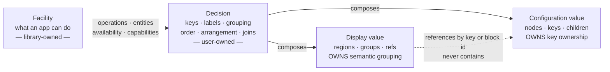

# configuration-exploration

> **PROPOSED / EXPLORATORY — not accepted, and not permission to implement.**
> This is the synthesis artifact of the `configuration-exploration` grove: an
> agreement document to argue with. Nothing here amends an accepted ADR, and
> where it disagrees with current behaviour it says so explicitly. No app was
> run, no layout measured, no runtime embedded, and no plugin built. Every
> validation obligation below is *stated*, never *discharged*.
>
> **Every cost claim here is an estimate of surface area, not a measurement.**
> Words like *small*, *bounded* or *cheap* mean "few new names, few new moving
> parts, no new artifact to ship" — never "measured and found inexpensive".
> Nothing in this exploration timed a round trip, sized a binary, or benchmarked
> a runtime, and the experiments that would are listed at the end.

Synthesises three surveys — [layout](../research/layout-controls-a.md),
[facilities](../research/app-facilities-a.md) and
[runtimes](../research/configuration-runtimes-a.md) — over the
[shared baseline](../research/configuration-exploration-context.md). Cited as
*layout §N*, *facilities §N*, *runtimes §N* throughout. Standing decisions it
builds on and does not restate: ADR-0011 (dispatch structure with attached
Display value), ADR-0012 (the `screen`/`panel`/`open` surface), ADR-0018 (one
explicit Configuration value; reload is relaunch), ADR-0021 (libraries hold
Facilities, configuration holds Decisions), ADR-0022 (config failure degrades),
ADR-0023 (native reach is host-installed), ADR-0026/0027/0028 (the VS Code
companion). Glossary: *Configuration value*, *Display value*, *Panel*, *Loose
region*, *Visit*, *Edge provider*, *Handoff*.

## Problem

Three complaints arrived as one, and they separate cleanly.

**The user cannot say where things go.** The VS Code screen has eight loose
command rows and three list panels; the user wants the editor list to sit with
its previous/next controls and the remaining commands split into their own
groups. That much is authorable today and always has been — a panel is a
Display-value clause referencing rows by key, so grouping costs no key path
(layout §1.2, §9). The gap is not expressiveness.

**The arrangement will not hold still.** `.overlay` is `width: max-content`
(layout §2.1), so the overlay's inline size is a function of its content, and
four consequences follow from that one declaration: flexible tracks size to
content; the renderer's column count is chosen by *measuring* candidate layouts
against a 1.4 aspect target, so a content change is a different answer; lane
packing re-selects lanes when a card's height changes; and the loose region
derives its own column count from the settled overlay width. A longer editor
title therefore re-columnises command rows that did not change. The user has
already chosen the behaviour they want — **keep groups stable; wrap or truncate
titles** — and today's default packing (`grid-lanes`) is the one behaviour that
cannot promise it.

**Facilities and preferences are tangled at the authoring surface, not at the
boundary.** ADR-0021's line is drawn in a defensible place; tracing the VS Code
example finds four items that are ceremony rather than choice — one alphabet
list passed three times, provider/listing pairing restated by hand, a panel
label authored twice, and pool disjointness asserted by the user though the
engine owns the rule (facilities §1.1). Separately, the *language* the user
writes those decisions in is LispKit Scheme, which carries three measured
defects: `string-ref` is Θ(n) and once cost 27 seconds of a leader press; the
runtime cannot protect its own evaluation, which is why ADR-0022 exists; and
immutable pairs plus a thin standard library shape real code (runtimes §1.3).

## Solution

**Four values, and four separations — three already true, one proposed.** The
architecture already has the values; what it lacks is the fourth separation and a
definite width to hang arrangement on.



The three separations that already hold, each load-bearing:

1. **Navigation is not grouping.** A `group`/`open` in the Configuration value
   adds a key path prefix; a `panel` in the Display value adds none. Different
   constructors, different values, never conflated. The user's request is
   entirely the second kind.
2. **Grouping is not key ownership.** The Display value *references* dispatch
   children; it never holds them. Substituting a display cannot change the live
   key set (ADR-0011).
3. **A Facility authors no key and no label** (ADR-0021). It offers operations
   and entities; the user names them.

And the fourth, which this document proposes:

4. **Arrangement is not geometry.** *Which* group an item is in and *which
   track* it occupies are authored facts. *How wide* the result is, and how text
   behaves inside it, are sizing facts. Today both are decided by the same
   measurement pass, which is why one long title moves unrelated rows.

## Decisions

### Stability, defined before a packing behaviour is chosen

"Groups stay in place" is three guarantees, and a design that does not separate
them will over- or under-deliver:

| | Guarantee | What breaks it today |
|---|---|---|
| **S1** | **Membership** — which items share a group, line or lane | measured column count (layout §2.1, ch. 2); lane re-selection (ch. 3) |
| **S2** | **Order** — the sequence within that group | nothing; `sort-rows` is canonical and shared (layout §7) |
| **S3** | **Track assignment** — which column or lane an item occupies | measured column count; lane re-selection |

**A fourth property is *not* stability and must not be promised as such:
vertical extent.** A wrapped title grows its cell, which pushes later content in
the same column down. That is the direct cost of the user's own choice — wrap or
truncate rather than rearrange — and it is the right trade. It should be stated
in the vocabulary, not discovered.

### Automatic and constrained placement are the real axis

The layout survey reads grid/flow/lanes as a stability ranking, concluding that
*"lanes and stability are in tension by definition"* (layout §5). **That is true
of the automatic form of each behaviour and false as a general claim**, and the
distinction matters because the constrained forms keep each behaviour's benefit:

| Behaviour | Automatic form | Constrained form | S1/S3 under a content change |
|---|---|---|---|
| **Grid** | auto-placement over a *measured* track count | pinned track count, placement by declaration order and span | automatic: unstable · constrained: **stable** |
| **Flow** | break the line at a *content-derived* budget | break at a *declared* budget | automatic: unstable · constrained: **stable while child widths and the budget are both fixed** |
| **Lanes** | lane chosen by running height | lane *assigned by the author*; vertical stacking still independent per lane | automatic: unstable by construction · constrained: **stable** |

Three consequences.

- **The instability is the content-derived budget, not the behaviour.** Every
  automatic row above fails for the same reason: the input to placement is a
  measurement of the content being placed. Fix the budget and all three
  behaviours become stable in S1–S3.
- **Constrained lanes are a real option that the survey did not consider.** They
  give stable membership and lane assignment *and* keep independent vertical
  stacking — which is the only thing masonry buys and which aligned grid gives
  up (an aligned grid shares row-track heights, so a tall card pads its
  neighbours).
- **Flow is not currently expressible at all.** `layout` accepts `masonry` and
  `grid` only (layout §5). The loose region *is* a flow of equal-width cells, but
  as a fixed renderer behaviour, not an authorable one.

Today's default is the one cell in the table that cannot deliver the user's
stated requirement, and it is also the one with no fallback on a WebKit lacking
Grid Lanes (layout §4.1). **Both point the same way: the packing behaviour should
be an explicit choice, not an inheritance.**

### The definite width is the primary decision, and it has two inputs

Every channel in layout §2.1 traces to `width: max-content`. Until a width is
definite, truncation cannot fire (layout §2.3), tracks cannot be stable, the
loose region cannot be decoupled, and any new sizing vocabulary inherits all of
it. **This is upstream of every option below and no approach may skip it.**

The design must keep two inputs permanently distinct, because conflating them is
exactly the bug:

- **Arrangement width** — the overlay's own inline size, derived from the
  *declared* track count, track sizing and gaps. Content does not set it.
- **Display budget** — how much room the screen actually has. Pushed from
  `NSScreen` at show time as a custom property or `data-*` attribute; there is no
  such channel today (layout §3).

**Only the display budget may drive a responsive change.** A viewport media query
is not merely unsupported here but *circular*: the WebView fills a panel whose
width the content just asked for (layout §3), so `@media (max-width: …)` would be
measuring the content's own request. With a definite arrangement width, container
queries — available across the whole supported macOS range (layout §4.2) — cover
per-panel responsiveness without needing viewport queries at all.

### Overflow is a user control, with a stated vertical cost

The truncation policy is already written (`text-overflow: ellipsis` on
`.entry-label`, repeated in the block stylesheets) and cannot engage, because
`min-width: 0` *permits* shrinking while nothing *forces* it and the track simply
grows (layout §2.3). Once the arrangement width is definite, the existing CSS
starts working with no new rules — which makes overflow a vocabulary question
rather than a rendering one.

Propose two authored values, defaulting per-arrangement and overridable
per-panel:

- **`'ellipsis`** — single line, clipped with an ellipsis. Vertical extent fixed.
- **`'(wrap . N)`** — wrap to at most N lines, then clip. `-webkit-line-clamp` is
  actively maintained in WebKit as of the Safari 26.4 notes (layout §7).

`'(wrap . N)` grows the row and moves later content in the same column down; the
documentation must say so at the point of use. Neither value may change S1, S2 or
S3 — that is the whole point of choosing them over rearrangement.

### Span under a narrowed arrangement: normalise at resolve

The stylesheet comment beside `.panel-span-wide` asserts that a span of two
clamps to a single explicit track. **The specification says the opposite**: an
unpositioned item whose span exceeds the implicit grid's width causes columns to
be *added* to that grid (layout §4.3). The implicit column is sized by
`grid-auto-columns` — unset, therefore `auto` — not by the explicit track's
`minmax(184px, 1fr)`. So a one-column screen containing a wide panel silently
becomes a two-column grid with mismatched tracks. The comment is not evidence and
must not be inherited.

Three rules are available; this document proposes the first.

| Rule | Behaviour | Why not |
|---|---|---|
| **Normalise at resolve** *(proposed)* | `resolve-display` clamps each panel's span to the arrangement's track count; the stylesheet never sees an over-wide span | — |
| Reject at construction | raise when a panel's span exceeds the authored `cols` | punishes a combination that is *meaningful* under a responsive reduction: a three-track screen narrowing to one on a small display is not an authoring error |
| Responsive maximum | treat a span as an upper bound resolved at render | moves the rule into the renderer, where it cannot be tested at the pure seam |

Normalisation wins because it puts the rule in the one pure function that already
owns the Display value's invariants, it holds under both packing behaviours
without depending on which one the browser implements, and it is checkable
without a browser.

**Normalising at resolve and reducing at render are in tension, and the tension
has to be designed out rather than noticed later.** Resolve time knows the
*authored* track count; only the renderer knows the display budget. If the
renderer may reduce the count, a span normalised against the authored count is
over-wide again at the reduced one, and the implicit-column behaviour is back.

The proposal: **resolve produces one arrangement per declared responsive step,
each already normalised against its own track count**, and the renderer's only
job is to *choose* among them by the display budget. The renderer never
normalises and never derives a track count. That keeps the whole rule inside the
pure function, makes every step checkable without a browser, and makes the
responsive rule an authored fact rather than an emergent one. Its cost is that a
responsive arrangement is a small set of arrangements rather than one — which is
also what makes it inspectable.

### The facility contract: semantic, stated once, over every boundary

ADR-0026's `parts` protocol is already a small facility contract without calling
itself one, and it holds up against LSP and the Neovim API (facilities §3.2).
Generalise exactly it:

| Element | Contract |
|---|---|
| **Queries and actions** | a bounded, named method set. No generic escape hatch — no caller may name an arbitrary host command |
| **Entity identity** | (peer, token), scoped to one snapshot, never reused; a stale target's message arrives nowhere rather than at the wrong entity |
| **Snapshots** | one read per Visit; visible rows and their labels come from the same read, so they cannot disagree |
| **Availability** | every miss — not installed, not activated, stale pointer, wedged host, version mismatch — ends as an **empty listing**, never as wrong rows |
| **Capabilities** | declared, LSP-style. An unknown capability is *absent*, not fatal |
| **Errors** | transport and peer faults map to availability, not to a raised configuration error |

**Bounded, and bounded against the right thing.** The surveys disagreed on where
a facility call runs: one placed evaluation *inside the keyboard tap*, the other
on the main queue. **The main queue is correct** — the tap services its own run
loop on a dedicated thread and installs a capture buffer *before* dispatching
Scheme work, deliberately so that slow evaluation buffers keystrokes rather than
losing them. So a blocking facility call costs a wedged main thread — AppKit, the
overlay, the buffered replay — and not a stalled tap. The discipline is unchanged
(ADR-0014: interactive commands never block), but the failure it guards against
is latency and an unresponsive UI, not input dropped at the tap. Whether input is
ultimately lost is unestablished.

Two additions to what ships today, both small in surface area and both
load-bearing for the scenarios: **capability declaration** (a version integer answers *can we talk*,
not *does this peer support subscriptions*), and **a stated place for
subscriptions** — `parts` deliberately left the door open and nothing pushes
through it yet.

**State the contract once, in Modaliser's own vocabulary, and let boundaries
implement it.** That single decision is what keeps a later language change
*bounded*: a new configuration language then needs **one adapter**, not one
implementation per facility. It is a large saving and not a free one — the adapter still owes
marshalling per operation type, an error mapping, and an inbound-callback story
the day subscriptions land (facilities §3.3).

It also settles what the surveys left open about in-process Swift facilities.
Bootstrap, interface and payload types are three layers: Apple's documented
`NSBundle`/`principalClass` path constrains only the *entry point* to be
Objective-C- or C-visible, and an entry point may hand back an object conforming
to a Swift protocol declared in a shared SDK module both sides link (facilities
§4.1). A Swift facility module is therefore **not ruled out**; its unpriced costs
are that shared SDK's versioning, distribution and library-evolution obligations,
plus a crash radius no in-process shape improves.

**Two defaults, one per boundary — they are not in competition.** For a facility
that stays *inside* the process, the default is a **bundled Scheme library**:
that is where the 52 existing libraries live, both invariant checks cover it, and
passing procedures within the Scheme tier is load-bearing and unbroken. For a
facility that reaches *outside* the process — a controlled app, a peer tool — the
default is an **out-of-process peer** speaking the contract above, because its
walk-away behaviour is the best in the comparison: uninstall the companion and
`config.scm` still loads, the screen still works, the affected panels are empty
and a row offers to reinstall. A Swift facility module sits between them and is
the shape to reach for only when a facility must be native *and* in-process, at
which point §4.1's costs apply. **That the companion "cost nothing extra" is a
statement about its design, not a measurement** — no round trip was timed in this
exploration, and the come-to-rest budget of a capability handshake is experiment
E7.

### Callback ownership: pervasive inside, absent at the edge

The surveys look contradictory here and are not. Facilities §3.1 finds that
Modaliser's facility surface passes procedures constantly; runtimes §2.1 counts
five native libraries accepting a Scheme procedure across seven sites, with two
retained registries. **Both are right about different boundaries**, and the
distinction is the single most useful structural fact in the exploration:

- Procedures are **pervasive inside the Scheme tier** — roughly 1 400
  procedures, 303 anonymous closures, and the whole provider / thunk / predicate
  idiom (runtimes §2.1).
- Procedures are **rare at the Swift edge** — a small enumerable surface.

So a **facility-boundary** redesign does not have to solve procedure passing,
while a **language** change must preserve first-class closures pervasively.

The proposed rule: **the resident configuration language owns every closure; the
facility contract carries no procedure in either direction.** Where a facility
must reach back, it does so as an inbound *message* the host dispatches — which
is the boundary the renderer already runs on in production, data pushed one way
and callbacks arriving as messages (runtimes §2.2).

**Lifetime is the hard part, and it gets harder with two runtimes.** A closure
registered by user configuration is owned by the runtime that created it, and
three obligations follow, all of which Approach 2 must answer explicitly and
Approach 1 largely inherits for free:

- **Scope.** A per-Visit closure — a provider, an `'assigned-fn` hook — dies with
  its Visit. A registered handler lives for the app's lifetime. Those are
  different lifetimes and the contract should name both rather than leaving the
  distinction to whichever registry happens to hold the value.
- **Rooting across a boundary.** Every candidate runtime documents a mechanism
  and none makes it free: Racket wants an object locked against collection and
  relocation, Lua wants an explicit registry reference released by hand
  (runtimes §4.2, §4.5). Each retaining registry becomes an owner with a teardown
  path.
- **Late replies.** A reply arriving after its Visit ended must be **dropped, not
  applied**. Snapshot-scoped identity already gives the test — a token minted in a
  finished Visit is not current — and the existing budget-to-empty discipline
  already covers the timeout half. What no survey establishes is what a *second*
  runtime does with a reply whose continuation belongs to a Visit the first
  runtime has torn down; that is a design obligation of Approach 2 and is
  unpriced.

### Dynamic snapshots, errors, compatibility, lifecycle

**Snapshots (scenario 3).** A Visit takes one snapshot; identities are minted in
it; a re-render inside the Visit reuses it. A refresh that re-snapshots may
change *row membership inside a panel* and must not change S1, S2 or S3 for the
panels themselves — which is precisely what an authored arrangement buys and a
measured one cannot give. Whether such a refresh ever reaches a live overlay is
unestablished (layout §1.3; probe P5).

**Errors, in three layers with three different answers.**

| Layer | Failure | Answer |
|---|---|---|
| Configuration load | read error, type error, unbound variable | ADR-0022, unchanged: the host sequences the load, a failure arms the bundled default, the menu carries the error |
| Display validation | a reference to a key no node owns; a span or track count out of range; a child placed twice or not at all | a **configuration** error, raised before the Handoff latches — never a render-time surprise. This extends `check-loose-coverage`'s existing "every child placed exactly once" over whatever shape the arrangement takes |
| Facility | unavailable, stale, version mismatch | empty listing; the screen still renders |

**Compatibility (scenario 4).** A user's Decision references an operation *by
name*. If a Facility loses that operation, capability declaration turns it into a
missing row — the user's keys, labels and grouping are untouched. **A Facility
change must never invalidate a Decision.** That is only true if capabilities are
declared; with a bare version integer, the same event is an unreachable peer.

**But "absent" and "misspelled" must not collapse into each other.** Silence is
right for an operation the facility *once declared and no longer offers*; it is
wrong for a name the facility has never declared at any version, which is
overwhelmingly a typo and deserves a diagnostic at load. A design that treats
every unknown name as an optional capability turns every typo into a silently
missing row — the worst diagnostic outcome available, and the exact failure
ADR-0022 exists to avoid at the layer above.

Distinguishing them needs information nothing carries today, and there are two
honest ways to get it:

- **The facility declares its retired names** alongside its live ones, so an
  undeclared name is unambiguously an error. Costs the facility a growing list.
- **The configuration declares its expectation** — the user marks a row as
  tolerating absence. Costs the user a word, and makes the default strict.

**This is unresolved**, and the spec should not pretend otherwise: the second is
cheaper and fits ADR-0021 (the user makes the Decision), the first is kinder to
the user. Until one is chosen, the honest statement is that a *declared-then-
withdrawn* capability is silent and everything else is a diagnostic.

**Runtime lifecycle.** Three shapes, and one doctrine that is not reopened.

| Shape | Consequence |
|---|---|
| App-lifetime embedded runtime | today's LispKit. SBCL is *forced* into this: its manual records that C cannot run exit hooks or gracefully undo Lisp initialisation (runtimes §4.3) |
| Restartable helper process | buys clean teardown and crash isolation; costs a protocol carrying per-visit live data |
| Relaunch-only reload | **Modaliser's doctrine** (ADR-0018), and the reason "a plugin cannot be unloaded" is cheap here rather than fatal |

**Hot reload stays rejected.** No candidate's REPL is an argument for it, and any
proposal to revisit it must be made on ADR-0018's own reopening terms.

### Front end versus runtime replacement

Both were compared, as the user asked. Three execution shapes (runtimes §3), and
the front-end shape is the one most often mis-specified:

| Shape | What it cannot do |
|---|---|
| **Startup-only front end** | it must *emit* something, and serialised data cannot carry resident closures — the `'hidden` predicates, provider thunks and `'assigned-fn` hooks |
| **Resident configuration runtime** | two collectors, two error models, and a protocol carrying per-visit live data |
| **Full replacement** | a one-shot port cost, plus every outward seam and ADR-0023 quarantine re-established in the new host |

**Declarative is a spectrum, not a switch.** At one end, data naming
library-exported operations and nothing else: the cross-facility join — discover
the focused VS Code workspace, ask grove for its live task, reveal it — fails
unless the library ships that join. At the other, a data representation carrying
its own sequencing, conditionals, bindings and expressions *can* express it, at
the price of being an additional language and interpreter to design, document and
diagnose. The real variable is **how much interpreter the data format contains**,
and every increment is language-design work the resident-runtime shapes get for
free. **Arbitrary resident user closures are the baseline capability, preserved
unless the user chooses to reduce them.**

**Language shortlist, reasoned — and the choice stays the user's.**

| Candidate | Take it if | It costs |
|---|---|---|
| **LispKit / Scheme** *(recommended first move)* | the goal is to fix what is measurably wrong | nothing to migrate; the three §1.3 defects persist until two are fixed locally and the third upstream, which ADR-0022 already names as its reopening condition |
| **TypeScript on JavaScriptCore** | typed facilities and mainstream editor tooling are the actual pain | the module loader *and* `JSScript` are both private API, so no supported ES modules and no public bytecode cache; something must strip types, in-app or while authoring; and an async pump must be reconciled with ADR-0018's one-shot latch |
| **Lua** | the smallest, most robust embedding is the goal | `lua_pcall` puts protected evaluation at the C API — the shape ADR-0022 wanted — and `_ENV` gives the decision-free contract a real mechanism rather than a grep; but it owes a `longjmp`-safe boundary against Swift frames, explicit handle lifetimes, and it discards or double-hosts 24 000 lines of Scheme, with no static types |
| **Racket** | language-oriented programming is the goal | `#lang` selects reader *and* expander per file — but the tree contains three macros in total, so the power is unsold; framework plus three boot files to package, object locking for retained handles, and eight-year-old startup figures |
| **Common Lisp on SBCL** *(as requested)* | Common Lisp's conditions-and-restarts error model — the richest of the five — and a very large standard library are what is wanted | embedding is documented in SBCL's own manual (`initialize_lisp`, Lisp-as-a-shared-library, `define-alien-callable`), and arm64-darwin is supported and maintained. Against it: process-wide signal handlers in an app that already owns an event tap on a dedicated thread; a fixed-address static space needing a linker flag on Modaliser's own executable on Intel (arm64 equivalent unestablished); a second tracing collector beside LispKit's; an opaque core artifact of unmeasured size; and — per §9.8.1 — no way for C to run exit hooks or undo Lisp initialisation |

**SBCL is viable, and the shape it is viable in is a helper process.** Its
sharpest documented limitation — that an embedded runtime cannot be cleanly shut
down — is an argument *against in-process embedding specifically*, not against
the language or the implementation. Run it as a restartable peer and the
limitation stops mattering, because teardown becomes process exit; what the peer
shape then costs is the protocol carrying per-visit live data, which is the same
cost every out-of-process configuration tier pays. **ECL is an alternative
implementation to weigh, not a redirection**: it is designed for embedding and
its manual carries a dedicated section on it, but its entry points, link target
and platform matrix were not confirmed from primary sources, so recommending it
over SBCL on embedding grounds would be trading a documented cost for an
unverified one. If Common Lisp is wanted, both belong in the comparison and the
in-process/helper choice is the more consequential fork.

**Do not promise all four.** A language-neutral facility contract is a legitimate
target; shipping four runtimes is a different commitment, and the multiplier is
diagnostics, packaging, the decision-free contract and the outward-seam
quarantine — each of which has exactly one enforcement mechanism today, and each
of which is a *recurring* per-language cost (runtimes §7).

### Three approaches, on the same VS Code screen

The scenario throughout: the editor list grouped with `[` and `]`; the remaining
commands (`e`, `p`, `P`, `/`, `L`, `I`) in their own groups placed independently;
and none of it moving when an editor title becomes a long path.

**What the user would actually write, under Approach 1.** This sketch is
*illustrative only* — no constructor in it exists, the keyword set is a strawman,
and it is included because an agreement document about an authoring surface is
not reviewable without one. What it does show faithfully is the **shape**: one
arrangement clause carrying width, packing and overflow, over peer panels whose
children are the screen's existing key nodes moved bodily inside. There is no
key-reference form and this proposal does not add one — a panel's children *are*
the key nodes, which is exactly why regrouping costs no key path.

```scheme
;; ILLUSTRATIVE — not a proposed API.
(screen 'com.microsoft.VSCode
  ;; … providers, alphabets and the state's 'provider slot, unchanged …

  ;; One clause, replacing today's 'cols / 'layout screen keywords.
  (arrangement 'tracks    3           ; declared, not measured
               'placement 'grid       ; grid | flow | lanes, constrained
               'width     'declared   ; the definite width §"definite width" needs
               'overflow  '(wrap . 2) ; per-panel overridable
               'narrow-to '(2 1))     ; responsive steps, chosen by display budget

  (panel "Editors"                    ; the list, with its own controls
    (key "[" "Prev Editor" (code:editor-cycler 'previous))
    (key "]" "Next Editor" (code:editor-cycler 'next))
    (code:editor-listing))

  (panel "Find"                       ; peer group — no key path changes
    (key "p" "File Finder"     (λ () (send-keystroke '(cmd) "p")))
    (key "P" "Command Palette" (λ () (send-keystroke '(cmd shift) "p")))
    (key "/" "Project Search"  (λ () (send-keystroke '(cmd shift) "f"))))

  (panel "Panes" 'overflow 'ellipsis  ; this group prefers one line
    (key "e" "Explorer" code:focus-explorer))

  (panel "Terminals" (code:terminal-listing))
  (panel "Projects"  (code:project-listing)))
```

Four things to read out of it, each a decision made above rather than a syntax
preference:

- **`'tracks 3` is declared, not measured** — that alone removes coupling
  channels 2 and 4, and with `'width 'declared` it removes channel 1.
- **`'narrow-to '(2 1)`** enumerates the responsive steps, so resolve emits three
  pre-normalised arrangements and the renderer only *chooses* — the span rule
  above, made concrete.
- **`'overflow` on the arrangement, overridden on `"Panes"`** — the wrap/truncate
  control the user asked for, at two scopes.
- **Nothing here names a track coordinate.** Placement is still membership plus
  order plus span; the proposal adds stability, not positions.

**Approach 2 writes the same shape in another language** — the arrangement is
data in every candidate, and that is exactly why the layout work is independent
of the language choice. **Approach 3 writes it as a schema-validated document**,
which makes the arrangement *easier*, and the `L` row — the cross-facility join —
the thing it can no longer express without an expression language.

**Approach 1 — Consolidate.** Definite arrangement width plus an explicit packing
choice; overflow as a user control; span normalised at resolve; the display
budget as a separate input; a stable per-panel DOM handle so the CSS escape hatch
that already ships becomes addressable. Facilities: generalise `parts` into one
semantic contract with capability declaration, keeping in-process facilities as
Scheme libraries. Runtime: keep LispKit.

**Approach 2 — Re-front.** Everything in 1, plus an app-owned semantic facility
interface with per-language adapters, and a chosen configuration language over
it — either beside LispKit as the config tier, or replacing it.

**Approach 3 — Constrain.** Configuration becomes data. Layout, keys, labels and
grouping are declarative; behaviour comes from named operations plus whatever
expression language the format carries.

| | 1 — Consolidate | 2 — Re-front | 3 — Constrain |
|---|---|---|---|
| Editor list with `[` `]` | authorable today (layout §9) | same | same |
| Other commands in independent groups | authorable today | same | same |
| Groups stable under a wider title | **yes** — definite width + constrained placement | same mechanism | same mechanism |
| Cross-facility join (Grove Leaf) | works — ordinary code | works | **fails** on named operations alone; works only if the format carries an expression language |
| Typed facilities | no | **yes**, with TypeScript | yes, by construction of the schema |
| New frozen names (ADR-0021) | one small arrangement vocabulary | the same, plus a facility interface | a whole schema |
| Migration event | none | **100 % of `config.scm` at once** | 100 % |
| Enforcement of the decision-free contract | today's greps | needs a per-language answer | strongest — the schema is the enforcement |
| Reversible if wrong | yes | partly — the adapter survives, the port does not | no |

### Provisional recommendation

**Approach 1, shaped so Approach 2 stays reachable without a redesign.**

Three reasons, each cited.

1. **The grouping the user asked for already works; what fails is stability**
   (layout §9). The problem is sizing, and sizing is fixed by one decision —
   who supplies the definite width — that every approach needs equally.
2. **The layout work is independent of the language choice.** Arrangement lives
   in the Display value, which is a pure value resolved by a pure function. So
   the user does not have to settle the language question to get the layout they
   asked for, and nothing about doing layout first forecloses a language change.
3. **Nothing found in three surveys *requires* a language change** (runtimes §8).
   Two of LispKit's three measured defects are local work; the third has a named
   upstream reopening condition. A language change is the largest single
   migration event this architecture admits — it invalidates the whole of the one
   user-owned file at once.

**The one thing to do now that only matters later:** define the facility contract
as a value, in Modaliser's own vocabulary, even while Scheme is its only
consumer. That is what makes Approach 2 an adapter rather than a rewrite, and it
is far less work to do while there is exactly one consumer to check it against
than to retrofit against two — an argument about ordering, not a measured cost.

**What would change this.**

- **If typed facilities are the actual pain** rather than layout, Approach 2
  leads and TypeScript is its candidate — the module-loader and type-stripping
  costs are then worth paying.
- **If probes P1–P3 show that `'cols N` with `'layout 'grid` already holds
  placement**, much of Approach 1 is already shipped and merely undiscovered, and
  the remaining work shrinks to a definite width and an overflow control.
- **If LispKit gains re-entrant protected evaluation and O(1) `string-ref`**, most
  of the runtime case evaporates.
- **If third-party facilities become a requirement**, the facility interface has
  to exist regardless, which makes recommendation-item 3 urgent rather than
  cheap insurance.
- **If nesting is wanted** — no current scenario needs it — a compositional
  layout tree becomes the better base and the arrangement vocabulary becomes its
  defaults (layout §9, option B).

## Requirements

Stated so the approaches can be compared precisely. **Proposed, and none has been
tested.**

### Requirement: Authored arrangement is stable under content change

The overlay SHALL preserve group membership (S1), order (S2) and track
assignment (S3) across any change to the *content* of the items it arranges, when
the arrangement declares a definite width and a constrained placement discipline.

#### Scenario: a longer editor title
- **WHEN** an editor row's label is replaced by a substantially longer path
- **THEN** every panel keeps its group, its order and its track
- **AND** the label wraps or truncates per the arrangement's overflow control
- **AND** no loose command row changes column

#### Scenario: a terminal appears mid-Visit
- **WHEN** a live list gains or loses a row while the screen is displayed
- **THEN** panel membership, order and track assignment are unchanged
- **AND** only that panel's own row set differs

### Requirement: Responsive change uses the display, not the content

The overlay SHALL derive any width-driven change of arrangement from the
available display width, and SHALL NOT derive one from a viewport whose size the
overlay's own content determined.

#### Scenario: a narrow display
- **WHEN** the available display width cannot accommodate the declared track count
- **THEN** the arrangement reduces its track count by its declared responsive rule
- **AND** spans are normalised to the reduced track count
- **AND** an identical overlay on a wide display is unaffected by its own content

### Requirement: A Facility change does not invalidate a Decision

A Facility SHALL declare its capabilities, and the configuration SHALL treat an
undeclared capability as absent rather than as an error.

#### Scenario: a declared capability is withdrawn
- **WHEN** a facility no longer offers an operation it previously declared, and a
  screen references that operation
- **THEN** the row bound to it is absent from the screen
- **AND** every other key, label and group on that screen is unchanged
- **AND** the configuration loads and the screen renders

#### Scenario: an operation name the facility never declared
- **WHEN** a screen references a name no version of the facility has declared
- **THEN** the load produces a diagnostic naming the reference
- **AND** the failure degrades per ADR-0022 rather than rendering a screen with a
  silently missing row

> **Unresolved.** These two scenarios are only distinguishable if something
> records what *was* declared, or the user marks a row as tolerating absence. See
> *Compatibility* above; a design must pick one before this requirement is
> testable.

## Validation obligations, and the seam they belong at

**Nothing below was run.** These are the checks a design would owe, named so that
the approaches can be costed against them.

**One seam, and it already exists.** `resolve-display` is a pure function from a
Display value to a resolved arrangement, exercised today by loading real Scheme
through a real LispKit context. Every obligation below except the last is
checkable there, without a browser, an app or a screenshot — which is the main
argument for putting normalisation and validation in the resolver rather than the
renderer.

| Obligation | Checked at |
|---|---|
| Every dispatch child is placed exactly once | `resolve-display` — extends `check-loose-coverage` over the arrangement's shape |
| A span exceeding the track count normalises to the track count | `resolve-display` |
| `'span 'full` is unaffected by normalisation | `resolve-display` |
| A reference to a key no node owns fails **before** the Handoff latches | configuration validation |
| An out-of-range track count or overflow value fails at construction | the DSL constructors |
| Order is canonical and shared between the panel and list paths | `sort-rows`, already exported for this reason |
| A missing capability yields an empty listing, not an error | the facility contract's own tests, against a canned peer (ADR-0023 keeps it inert) |
| The rendered arrangement matches the resolved one | **not checkable at this seam** — it needs a run, and it is experiment E3 below |

## Open choices — only the user can settle these

**One question is *not* open, and is recorded here so it is not reopened.**
Whether "groups stay in place" means cells or pixels was raised by the layout
survey (its U1) and is already settled by the user's own confirmed choice —
*keep groups stable; wrap or truncate titles*. Wrapping and truncation cannot
fire without a definite width, so that one sentence entails **both** placement
stability (S1–S3) **and** content-independent geometry. Both are requirements
here, not preferences, and the brief says so directly.

1. **Which constrained placement discipline?** Aligned grid, constrained flow, or
   author-pinned lanes all deliver S1–S3. They differ in appearance and density:
   an aligned grid shares row-track heights, so a tall card pads its neighbours;
   pinned lanes let each column stack independently; constrained flow packs by
   line. A preference, not a correctness question.
2. **Wrap to N lines, or single-line ellipsis, as the default?** Both are
   proposed as controls; one has to be the default.
3. **Is responsiveness to display width wanted at all**, or is a fixed,
   predictable overlay preferable? It is absent entirely today, so it is an
   addition either way.
4. **Does the measured aspect-ratio balance survive** once a declared track count
   is the norm? The 1.4 target was already declined as an authored knob once; the
   live question is whether the *policy* survives, not the constant.
5. **Should third parties be able to ship facilities at all?** The answer decides
   whether the facility interface is cheap insurance or urgent work.
6. **Does the configuration surface stay Turing-complete?** The single
   highest-leverage question in the exploration, and the cross-facility join is
   its test case.
7. **Are static types in the configuration worth a language change**, and are
   s-expressions a value to preserve or an obstacle to remove?
8. **Is notarisation on the roadmap?** It prices the JIT-entitlement column that
   is dormant today, and it prices third-party plugin signing.

## Experiments this exploration could not run

Documentation-only by charter; each is recorded, none attempted.

- **E1.** Does `CSS.supports('display', 'grid-lanes')` return true in Modaliser's
  WKWebView at the macOS 14 floor? Settles whether today's observed behaviour is
  lanes or an unstyled block stack (layout §11, P1).
- **E2.** On a real VS Code screen, does a long path (a) widen tracks, (b) change
  the balanced column count, (c) change the loose-row column count, (d) engage
  the ellipsis? Four answers pin all four coupling channels at once (P2).
- **E3.** Does `'cols 3` with `'layout 'grid` hold placement across a content
  change today? If yes, part of the requirement already ships (P3).
- **E4.** With `'cols 1` and a wide panel, does the grid render one track or two
  — under `'layout 'grid`, and under the lanes default (P6)?
- **E5.** Does a definite-width overlay feel worse on narrow screens — short
  lists in a wide box? A prototype answers this; a document cannot.
- **E6.** Startup cost, resident memory and overlay latency for any candidate
  runtime inside a `.app`. Nothing in the runtime survey establishes that any
  candidate is fast enough, small enough, or coexists without incident.
- **E7.** Whether a capability-negotiating handshake costs anything measurable at
  come-to-rest.

## Out of scope

- **Implementation, prototyping and planning.** This grove is exploratory by
  charter. No implementation leaf exists, none is authorised, and a recommendation
  here is not an accepted decision.
- **Amending accepted ADRs.** ADR-0011, 0012, 0018, 0021, 0022, 0023 and
  0026–0028 stand as written. Where this document proposes something they do not
  cover — an arrangement vocabulary, capability declaration, a facility interface
  as a value — that is a *proposal*, and adopting it would mean a new ADR or an
  explicit rework, not a silent edit.
- **Hot reload.** Rejected in ADR-0018 on orphan-state grounds; no candidate
  runtime's REPL reopens it. Reload is relaunch.
- **A fix programme for LispKit's measured defects.** They inform migration cost
  and belong in the trade-off; they are not this exploration's subject.
- **Choosing a language.** A shortlist with reasons is the deliverable. The choice
  is the user's, and questions 6 and 7 above are upstream of it.
- **A plugin ABI, packaging format or marketplace.** Swift-based delivery is
  assessed as a candidate with unpriced costs, not settled as a mechanism.
