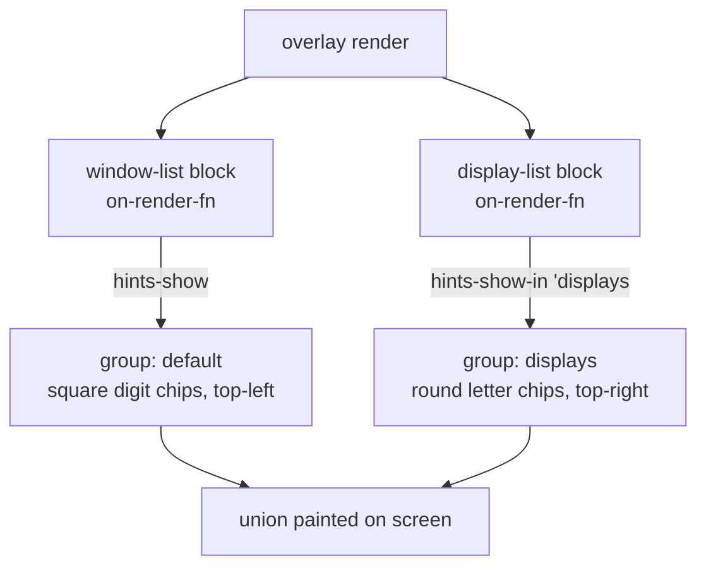

# Display Window Commands Implementation Plan

> **For agentic workers:** REQUIRED SUB-SKILL: Use superpowers:subagent-driven-development (recommended) or superpowers:executing-plans to implement this plan task-by-task. Steps use checkbox (`- [ ]`) syntax for tracking.

**Goal:** Add display-aware window management to Modaliser — move the focused window to another display (preserving its size/position as a fraction of each display's visible frame), paint round "display chips" alongside the square window chips, and focus a display.

**Architecture:** Three new native primitives in `WindowLibrary`/`WindowManipulator` (`list-displays`, `set-focused-window-frame`, `focus-display`); named hint groups in `HintsLibrary` so two chip painters coexist; two new portable Scheme libraries (`(modaliser blocks display-list)` paints chips + renders rows, `(modaliser display-actions)` bundles dispatch keys and owns the pure proportional-remap math); a `'display` chip-theme variant; one config line.

**Tech Stack:** Swift 5.9 (AppKit/Accessibility/CoreGraphics) + embedded LispKit Scheme (R7RS `define-library`), XCTest/swift-testing, WKWebView-backed overlay.

## Global Constraints

Copied verbatim from the spec and project conventions — every task's requirements implicitly include these:

- **Terminology:** a physical monitor is a **display**, never a "screen" (`screen` is a reserved overlay-DSL word). Native names use `display`.
- **Portability contract:** files under `Sources/Modaliser/Scheme/lib/modaliser/**` must import only `(scheme …)`, `(srfi …)`, and other `(modaliser …)` libraries — never the host LispKit library. Prose comments in those files must not contain the literal `(` + `lispkit` + ` ` token (it trips the grep gate). Run `./scripts/check-portable-surface.sh` after touching `lib/modaliser` — it must stay green.
- **No live-env mutation in tests:** never call a primitive that moves/focuses a real window/display/mouse from a unit test (it would damage the user's session). Mutators get `(procedure? …)` existence checks only — exactly as the existing `WindowLibraryTests` treats `move-window`/`center-window`/`restore-window`. Only read-only primitives (`list-displays`) are invoked-and-asserted.
- **Coordinate space:** `x y w h` everywhere in this feature are AX top-left-origin coords (the space `move-window`, `list-current-space-windows`, `hints-show`, and `find-chip-position` already use). Display rects are the **visible frame** (menu bar + Dock excluded).
- **Config sync:** any edit to `~/.config/modaliser/config.scm` is mirrored into `Sources/Modaliser/Scheme/default-config.scm` (and vice versa) so the bundled first-run default tracks the live config.
- **Install flow:** source changes need `./scripts/install.sh` to take effect in the installed `.app`; "Relaunch" only restarts the stale bundle.
- **Test runs:** per-task, run only the new suite with `swift test --filter <SuiteName>` (fast, and sidesteps the pre-existing `ModaliserAppsItermLibraryTests` signal-10 crash). For a full-suite run use `swift test --skip ModaliserAppsItermLibraryTests --skip HttpLibraryTests`.
- **Mermaid, never ASCII art** for diagrams in docs.
- `move-window` is **left unchanged**.

**Spec:** `docs/superpowers/specs/2026-06-30-display-window-commands-design.md` is the source of truth.

---

## File Structure

**Native (Swift):**
- `Sources/Modaliser/WindowManipulator.swift` (modify) — add `listDisplays()`, `setFocusedWindowFrame(...)`, `focusDisplay(_:)`, a `DisplayInfo` struct, and de-private `axVisibleFrame`.
- `Sources/Modaliser/WindowLibrary.swift` (modify) — declare `list-displays`, `set-focused-window-frame`, `focus-display`.
- `Sources/Modaliser/HintsLibrary.swift` (modify) — key panels by group; add `hints-show-in`, `hints-hide-in`; keep `hints-show`/`hints-hide` compatible.

**Portable Scheme + assets:**
- `Sources/Modaliser/Scheme/lib/modaliser/theming.sld` (modify) — add the `'display` chip-theme variant (seed, probe div, probe-script field, handler, branch).
- `Sources/Modaliser/Scheme/base.css` (modify) — add the `.chip.display` rule.
- `Sources/Modaliser/Scheme/lib/modaliser/blocks/display-list.sld` (create) — chip + row block constructor.
- `Sources/Modaliser/Scheme/lib/modaliser/blocks/display-list.css` (create) — `.block-display-list` row styling.
- `Sources/Modaliser/Scheme/lib/modaliser/blocks/display-list.js` (create) — `overlayBlockRenderers['display-list']`.
- `Sources/Modaliser/Scheme/lib/modaliser/display-actions.sld` (create) — dispatch-key wrapper + pure remap math.

**Config:**
- `Sources/Modaliser/Scheme/default-config.scm` (modify) — import prefix + wire block.
- `~/.config/modaliser/config.scm` (modify) — same (config sync).

**Tests:**
- `Tests/ModaliserTests/WindowLibraryTests.swift` (modify) — `list-displays` shape + the two mutators' existence.
- `Tests/ModaliserTests/HintsLibraryTests.swift` (create) — named-group procedures.
- `Tests/ModaliserTests/ModaliserThemingLibraryTests.swift` (modify) — `'display` variant.
- `Tests/ModaliserTests/BlocksDisplayListLibraryTests.swift` (create) — block hooks + chip geometry.
- `Tests/ModaliserTests/ModaliserDisplayActionsLibraryTests.swift` (create) — remap math + dispatch lift.

**Docs:**
- `docs/reference/libraries.md`, `CONTEXT.md`, `docs/how-to/move-and-focus-windows-across-displays.md`.

---

## Task 1: Native `list-displays`

**Files:**
- Modify: `Sources/Modaliser/WindowManipulator.swift` (add `DisplayInfo`, `listDisplays()`; change `axVisibleFrame` from `private` to non-private `static`)
- Modify: `Sources/Modaliser/WindowLibrary.swift` (declare + implement `list-displays`)
- Test: `Tests/ModaliserTests/WindowLibraryTests.swift`

**Interfaces:**
- Produces (Swift): `WindowManipulator.DisplayInfo { let id: CGDirectDisplayID; let frame: CGRect; let isPrimary: Bool }`; `static func listDisplays() -> [DisplayInfo]` (sorted ascending by `frame.origin.x`).
- Produces (Scheme): `(list-displays) → (((id . N) (x . X) (y . Y) (w . W) (h . H) (is-primary . BOOL)) …)`, one alist per display, left-to-right by `x`, AX-visible-frame coords.

- [ ] **Step 1: Write the failing test**

Add to `Tests/ModaliserTests/WindowLibraryTests.swift`, inside `struct WindowLibraryTests`:

```swift
    @Test func listDisplaysIsProcedure() throws {
        let engine = try SchemeEngine()
        #expect(try engine.evaluate("(procedure? list-displays)") == .true)
    }

    @Test func listDisplaysReturnsWellFormedAlists() throws {
        // Read-only primitive — safe to call. Assert structural shape and
        // left-to-right (ascending x) ordering without asserting a concrete
        // display count (CI may have 0 or 1 screen).
        let engine = try SchemeEngine()
        try engine.evaluate("(import (modaliser window))")
        try engine.evaluate("(define ds (list-displays))")
        #expect(try engine.evaluate("(list? ds)") == .true)
        try engine.evaluate("""
          (define well-formed?
            (let loop ((xs ds))
              (cond ((null? xs) #t)
                    ((not (and (assoc 'id (car xs)) (assoc 'x (car xs))
                               (assoc 'y (car xs)) (assoc 'w (car xs))
                               (assoc 'h (car xs)) (assoc 'is-primary (car xs)))) #f)
                    (else (loop (cdr xs))))))
          (define ordered?
            (let loop ((xs ds) (prev #f))
              (cond ((null? xs) #t)
                    ((and prev (< (cdr (assoc 'x (car xs))) prev)) #f)
                    (else (loop (cdr xs) (cdr (assoc 'x (car xs))))))))
        """)
        #expect(try engine.evaluate("well-formed?") == .true)
        #expect(try engine.evaluate("ordered?") == .true)
    }
```

- [ ] **Step 2: Run test to verify it fails**

Run: `swift test --filter WindowLibraryTests/listDisplaysIsProcedure`
Expected: FAIL — evaluating `(procedure? list-displays)` errors with an unbound-variable / not-a-procedure error (the symbol `list-displays` is not defined).

- [ ] **Step 3: Implement — WindowManipulator**

In `Sources/Modaliser/WindowManipulator.swift`, change the `axVisibleFrame` declaration from private to non-private (so `WindowLibrary` paths and the new method can share it). Find:

```swift
    /// Convert an NSScreen's visibleFrame from Cocoa coordinates (bottom-left origin)
    /// to screen coordinates (top-left origin) used by the Accessibility API.
    private static func axVisibleFrame(for screen: NSScreen) -> CGRect {
```

Replace the `private static func axVisibleFrame` line with:

```swift
    static func axVisibleFrame(for screen: NSScreen) -> CGRect {
```

Then add, immediately after the `enum WindowManipulator {` opening (just below the `static func activateApp` block is fine — place it near the top so it reads as part of the public surface):

```swift
    /// One display's identity + AX-visible-frame geometry, used by
    /// `(list-displays)` to power display-chip placement and the
    /// proportional move-remap. `frame` is the visible frame (menu bar +
    /// Dock excluded) in AX top-left coords — the same space `move-window`
    /// and `hints-show` use. `id` is the stable CGDirectDisplayID.
    struct DisplayInfo {
        let id: CGDirectDisplayID
        let frame: CGRect
        let isPrimary: Bool
    }

    /// All displays, left-to-right by visible-frame x. `is-primary` flags
    /// `NSScreen.screens[0]` (the menu-bar display) regardless of sort
    /// position — a display to the left has a smaller x but isn't primary.
    static func listDisplays() -> [DisplayInfo] {
        let primary = NSScreen.screens.first
        let key = NSDeviceDescriptionKey("NSScreenNumber")
        return NSScreen.screens.map { screen in
            let id = (screen.deviceDescription[key] as? NSNumber)?.uint32Value ?? 0
            return DisplayInfo(
                id: id,
                frame: axVisibleFrame(for: screen),
                isPrimary: screen === primary)
        }.sorted { $0.frame.origin.x < $1.frame.origin.x }
    }
```

- [ ] **Step 4: Implement — WindowLibrary**

In `Sources/Modaliser/WindowLibrary.swift`, add to `declarations()` (after the `focused-window` line):

```swift
        self.define(Procedure("list-displays", listDisplaysFunction))
```

And add the function in the `// MARK: - Functions` section (after `focusedWindowFunction`):

```swift
    /// (list-displays) → list of alists, one per display, left-to-right by x.
    /// Each: ((id . N) (x . X) (y . Y) (w . W) (h . H) (is-primary . BOOL)).
    /// Coords are the display's AX-visible frame — the space move-window,
    /// list-current-space-windows, and hints-show all use. Powers both
    /// display-chip placement and the proportional move-remap.
    private func listDisplaysFunction() -> Expr {
        let displays = WindowManipulator.listDisplays()
        var result: Expr = .null
        for d in displays.reversed() {
            let alist = SchemeAlistLookup.makeAlist([
                ("id", .fixnum(Int64(d.id))),
                ("x", .fixnum(Int64(d.frame.origin.x))),
                ("y", .fixnum(Int64(d.frame.origin.y))),
                ("w", .fixnum(Int64(d.frame.size.width))),
                ("h", .fixnum(Int64(d.frame.size.height))),
                ("is-primary", .makeBoolean(d.isPrimary)),
            ], symbols: self.context.symbols)
            result = .pair(alist, result)
        }
        return result
    }
```

- [ ] **Step 5: Run tests to verify they pass**

Run: `swift test --filter WindowLibraryTests`
Expected: PASS — all `WindowLibraryTests` (existing + the two new `listDisplays…`).

- [ ] **Step 6: Commit**

```bash
git add Sources/Modaliser/WindowManipulator.swift Sources/Modaliser/WindowLibrary.swift Tests/ModaliserTests/WindowLibraryTests.swift
git commit -m "feat(display-window-commands): add (list-displays) native primitive"
```

---

## Task 2: Native `set-focused-window-frame` + `focus-display`

**Files:**
- Modify: `Sources/Modaliser/WindowManipulator.swift` (add `setFocusedWindowFrame`, `focusDisplay`, mouse helpers)
- Modify: `Sources/Modaliser/WindowLibrary.swift` (declare + implement both)
- Test: `Tests/ModaliserTests/WindowLibraryTests.swift`

**Interfaces:**
- Produces (Scheme): `(set-focused-window-frame x y w h) → void` — absolute AX-coord placement of the focused window. `(focus-display id) → void` — give keyboard focus to display `id`.
- Both are mutators: **existence-tested only** (never invoked from tests, per the no-live-env-mutation constraint).

- [ ] **Step 1: Write the failing test**

Add to `struct WindowLibraryTests`:

```swift
    @Test func setFocusedWindowFrameIsProcedure() throws {
        // Mutator — existence check only; calling it would move a real window.
        let engine = try SchemeEngine()
        #expect(try engine.evaluate("(procedure? set-focused-window-frame)") == .true)
    }

    @Test func focusDisplayIsProcedure() throws {
        // Mutator — existence check only; calling it would warp the mouse /
        // raise a real window in the user's live session.
        let engine = try SchemeEngine()
        #expect(try engine.evaluate("(procedure? focus-display)") == .true)
    }
```

- [ ] **Step 2: Run test to verify it fails**

Run: `swift test --filter WindowLibraryTests/setFocusedWindowFrameIsProcedure`
Expected: FAIL — `set-focused-window-frame` is unbound.

- [ ] **Step 3: Implement — WindowManipulator mechanics**

In `Sources/Modaliser/WindowManipulator.swift`, add these methods (place them after `moveFocusedWindow`):

```swift
    /// Absolute placement of the focused window in AX coords — the absolute
    /// sibling of fractional `moveFocusedWindow`. Resolves the window via the
    /// same cold-AX-safe path, saves its frame first (so `restore-window`
    /// still works), and wraps the writes in `withResizableApp` (the EUI flip).
    static func setFocusedWindowFrame(x: CGFloat, y: CGFloat, width: CGFloat, height: CGFloat) {
        guard let (window, frame) = focusedWindowAndFrame() else { return }
        saveFrame(window, frame: frame)
        withResizableApp(window) {
            setWindowPosition(window, x: x, y: y)
            setWindowSize(window, width: width, height: height)
        }
    }

    /// Give keyboard focus to display `id` so macOS Space / Mission-Control
    /// keyboard commands act on it. (1) Find the topmost regular window whose
    /// bounds-centre lies on the display by walking CGWindowList front-to-back
    /// (z-order); raise it (AXRaise + AXMain + AXFocused) and activate its app.
    /// (2) Warp the mouse to the display centre. (3) If no window was found,
    /// synthesize a desktop click so the display still becomes active.
    static func focusDisplay(_ id: CGDirectDisplayID) {
        let bounds = CGDisplayBounds(id)   // global display coords, top-left origin
        let center = CGPoint(x: bounds.midX, y: bounds.midY)
        let myPID = ProcessInfo.processInfo.processIdentifier
        var raised = false

        let options: CGWindowListOption = [.optionOnScreenOnly, .excludeDesktopElements]
        if let list = CGWindowListCopyWindowInfo(options, kCGNullWindowID) as? [[String: Any]] {
            for entry in list {
                guard let pid = (entry[kCGWindowOwnerPID as String] as? NSNumber)?.int32Value,
                      pid != myPID,
                      let layer = (entry[kCGWindowLayer as String] as? NSNumber)?.intValue,
                      layer == 0,   // 0 == normal app window layer; skip menus/overlays
                      let b = entry[kCGWindowBounds as String] as? [String: Any],
                      let bx = (b["X"] as? NSNumber)?.doubleValue,
                      let by = (b["Y"] as? NSNumber)?.doubleValue,
                      let bw = (b["Width"] as? NSNumber)?.doubleValue,
                      let bh = (b["Height"] as? NSNumber)?.doubleValue
                else { continue }
                let windowCenter = CGPoint(x: bx + bw / 2, y: by + bh / 2)
                if !bounds.contains(windowCenter) { continue }

                // Best-effort: raise the AX window whose origin matches this
                // CGWindowList entry, then activate the owning app.
                let appElement = AXUIElementCreateApplication(pid)
                if let windows = axAttribute(appElement, kAXWindowsAttribute) as? [AXUIElement] {
                    for w in windows {
                        if let pos = axPosition(w),
                           abs(pos.x - bx) < 2, abs(pos.y - by) < 2 {
                            AXUIElementSetAttributeValue(w, kAXMainAttribute as CFString, kCFBooleanTrue)
                            AXUIElementSetAttributeValue(w, kAXFocusedAttribute as CFString, kCFBooleanTrue)
                            AXUIElementPerformAction(w, kAXRaiseAction as CFString)
                            break
                        }
                    }
                }
                NSRunningApplication(processIdentifier: pid)?.activate()
                raised = true
                break
            }
        }

        warpMouse(to: center)
        if !raised {
            synthesizeClick(at: center)
        }
    }

    /// Warp the cursor to `p` and post a synthetic mouse-moved event so the
    /// window server registers the cursor on the destination display.
    private static func warpMouse(to p: CGPoint) {
        CGWarpMouseCursorPosition(p)
        if let move = CGEvent(mouseEventSource: nil, mouseType: .mouseMoved,
                              mouseCursorPosition: p, mouseButton: .left) {
            move.post(tap: .cghidEventTap)
        }
    }

    /// Synthesize a left click at `p` — used only when no window was found on
    /// the target display, so the desktop click still makes the display active.
    private static func synthesizeClick(at p: CGPoint) {
        let src = CGEventSource(stateID: .hidSystemState)
        if let down = CGEvent(mouseEventSource: src, mouseType: .leftMouseDown,
                              mouseCursorPosition: p, mouseButton: .left),
           let up = CGEvent(mouseEventSource: src, mouseType: .leftMouseUp,
                            mouseCursorPosition: p, mouseButton: .left) {
            down.post(tap: .cghidEventTap)
            up.post(tap: .cghidEventTap)
        }
    }
```

- [ ] **Step 4: Implement — WindowLibrary**

In `Sources/Modaliser/WindowLibrary.swift` `declarations()`, add (after `list-displays`):

```swift
        self.define(Procedure("set-focused-window-frame", setFocusedWindowFrameFunction))
        self.define(Procedure("focus-display", focusDisplayFunction))
```

And add the functions (after `listDisplaysFunction`):

```swift
    /// (set-focused-window-frame x y w h) → void
    /// Absolute placement of the focused window in AX coords — the absolute
    /// sibling of fractional move-window. Args are coerced to doubles.
    private func setFocusedWindowFrameFunction(_ xExpr: Expr, _ yExpr: Expr,
                                               _ wExpr: Expr, _ hExpr: Expr) throws -> Expr {
        let x = try xExpr.asDouble(coerce: true)
        let y = try yExpr.asDouble(coerce: true)
        let w = try wExpr.asDouble(coerce: true)
        let h = try hExpr.asDouble(coerce: true)
        WindowManipulator.setFocusedWindowFrame(x: x, y: y, width: w, height: h)
        return .void
    }

    /// (focus-display id) → void
    /// Give keyboard focus to display `id` (a CGDirectDisplayID from
    /// list-displays) so macOS Space / Mission-Control keys act on it.
    private func focusDisplayFunction(_ idExpr: Expr) throws -> Expr {
        let id = CGDirectDisplayID(try idExpr.asInt64())
        WindowManipulator.focusDisplay(id)
        return .void
    }
```

- [ ] **Step 5: Run tests to verify they pass**

Run: `swift test --filter WindowLibraryTests`
Expected: PASS — including `setFocusedWindowFrameIsProcedure` and `focusDisplayIsProcedure`.

- [ ] **Step 6: Commit**

```bash
git add Sources/Modaliser/WindowManipulator.swift Sources/Modaliser/WindowLibrary.swift Tests/ModaliserTests/WindowLibraryTests.swift
git commit -m "feat(display-window-commands): add set-focused-window-frame + focus-display primitives"
```

---

## Task 3: Named hint groups in HintsLibrary

**Files:**
- Modify: `Sources/Modaliser/HintsLibrary.swift`
- Test: `Tests/ModaliserTests/HintsLibraryTests.swift` (create)

**Interfaces:**
- Consumes: nothing new.
- Produces (Scheme): `(hints-show hint-list)` — unchanged signature, now manages the `"default"` group. `(hints-show-in group hint-list)` — rebuild only `group`'s panels (group is a symbol or string). `(hints-hide)` — clear **all** groups. `(hints-hide-in group)` — clear one group.
- The visible chip set is the union of all groups; `hints-show`/`hints-show-in` for one group never clear another.

- [ ] **Step 1: Write the failing test**

Create `Tests/ModaliserTests/HintsLibraryTests.swift`:

```swift
import Testing
@testable import Modaliser

@Suite("Hints Library — named groups")
struct HintsLibraryTests {

    @Test func hintsProceduresExist() throws {
        let engine = try SchemeEngine()
        #expect(try engine.evaluate("(procedure? hints-show)") == .true)
        #expect(try engine.evaluate("(procedure? hints-hide)") == .true)
        #expect(try engine.evaluate("(procedure? hints-show-in)") == .true)
        #expect(try engine.evaluate("(procedure? hints-hide-in)") == .true)
    }

    @Test func namedGroupShowHideDoesNotThrow() throws {
        // Empty hint-list paints no panels (safe in a headless test), so this
        // exercises the group-keyed show/hide plumbing without creating UI.
        let engine = try SchemeEngine()
        try engine.evaluate("(import (modaliser hints))")
        #expect(try engine.evaluate("(begin (hints-show-in 'displays '()) #t)") == .true)
        #expect(try engine.evaluate("(begin (hints-hide-in 'displays) #t)") == .true)
        #expect(try engine.evaluate("(begin (hints-show '()) #t)") == .true)
        #expect(try engine.evaluate("(begin (hints-hide) #t)") == .true)
    }
}
```

- [ ] **Step 2: Run test to verify it fails**

Run: `swift test --filter HintsLibraryTests/hintsProceduresExist`
Expected: FAIL — `hints-show-in` is unbound.

- [ ] **Step 3: Implement — storage + declarations**

In `Sources/Modaliser/HintsLibrary.swift`, replace the storage declaration:

```swift
    /// Live hint panels, kept alive until hints-hide is called.
    private var panels: [NSPanel] = []
```

with:

```swift
    /// Live hint panels, keyed by group string so independent painters (window
    /// chips, display chips, iTerm panes) coexist without clobbering each other.
    /// hints-show owns the "default" group; hints-show-in names its own.
    private var panels: [String: [NSPanel]] = [:]

    /// The group hints-show / hints-hide operate on (backward-compatible API).
    private static let defaultGroup = "default"
```

Replace the `declarations()` body:

```swift
    public override func declarations() {
        self.define(Procedure("hints-show", hintsShowFunction))
        self.define(Procedure("hints-hide", hintsHideFunction))
    }
```

with:

```swift
    public override func declarations() {
        self.define(Procedure("hints-show", hintsShowFunction))
        self.define(Procedure("hints-show-in", hintsShowInFunction))
        self.define(Procedure("hints-hide", hintsHideFunction))
        self.define(Procedure("hints-hide-in", hintsHideInFunction))
    }
```

- [ ] **Step 4: Implement — show/hide functions**

Replace the whole `hintsShowFunction` (from `private func hintsShowFunction` through its closing `}` before `logChipRects`) with:

```swift
    /// (hints-show hint-list) → void — manages the "default" group.
    /// hint-list shape is unchanged (see makeHintPanel for the per-entry keys).
    private func hintsShowFunction(_ hintsExpr: Expr) throws -> Expr {
        runOnMain { self.rebuild(group: Self.defaultGroup, from: hintsExpr) }
        return .void
    }

    /// (hints-show-in group hint-list) → void — rebuild only `group`'s panels,
    /// leaving other groups on screen. `group` is a symbol ('displays) or a
    /// string. The visible chip set is the union of all groups.
    private func hintsShowInFunction(_ groupExpr: Expr, _ hintsExpr: Expr) throws -> Expr {
        let group = Self.groupName(groupExpr)
        runOnMain { self.rebuild(group: group, from: hintsExpr) }
        return .void
    }

    /// Rebuild one group's panels from a hint-list, running the per-group
    /// overlap self-check on just that group's painted rects.
    private func rebuild(group: String, from hintsExpr: Expr) {
        self.closePanels(in: group)
        var built: [NSPanel] = []
        var dumped: [(label: String, x: Int, y: Int, w: Int, h: Int)] = []
        var current = hintsExpr
        while case .pair(let entry, let tail) = current {
            if let panel = self.makeHintPanel(from: entry) {
                built.append(panel)
            }
            if let label = SchemeAlistLookup.lookupString(entry, key: "label"),
               let x = SchemeAlistLookup.lookupFixnum(entry, key: "x"),
               let y = SchemeAlistLookup.lookupFixnum(entry, key: "y"),
               let w = SchemeAlistLookup.lookupFixnum(entry, key: "w"),
               let h = SchemeAlistLookup.lookupFixnum(entry, key: "h") {
                dumped.append((label, Int(x), Int(y), Int(w), Int(h)))
            }
            current = tail
        }
        self.panels[group] = built
        Self.logChipRects(dumped)
    }

    /// Coerce a Scheme group argument (symbol or string) to a group key.
    private static func groupName(_ expr: Expr) -> String {
        if case .symbol(let s) = expr { return s.identifier }
        return (try? expr.asString()) ?? defaultGroup
    }
```

Replace `hintsHideFunction` and `closeAllPanels` with the group-aware versions. Find:

```swift
    /// (hints-hide) → void
    private func hintsHideFunction() -> Expr {
        runOnMain { self.closeAllPanels() }
        return .void
    }
```

Replace with:

```swift
    /// (hints-hide) → void — clears ALL groups (whole overlay closing).
    private func hintsHideFunction() -> Expr {
        runOnMain { self.closeAllPanels() }
        return .void
    }

    /// (hints-hide-in group) → void — clears one group.
    private func hintsHideInFunction(_ groupExpr: Expr) -> Expr {
        let group = Self.groupName(groupExpr)
        runOnMain { self.closePanels(in: group) }
        return .void
    }
```

Find:

```swift
    private func closeAllPanels() {
        for p in panels {
            p.orderOut(nil)
            p.close()
        }
        panels.removeAll()
    }
```

Replace with:

```swift
    /// Close and forget one group's panels.
    private func closePanels(in group: String) {
        guard let ps = panels[group] else { return }
        for p in ps {
            p.orderOut(nil)
            p.close()
        }
        panels[group] = nil
    }

    /// Close and forget every group's panels.
    private func closeAllPanels() {
        for (_, ps) in panels {
            for p in ps {
                p.orderOut(nil)
                p.close()
            }
        }
        panels.removeAll()
    }
```

- [ ] **Step 5: Run tests to verify they pass**

Run: `swift test --filter HintsLibraryTests`
Expected: PASS — both tests. (Also confirms the refactor didn't break compilation of the existing `hints-show`/`hints-hide` callers.)

- [ ] **Step 6: Commit**

```bash
git add Sources/Modaliser/HintsLibrary.swift Tests/ModaliserTests/HintsLibraryTests.swift
git commit -m "feat(display-window-commands): key hint panels by group; add hints-show-in/hints-hide-in"
```

---

## Task 4: `'display` chip-theme variant + `.chip.display` CSS

**Files:**
- Modify: `Sources/Modaliser/Scheme/lib/modaliser/theming.sld`
- Modify: `Sources/Modaliser/Scheme/base.css`
- Test: `Tests/ModaliserTests/ModaliserThemingLibraryTests.swift`

**Interfaces:**
- Produces (Scheme): `(current-chip-theme 'display)` → chip alist (same key shape as `'normal`/`'faded`), resolved from the `.chip` + `.chip.display` CSS at boot, or the seed default before the probe runs.

- [ ] **Step 1: Write the failing test**

Add to `struct ModaliserThemingLibraryTests`:

```swift
    @Test func currentChipThemeDisplayReturnsSeedDefaults() throws {
        // The 'display variant resolves .chip + .chip.display. Before the probe
        // runs (never, in unit tests), it returns seed defaults mirroring those
        // rules — a distinct background from the .chip (window-chip) default.
        let engine = try SchemeEngine()
        try engine.evaluate("(import (modaliser theming))")
        try engine.evaluate("(define t (current-chip-theme 'display))")
        #expect(try engine.evaluate("(equal? (cdr (assoc 'background t)) \"#2ca58d\")") == .true)
        #expect(try engine.evaluate("(equal? (cdr (assoc 'color t)) \"#ffffff\")") == .true)
        #expect(try engine.evaluate("(= (cdr (assoc 'font-size t)) 56)") == .true)
        #expect(try engine.evaluate("(= (cdr (assoc 'padding t)) 16)") == .true)
        #expect(try engine.evaluate("(= (cdr (assoc 'border-width t)) 1)") == .true)
    }
```

- [ ] **Step 2: Run test to verify it fails**

Run: `swift test --filter ModaliserThemingLibraryTests/currentChipThemeDisplayReturnsSeedDefaults`
Expected: FAIL — `(current-chip-theme 'display)` raises (`'display` is neither `'normal` nor `'faded`).

- [ ] **Step 3: Implement — seed default**

In `Sources/Modaliser/Scheme/lib/modaliser/theming.sld`, after the `chip-theme-faded` definition, add:

```scheme
    ;; Display-chip seed — mirrors .chip + .chip.display in base.css. Distinct
    ;; teal background so display chips read apart from the dodgerblue window
    ;; chips even before the probe resolves the live CSS. The painter
    ;; (display-chip-for) computes the round corner-radius itself, so the
    ;; corner-radius value here is unused for display chips.
    (define chip-theme-display
      (list (cons 'color "#ffffff")
            (cons 'background "#2ca58d")
            (cons 'font-size 56)
            (cons 'padding 16)
            (cons 'corner-radius 8)
            (cons 'border-width 1)
            (cons 'border-color "#000000")))
```

- [ ] **Step 4: Implement — variant branch**

Replace the `current-chip-theme` body:

```scheme
    (define (current-chip-theme . args)
      (let ((variant (if (null? args) 'normal (car args))))
        (cond
          ((eq? variant 'normal) chip-theme-normal)
          ((eq? variant 'faded)  chip-theme-faded)
          (else (error
                  "current-chip-theme: variant must be 'normal or 'faded"
                  variant)))))
```

with:

```scheme
    (define (current-chip-theme . args)
      (let ((variant (if (null? args) 'normal (car args))))
        (cond
          ((eq? variant 'normal)  chip-theme-normal)
          ((eq? variant 'faded)   chip-theme-faded)
          ((eq? variant 'display) chip-theme-display)
          (else (error
                  "current-chip-theme: variant must be 'normal, 'faded or 'display"
                  variant)))))
```

- [ ] **Step 5: Implement — probe div, script field, handler**

In the same file, in `probe-script`, find the `_probe` object literal end and the two probe reads. After:

```scheme
        "var faded=_probe(document.getElementById('probe-faded'));"
```

add:

```scheme
        "var display=_probe(document.getElementById('probe-display'));"
```

And in the `postMessage` object, change:

```scheme
        "type:'chip-theme',normal:normal,faded:faded"
```

to:

```scheme
        "type:'chip-theme',normal:normal,faded:faded,display:display"
```

In `probe-html`, after the `probe-faded` div line:

```scheme
        "<div class=\"chip faded\" id=\"probe-faded\">M</div>"
```

add:

```scheme
        "<div class=\"chip display\" id=\"probe-display\">M</div>"
```

In `handle-probe-message`, after the `faded` handling, extend so the display variant is read and stored. Replace:

```scheme
          (let ((normal (alist-ref msg 'normal '()))
                (faded  (alist-ref msg 'faded '())))
            ;; LispKit excludes set-cdr! (per
            ;; feedback_lispkit_no_mutable_pairs) — assign fresh alists
            ;; with set! rather than mutating in place.
            (when (pair? normal)
              (set! chip-theme-normal (coerce-chip-alist normal)))
            (when (pair? faded)
              (set! chip-theme-faded  (coerce-chip-alist faded)))
            (webview-close probe-panel-id)))))
```

with:

```scheme
          (let ((normal  (alist-ref msg 'normal '()))
                (faded   (alist-ref msg 'faded '()))
                (display (alist-ref msg 'display '())))
            ;; The hashtable library excludes set-cdr! (per
            ;; feedback_lispkit_no_mutable_pairs) — assign fresh alists
            ;; with set! rather than mutating in place.
            (when (pair? normal)
              (set! chip-theme-normal (coerce-chip-alist normal)))
            (when (pair? faded)
              (set! chip-theme-faded  (coerce-chip-alist faded)))
            (when (pair? display)
              (set! chip-theme-display (coerce-chip-alist display)))
            (webview-close probe-panel-id)))))
```

> Note: the original comment said "LispKit excludes set-cdr!" — that literal phrasing is fine in `theming.sld` because it does not contain the `(`+`lispkit`+` ` token. The replacement above rephrases to "the hashtable library" purely to stay clearly clear of the gate; either is acceptable.

- [ ] **Step 6: Implement — base.css rule**

In `Sources/Modaliser/Scheme/base.css`, after the `.chip.faded` rule (the last rule in the file), add:

```css
/* Display-chip variant — round, top-right chips painted one per display in
 * the Windows menu (sibling of the square, top-left window chips). The painter
 * makes them round (corner-radius = size/2, computed in display-chip-for), so
 * this rule only carries the distinct colour: teal, to read apart from the
 * dodgerblue window chips. The 'display variant of (current-chip-theme)
 * resolves these values through the boot-time probe. */
.chip.display {
  background: #2ca58d;
}
```

- [ ] **Step 7: Run tests to verify they pass**

Run: `swift test --filter ModaliserThemingLibraryTests`
Expected: PASS — all theming tests including the new `'display` seed test.

- [ ] **Step 8: Commit**

```bash
git add Sources/Modaliser/Scheme/lib/modaliser/theming.sld Sources/Modaliser/Scheme/base.css Tests/ModaliserTests/ModaliserThemingLibraryTests.swift
git commit -m "feat(display-window-commands): add 'display chip-theme variant + .chip.display rule"
```

---

## Task 5: `(modaliser blocks display-list)` block + assets

**Files:**
- Create: `Sources/Modaliser/Scheme/lib/modaliser/blocks/display-list.sld`
- Create: `Sources/Modaliser/Scheme/lib/modaliser/blocks/display-list.css`
- Create: `Sources/Modaliser/Scheme/lib/modaliser/blocks/display-list.js`
- Test: `Tests/ModaliserTests/BlocksDisplayListLibraryTests.swift` (create)

**Interfaces:**
- Consumes: `(list-displays)` (Task 1), `(hints-show-in 'displays …)`/`(hints-hide)` (Task 3), `(current-chip-theme 'display)` (Task 4), `(chip-host-padding)` + `label-pairs`.
- Produces (Scheme): `(make-display-list-block . opts)` → block-spec alist with `'type 'display-list`; opts `'chips?` (default `#f`), `'labels` (default `default-display-labels`), `'corner` (default `'top-right`). Exports `make-display-list-block`, `display-list-current-labels`, `display-list-current-targets`, `default-display-labels`, `display-chip-for`.
- `display-chip-for` signature: `(display-chip-for label disp theme corner) → chip-alist`. `corner` ∈ `top-left | top-right | bottom-left | bottom-right`.

- [ ] **Step 1: Write the failing test**

Create `Tests/ModaliserTests/BlocksDisplayListLibraryTests.swift`:

```swift
import Foundation
import Testing
@testable import Modaliser

@Suite("(modaliser blocks display-list) library")
struct BlocksDisplayListLibraryTests {

    @Test func makeDisplayListBlockWithoutChipsHasNoChipHooks() throws {
        let engine = try SchemeEngine()
        try engine.evaluate("(import (modaliser blocks display-list))")
        try engine.evaluate("(define b (make-display-list-block))")
        #expect(try engine.evaluate("(eq? (cdr (assoc 'type b)) 'display-list)") == .true)
        #expect(try engine.evaluate("(not (assoc 'on-render-fn b))") == .true)
        #expect(try engine.evaluate("(not (assoc 'on-leave-fn b))") == .true)
    }

    @Test func makeDisplayListBlockWithChipsEnablesChips() throws {
        let engine = try SchemeEngine()
        try engine.evaluate("(import (modaliser blocks display-list))")
        try engine.evaluate("(define b (make-display-list-block 'chips? #t))")
        #expect(try engine.evaluate("(procedure? (cdr (assoc 'on-render-fn b)))") == .true)
        #expect(try engine.evaluate("(procedure? (cdr (assoc 'on-leave-fn b)))") == .true)
    }

    @Test func defaultDisplayLabelsAreHJKLNO() throws {
        let engine = try SchemeEngine()
        try engine.evaluate("(import (modaliser blocks display-list))")
        #expect(try engine.evaluate(
            "(equal? default-display-labels '(\"h\" \"j\" \"k\" \"l\" \"n\" \"o\"))") == .true)
    }

    @Test func displayChipForIsRoundAndTopRight() throws {
        // Synthetic display + theme — pure geometry, no native call. A 1440x900
        // display at origin (0,0); theme font-size 56, padding 16 → size 88,
        // host-pad 12. Round: corner-radius = floor(88/2) = 44. Top-right:
        // x = 0 + 1440 - 88 - 12 = 1340 ; y = 0 + 12 = 12.
        let engine = try SchemeEngine()
        try engine.evaluate("(import (modaliser blocks display-list))")
        try engine.evaluate("""
          (define disp (list (cons 'id 1) (cons 'x 0) (cons 'y 0)
                             (cons 'w 1440) (cons 'h 900) (cons 'is-primary #t)))
          (define theme (list (cons 'color "#fff") (cons 'background "#2ca58d")
                              (cons 'font-size 56) (cons 'padding 16)
                              (cons 'corner-radius 8) (cons 'border-width 1)
                              (cons 'border-color "#000")))
          (define c (display-chip-for "h" disp theme 'top-right))
        """)
        #expect(try engine.evaluate("(= (cdr (assoc 'w c)) 88)") == .true)
        #expect(try engine.evaluate("(= (cdr (assoc 'h c)) 88)") == .true)
        #expect(try engine.evaluate("(= (cdr (assoc 'corner-radius c)) 44)") == .true)
        #expect(try engine.evaluate("(= (cdr (assoc 'x c)) 1340)") == .true)
        #expect(try engine.evaluate("(= (cdr (assoc 'y c)) 12)") == .true)
        #expect(try engine.evaluate("(equal? (cdr (assoc 'label c)) \"h\")") == .true)
    }

    @Test func displayChipForTopLeftCorner() throws {
        // Same display/theme; 'top-left → x = 0 + 12 = 12, y = 0 + 12 = 12.
        let engine = try SchemeEngine()
        try engine.evaluate("(import (modaliser blocks display-list))")
        try engine.evaluate("""
          (define disp (list (cons 'id 1) (cons 'x 0) (cons 'y 0)
                             (cons 'w 1440) (cons 'h 900) (cons 'is-primary #t)))
          (define theme (list (cons 'color "#fff") (cons 'background "#2ca58d")
                              (cons 'font-size 56) (cons 'padding 16)
                              (cons 'corner-radius 8) (cons 'border-width 1)
                              (cons 'border-color "#000")))
          (define c (display-chip-for "h" disp theme 'top-left))
        """)
        #expect(try engine.evaluate("(= (cdr (assoc 'x c)) 12)") == .true)
        #expect(try engine.evaluate("(= (cdr (assoc 'y c)) 12)") == .true)
    }
}
```

- [ ] **Step 2: Run test to verify it fails**

Run: `swift test --filter BlocksDisplayListLibraryTests/defaultDisplayLabelsAreHJKLNO`
Expected: FAIL — `(import (modaliser blocks display-list))` errors (library not found).

- [ ] **Step 3: Implement — display-list.sld**

Create `Sources/Modaliser/Scheme/lib/modaliser/blocks/display-list.sld`:

```scheme
;; (modaliser blocks display-list) — block constructor for the display-list
;; block. The sibling of (modaliser blocks window-list): it paints one round
;; "display chip" per display (top-right by default) and renders one overlay
;; row per display, exposing a label→display target map the action layer
;; resolves a pressed chip letter against.
;;
;; (make-display-list-block . opts) → block-spec alist
;;
;; Opts:
;;   'chips?  BOOL  — default #f. When #t the block's on-render-fn paints the
;;                    display chips (into the 'displays hint group) and snapshots
;;                    the displays list so the rendered rows mirror the chips.
;;   'labels  LIST  — default default-display-labels. Single-char strings, one
;;                    per display in left-to-right order; truncated to the
;;                    display count by label-pairs.
;;   'corner  SYM   — default 'top-right. One of top-left / top-right /
;;                    bottom-left / bottom-right — which corner of each display's
;;                    visible frame the chip is inset into.
;;
;; Chip styling is read at paint time from (current-chip-theme 'display), which
;; resolves the .chip + .chip.display CSS rules (see modaliser theming). The
;; round corner is computed here (corner-radius = floor(size / 2)), not from CSS.
;;
;; Display chips never overlap (a handful of displays, one per distinct corner),
;; so there is no occlusion search or slot-lattice cascade — placement is direct.

(define-library (modaliser blocks display-list)
  (export make-display-list-block
          display-list-current-labels
          display-list-current-targets
          default-display-labels
          ;; Exported for unit-testing the pure chip geometry.
          display-chip-for)
  (import (scheme base)
          (modaliser util)
          (modaliser window)
          (modaliser hints)
          (modaliser ax-hints)
          (modaliser overlay-assets)
          (modaliser theming))
  (begin

    ;; Per-render state — refreshed by the on-render effect every render. The
    ;; action layer's move/focus dispatch reads from these.
    (define current-display-targets '())   ;; ((label . display-alist) ...)
    (define current-displays-data '())     ;; ((label name primary) row shape)

    (define (display-list-current-targets) current-display-targets)
    (define (display-list-current-labels)
      (map car current-display-targets))

    ;; Default chip letters, left-to-right. hjkl are the user's movement keys;
    ;; n/o extend past four displays. Override with 'labels.
    (define default-display-labels
      (list "h" "j" "k" "l" "n" "o"))

    (define (floor-div a b)
      (exact (floor (/ a b))))

    ;; (display-chip-for label disp theme corner) → chip alist for hints-show-in.
    ;; Round (corner-radius = floor(size/2)) and inset (chip-host-padding) from
    ;; the chosen corner of the display's visible frame.
    (define (display-chip-for label disp theme corner)
      (let* ((dx (cdr (assoc 'x disp))) (dy (cdr (assoc 'y disp)))
             (dw (cdr (assoc 'w disp))) (dh (cdr (assoc 'h disp)))
             (font-size (cdr (assoc 'font-size theme)))
             (padding   (cdr (assoc 'padding theme)))
             (host-pad  (chip-host-padding))
             (size      (+ font-size (* 2 padding)))
             (right?    (or (eq? corner 'top-right) (eq? corner 'bottom-right)))
             (bottom?   (or (eq? corner 'bottom-left) (eq? corner 'bottom-right)))
             (chip-x    (if right?  (- (+ dx dw) size host-pad) (+ dx host-pad)))
             (chip-y    (if bottom? (- (+ dy dh) size host-pad) (+ dy host-pad)))
             (radius    (floor-div size 2)))
        (list (cons 'label label)
              (cons 'x chip-x) (cons 'y chip-y)
              (cons 'w size) (cons 'h size)
              (cons 'font-size font-size)
              (cons 'padding padding)
              (cons 'corner-radius radius)
              (cons 'color (cdr (assoc 'color theme)))
              (cons 'background (cdr (assoc 'background theme)))
              (cons 'border-width (cdr (assoc 'border-width theme)))
              (cons 'border-color (cdr (assoc 'border-color theme))))))

    ;; on-render side-effect: paint the display chips into the 'displays group
    ;; (so they coexist with the window chips in the default group) and snapshot
    ;; the rows. Reads the 'display chip theme at paint time.
    (define (paint-and-snapshot! labels corner)
      (let* ((theme    (current-chip-theme 'display))
             (displays (list-displays))
             (labelled (label-pairs labels displays))
             (chips    (map (lambda (ld)
                              (display-chip-for (car ld) (cdr ld) theme corner))
                            labelled))
             (rows (let loop ((ls labelled) (i 1) (acc '()))
                     (if (null? ls)
                       (reverse acc)
                       (let ((label (car (car ls)))
                             (d     (cdr (car ls))))
                         (loop (cdr ls) (+ i 1)
                               (cons (list (cons 'label label)
                                           (cons 'name (string-append
                                                         "Display " (number->string i)))
                                           (cons 'primary (cdr (assoc 'is-primary d))))
                                     acc)))))))
        (set! current-display-targets labelled)
        (set! current-displays-data rows)
        (hints-show-in 'displays chips)))

    ;; Constructor. Mirrors make-window-list-block: 'chips? #t installs the
    ;; on-render paint + snapshot and an on-leave that clears ALL hint groups
    ;; (hints-hide) when the overlay closes — display chips and window chips
    ;; clear together. Absence (or #f) yields a static block with no chips.
    (define (make-display-list-block . opts)
      (let* ((alist  (apply props->alist opts))
             (labels (alist-ref alist 'labels default-display-labels))
             (corner (alist-ref alist 'corner 'top-right)))
        (cond
          ((alist-ref alist 'chips? #f)
            (list (cons 'type 'display-list)
                  (cons 'on-render-fn
                    (lambda ()
                      (paint-and-snapshot! labels corner)
                      (list (cons 'displays current-displays-data))))
                  (cons 'on-leave-fn
                    (lambda () (hints-hide)))))
          (else
            (list (cons 'type 'display-list)
                  (cons 'displays '()))))))

    (add-overlay-asset-file! 'css "lib/modaliser/blocks/display-list.css")
    (add-overlay-asset-file! 'js  "lib/modaliser/blocks/display-list.js")))
```

- [ ] **Step 4: Implement — display-list.css**

Create `Sources/Modaliser/Scheme/lib/modaliser/blocks/display-list.css`:

```css
/* display-list.js — labelled displays-list block (one row per display). */

.block-display-list {
  margin-top: 14px;
  padding-top: 6px;
  border-top: 1px solid var(--color-separator);
  display: flex;
  flex-direction: column;
  gap: 2px;
}

.block-display-list .dl-row {
  display: grid;
  /* keycap / arrow / label / shift-detail */
  grid-template-columns: max-content max-content 1fr max-content;
  column-gap: 7px;
  align-items: center;
}

.block-display-list .dl-row .entry-key { color: var(--color-key); }
.block-display-list .dl-row .entry-arrow { color: var(--color-arrow); }
.block-display-list .dl-row .entry-label {
  color: var(--color-label);
  white-space: nowrap;
  overflow: hidden;
  text-overflow: ellipsis;
}

/* The Shift+letter focus hint, right-aligned in a muted mono tag. */
.block-display-list .dl-row .dl-detail {
  margin-left: auto;
  font-family: var(--font-mono);
  font-size: calc(var(--font-size) - 3px);
  color: var(--color-header);
  white-space: nowrap;
}
```

- [ ] **Step 5: Implement — display-list.js**

Create `Sources/Modaliser/Scheme/lib/modaliser/blocks/display-list.js`:

```javascript
/* display-list.js — block renderer for the labelled displays list. Each row:
 * a move keycap (plain letter), the display name, and a right-aligned Shift+
 * letter focus hint. */

(function() {
  function el(tag, attrs, ...kids) {
    const e = document.createElement(tag);
    if (attrs) {
      for (const k in attrs) {
        if (k === 'class') e.className = attrs[k];
        else if (k === 'text') e.textContent = attrs[k];
        else e.setAttribute(k, attrs[k]);
      }
    }
    for (const kid of kids) {
      if (kid == null) continue;
      e.appendChild(typeof kid === 'string' ? document.createTextNode(kid) : kid);
    }
    return e;
  }

  window.overlayBlockRenderers = window.overlayBlockRenderers || {};
  window.overlayBlockRenderers['display-list'] = function(block, container) {
    while (container.firstChild) container.removeChild(container.firstChild);
    const displays = block.displays || [];
    for (let i = 0; i < displays.length; i++) {
      const d = displays[i];
      const name = d.primary ? (d.name + ' · primary') : d.name;
      const focus = '⇧' + (d.label || '').toUpperCase();   // ⇧H
      const row = el('div', { class: 'dl-row' },
        el('span', { class: 'entry-key', text: d.label }),
        el('span', { class: 'entry-arrow', text: '→' }),    // →
        el('span', { class: 'entry-label', text: name }),
        el('span', { class: 'dl-detail', text: focus })
      );
      container.appendChild(row);
    }
  };
})();
```

- [ ] **Step 6: Run tests + portable-surface gate**

Run: `swift test --filter BlocksDisplayListLibraryTests`
Expected: PASS — all five tests.

Run: `./scripts/check-portable-surface.sh`
Expected: `check-portable-surface: OK — no (lispkit …) references in …`

- [ ] **Step 7: Commit**

```bash
git add Sources/Modaliser/Scheme/lib/modaliser/blocks/display-list.sld Sources/Modaliser/Scheme/lib/modaliser/blocks/display-list.css Sources/Modaliser/Scheme/lib/modaliser/blocks/display-list.js Tests/ModaliserTests/BlocksDisplayListLibraryTests.swift
git commit -m "feat(display-window-commands): add (modaliser blocks display-list) chip+row block"
```

---

## Task 6: `(modaliser display-actions)` — dispatch keys + remap math

**Files:**
- Create: `Sources/Modaliser/Scheme/lib/modaliser/display-actions.sld`
- Test: `Tests/ModaliserTests/ModaliserDisplayActionsLibraryTests.swift` (create)

**Interfaces:**
- Consumes: `make-display-list-block`/`display-list-current-targets`/`default-display-labels` (Task 5); `(focused-window)`/`(list-displays)`/`(set-focused-window-frame …)`/`(focus-display id)` (Tasks 1–2); `(key …)` (dsl); `props->alist`/`alist-ref` (util); `char-upcase` (scheme char).
- Produces (Scheme): `(display-list-block . opts)` → block-spec with `'block-children` lifted (two dispatch keys per label: plain letter → move, uppercase → focus). Exports `display-list-block`, `move-focused-window-to-display`, and the pure `remap-frame` + `display-containing-point` for unit tests.
- `remap-frame` signature: `(remap-frame win src tgt) → (list newX newY newW newH)` where `win`/`src`/`tgt` are alists carrying `x y w h`.
- `display-containing-point` signature: `(display-containing-point displays px py) → display-alist | #f`.

- [ ] **Step 1: Write the failing test**

Create `Tests/ModaliserTests/ModaliserDisplayActionsLibraryTests.swift`:

```swift
import Foundation
import Testing
@testable import Modaliser

@Suite("(modaliser display-actions) library")
struct ModaliserDisplayActionsLibraryTests {

    private func booted() throws -> SchemeEngine {
        let engine = try SchemeEngine()
        try engine.evaluate("(import (modaliser dsl) (prefix (modaliser display-actions) display:))")
        return engine
    }

    // ── Pure remap math ────────────────────────────────────────────

    @Test func remapLeftThirdStaysLeftThirdAcrossSizes() throws {
        // Window = left third of a 1200x900 source. Target 3000x2000 of a
        // different aspect. Independent x/y scaling: still the left third of T.
        let engine = try booted()
        try engine.evaluate("""
          (define src (list (cons 'x 0) (cons 'y 0) (cons 'w 1200) (cons 'h 900)))
          (define tgt (list (cons 'x 0) (cons 'y 0) (cons 'w 3000) (cons 'h 2000)))
          (define win (list (cons 'x 0) (cons 'y 0) (cons 'w 400) (cons 'h 900)))
          (define r (display:remap-frame win src tgt))
        """)
        #expect(try engine.evaluate("(= (car r) 0)") == .true)        // newX
        #expect(try engine.evaluate("(= (cadr r) 0)") == .true)       // newY
        #expect(try engine.evaluate("(= (caddr r) 1000)") == .true)   // newW = (1/3)*3000
        #expect(try engine.evaluate("(= (cadddr r) 2000)") == .true)  // newH = 1*2000
    }

    @Test func remapTranslatesTargetOrigin() throws {
        // A target whose origin isn't (0,0): the offset is preserved.
        let engine = try booted()
        try engine.evaluate("""
          (define src (list (cons 'x 0) (cons 'y 0) (cons 'w 1000) (cons 'h 1000)))
          (define tgt (list (cons 'x 2000) (cons 'y 100) (cons 'w 1000) (cons 'h 1000)))
          (define win (list (cons 'x 500) (cons 'y 500) (cons 'w 250) (cons 'h 250)))
          (define r (display:remap-frame win src tgt))
        """)
        #expect(try engine.evaluate("(= (car r) 2500)") == .true)    // 2000 + 0.5*1000
        #expect(try engine.evaluate("(= (cadr r) 600)") == .true)    // 100 + 0.5*1000
        #expect(try engine.evaluate("(= (caddr r) 250)") == .true)
        #expect(try engine.evaluate("(= (cadddr r) 250)") == .true)
    }

    @Test func remapIdentityOnSameDisplay() throws {
        // Remapping onto the display the window already occupies is identity.
        let engine = try booted()
        try engine.evaluate("""
          (define d (list (cons 'x 0) (cons 'y 0) (cons 'w 1440) (cons 'h 900)))
          (define win (list (cons 'x 120) (cons 'y 80) (cons 'w 600) (cons 'h 400)))
          (define r (display:remap-frame win d d))
        """)
        #expect(try engine.evaluate("(= (car r) 120)") == .true)
        #expect(try engine.evaluate("(= (cadr r) 80)") == .true)
        #expect(try engine.evaluate("(= (caddr r) 600)") == .true)
        #expect(try engine.evaluate("(= (cadddr r) 400)") == .true)
    }

    @Test func remapClampsOversizeWithinTarget() throws {
        // A window wider than its fraction allows on T is clamped to stay in T
        // (mirrors move-window's min(width, 1 - x) clamp). Window at x=0.5 of S
        // spanning to the right edge → on a narrower T it must not exceed T.
        let engine = try booted()
        try engine.evaluate("""
          (define src (list (cons 'x 0) (cons 'y 0) (cons 'w 1000) (cons 'h 1000)))
          (define tgt (list (cons 'x 0) (cons 'y 0) (cons 'w 600) (cons 'h 600)))
          (define win (list (cons 'x 500) (cons 'y 0) (cons 'w 500) (cons 'h 1000)))
          (define r (display:remap-frame win src tgt))
        """)
        // fx = 0.5 → newX = 300 ; clamped fw = min(0.5, 0.5) = 0.5 → newW = 300,
        // and newX + newW = 600 = right edge of T (stays within bounds).
        #expect(try engine.evaluate("(= (car r) 300)") == .true)
        #expect(try engine.evaluate("(= (caddr r) 300)") == .true)
        #expect(try engine.evaluate("(<= (+ (car r) (caddr r)) 600)") == .true)
    }

    // ── Source-display selection ───────────────────────────────────

    @Test func displayContainingPointPicksByCentre() throws {
        let engine = try booted()
        try engine.evaluate("""
          (define ds (list (list (cons 'id 1) (cons 'x 0) (cons 'y 0)
                                 (cons 'w 1000) (cons 'h 800))
                           (list (cons 'id 2) (cons 'x 1000) (cons 'y 0)
                                 (cons 'w 1000) (cons 'h 800))))
          (define hit (display:display-containing-point ds 1500 400))
        """)
        #expect(try engine.evaluate("(= (cdr (assoc 'id hit)) 2)") == .true)
        #expect(try engine.evaluate("(eq? #f (display:display-containing-point ds 5000 5000))") == .true)
    }

    // ── Dispatch-key lift ──────────────────────────────────────────

    @Test func displayListBlockLiftsTwoKeysPerLabel() throws {
        // Default 6 labels → 12 block-children: a move key (lowercase) and a
        // focus key (uppercase) per display, all hidden (the rows show the map).
        let engine = try booted()
        try engine.evaluate("""
          (define b (display:display-list-block 'chips? #t))
          (define bc (cdr (assoc 'block-children b)))
        """)
        #expect(try engine.evaluate("(= (length bc) 12)") == .true)
        // First two children are h (move) then H (focus), both hidden.
        #expect(try engine.evaluate("(equal? (cdr (assoc 'key (car bc))) \"h\")") == .true)
        #expect(try engine.evaluate("(equal? (cdr (assoc 'hidden (car bc))) #t)") == .true)
        #expect(try engine.evaluate("(equal? (cdr (assoc 'key (cadr bc))) \"H\")") == .true)
        #expect(try engine.evaluate("(equal? (cdr (assoc 'hidden (cadr bc))) #t)") == .true)
    }

    @Test func displayListBlockHonoursCustomLabels() throws {
        let engine = try booted()
        try engine.evaluate("""
          (define b (display:display-list-block 'chips? #t 'labels '("a" "b")))
          (define bc (cdr (assoc 'block-children b)))
        """)
        #expect(try engine.evaluate("(= (length bc) 4)") == .true)
        #expect(try engine.evaluate("(equal? (cdr (assoc 'key (car bc))) \"a\")") == .true)
        #expect(try engine.evaluate("(equal? (cdr (assoc 'key (cadr bc))) \"A\")") == .true)
        #expect(try engine.evaluate("(equal? (cdr (assoc 'key (caddr bc))) \"b\")") == .true)
        #expect(try engine.evaluate("(equal? (cdr (assoc 'key (cadddr bc))) \"B\")") == .true)
    }
}
```

- [ ] **Step 2: Run test to verify it fails**

Run: `swift test --filter ModaliserDisplayActionsLibraryTests/remapLeftThirdStaysLeftThirdAcrossSizes`
Expected: FAIL — `(import … (modaliser display-actions) …)` errors (library not found).

- [ ] **Step 3: Implement — display-actions.sld**

Create `Sources/Modaliser/Scheme/lib/modaliser/display-actions.sld`:

```scheme
;; (modaliser display-actions) — display-management panel block.
;;
;; The sibling of (modaliser window-actions). Users embed (display:display-list-
;; block 'chips? #t) in a window-management sub-screen alongside (window:list-
;; block 'chips? #t): round display chips (top-right) light up next to the
;; square window chips (top-left).
;;
;;   (import (modaliser dsl)
;;           (prefix (modaliser display-actions) display:))
;;
;;   (open "w" "Windows"
;;     (window:list-block 'chips? #t)
;;     (display:display-list-block 'chips? #t))
;;
;; Interaction: per display label, two dispatch keys are lifted to the block's
;; 'block-children — the plain letter moves the focused window to that display
;; (preserving its size/position as a fraction of the display, see remap-frame),
;; and the uppercase (Shift) letter focuses that display. Default labels
;; h j k l n o; override with 'labels. Surplus labels (more labels than
;; displays) are inert no-ops, exactly as the window-list digit range binds all
;; ten digits regardless of window count.

(define-library (modaliser display-actions)
  (export display-list-block
          move-focused-window-to-display
          ;; Exported for unit testing the proportional remap + source pick.
          remap-frame
          display-containing-point)
  (import (scheme base)
          (scheme char)
          (modaliser dsl)
          (modaliser util)
          (modaliser window)
          (modaliser blocks display-list))
  (begin

    ;; ─── Proportional remap (pure) ─────────────────────────────────
    ;;
    ;; Preserve the window's size and position as a FRACTION of each display's
    ;; visible frame, scaling x and y independently so a ⅓-width window stays
    ;; ⅓-width across displays of differing size/aspect. newW/newH are clamped
    ;; so the window stays within the target (mirrors move-window's
    ;; min(width, 1 - x) clamp). win/src/tgt are alists carrying x y w h.
    (define (remap-frame win src tgt)
      (let* ((wx (cdr (assoc 'x win))) (wy (cdr (assoc 'y win)))
             (ww (cdr (assoc 'w win))) (wh (cdr (assoc 'h win)))
             (sx (cdr (assoc 'x src))) (sy (cdr (assoc 'y src)))
             (sw (cdr (assoc 'w src))) (sh (cdr (assoc 'h src)))
             (tx (cdr (assoc 'x tgt))) (ty (cdr (assoc 'y tgt)))
             (tw (cdr (assoc 'w tgt))) (th (cdr (assoc 'h tgt)))
             (fx (/ (- wx sx) sw))
             (fy (/ (- wy sy) sh))
             (fw (/ ww sw))
             (fh (/ wh sh))
             (cfw (min fw (- 1 fx)))
             (cfh (min fh (- 1 fy)))
             (nx (+ tx (* fx tw)))
             (ny (+ ty (* fy th)))
             (nw (* cfw tw))
             (nh (* cfh th)))
        (list nx ny nw nh)))

    ;; ─── Source-display selection (pure) ───────────────────────────

    (define (point-in-display? d px py)
      (let ((x (cdr (assoc 'x d))) (y (cdr (assoc 'y d)))
            (w (cdr (assoc 'w d))) (h (cdr (assoc 'h d))))
        (and (>= px x) (< px (+ x w))
             (>= py y) (< py (+ y h)))))

    ;; First display whose visible frame contains (px, py), or #f.
    (define (display-containing-point displays px py)
      (let loop ((ds displays))
        (cond
          ((null? ds) #f)
          ((point-in-display? (car ds) px py) (car ds))
          (else (loop (cdr ds))))))

    (define (primary-display displays)
      (let loop ((ds displays))
        (cond
          ((null? ds) (and (pair? displays) (car displays)))
          ((cdr (assoc 'is-primary (car ds))) (car ds))
          (else (loop (cdr ds))))))

    (define (display-by-id displays id)
      (let loop ((ds displays))
        (cond
          ((null? ds) #f)
          ((= (cdr (assoc 'id (car ds))) id) (car ds))
          (else (loop (cdr ds))))))

    ;; ─── Move (impure: reads focused-window, writes the frame) ─────

    ;; Move the focused window to display `id`, preserving its position/size as
    ;; a fraction of each display's visible frame. Source = the display whose
    ;; visible frame contains the window's centre (fall back to primary).
    (define (move-focused-window-to-display id)
      (let ((fw (focused-window))
            (displays (list-displays)))
        (when (and fw (pair? displays))
          (let* ((cx (+ (cdr (assoc 'x fw)) (/ (cdr (assoc 'w fw)) 2)))
                 (cy (+ (cdr (assoc 'y fw)) (/ (cdr (assoc 'h fw)) 2)))
                 (src (or (display-containing-point displays cx cy)
                          (primary-display displays)))
                 (tgt (display-by-id displays id)))
            (when (and src tgt)
              (let ((r (remap-frame fw src tgt)))
                (set-focused-window-frame (car r) (cadr r)
                                          (caddr r) (cadddr r))))))))

    ;; ─── Dispatch (resolve a pressed label to the live display) ────

    (define (move-by-label label)
      (let ((entry (assoc label (display-list-current-targets))))
        (when entry
          (move-focused-window-to-display (cdr (assoc 'id (cdr entry)))))))

    (define (focus-by-label label)
      (let ((entry (assoc label (display-list-current-targets))))
        (when entry
          (focus-display (cdr (assoc 'id (cdr entry)))))))

    ;; Uppercase a single-char label string for the Shift focus binding.
    (define (label-shift label)
      (string (char-upcase (string-ref label 0))))

    ;; Two hidden dispatch keys per label: plain → move, Shift → focus. Marked
    ;; 'hidden so the loose region doesn't surface them as rows — the block's
    ;; own JS rows already show the label→display map and the Shift hint.
    (define (display-dispatch-keys labels)
      (let loop ((ls labels) (acc '()))
        (if (null? ls)
          (reverse acc)
          (let ((label (car ls)))
            (loop (cdr ls)
                  (cons (cons (cons 'hidden #t)
                              (key (label-shift label)
                                   (string-append "Focus " label)
                                   (lambda () (focus-by-label label))))
                        (cons (cons (cons 'hidden #t)
                                    (key label
                                         (string-append "Move to " label)
                                         (lambda () (move-by-label label))))
                              acc)))))))

    ;; (display-list-block . opts) → display-list block spec with dispatch keys.
    ;; Wraps make-display-list-block and lifts the move/focus keys for the whole
    ;; configured label set. Opts ('chips?, 'labels, 'corner) flow through.
    (define (display-list-block . opts)
      (let* ((base   (apply make-display-list-block opts))
             (alist  (apply props->alist opts))
             (labels (alist-ref alist 'labels default-display-labels)))
        (append base
                (list (cons 'block-children (display-dispatch-keys labels))))))

    ))
```

> Implementation note for the dispatch-key ordering: `display-dispatch-keys` must emit, per label, the **move key first then the focus key** (so the test's `(car bc)` is `"h"` and `(cadr bc)` is `"H"`). The `loop`/`acc` above conses focus then move onto `acc` and reverses at the end — trace it: for label "h" with `acc='()`, it conses focus-H then move-h, giving `acc=(move-h focus-H)`; after the final `reverse` the order across labels is `(move-h focus-H move-j focus-J …)`. That yields `(car bc)="h"`, `(cadr bc)="H"`. Keep this ordering.

- [ ] **Step 4: Run tests + portable-surface gate**

Run: `swift test --filter ModaliserDisplayActionsLibraryTests`
Expected: PASS — all remap/selection/lift tests.

Run: `./scripts/check-portable-surface.sh`
Expected: OK.

- [ ] **Step 5: Commit**

```bash
git add Sources/Modaliser/Scheme/lib/modaliser/display-actions.sld Tests/ModaliserTests/ModaliserDisplayActionsLibraryTests.swift
git commit -m "feat(display-window-commands): add (modaliser display-actions) with proportional remap"
```

---

## Task 7: Config wiring (default + user config)

**Files:**
- Modify: `Sources/Modaliser/Scheme/default-config.scm`
- Modify: `~/.config/modaliser/config.scm`
- Test: `Tests/ModaliserTests/ConfigDslTests.swift` (verify by loading default-config — see Step 1)

**Interfaces:**
- Consumes: `(prefix (modaliser display-actions) display:)`, `display:display-list-block`.
- Produces: the `(open "w" "Windows" …)` sub-screen now lights up display chips alongside window chips.

- [ ] **Step 1: Write the failing test**

First check whether `Tests/ModaliserTests/ConfigDslTests.swift` already loads `default-config.scm`. Run:

```bash
grep -n "default-config\|loadRootSchemeFile\|display-actions\|display-list-block" Tests/ModaliserTests/ConfigDslTests.swift
```

If a default-config-loading test exists, add an assertion to it; otherwise add this self-contained test to `ConfigDslTests` (it loads the bundled default config through a real engine and asserts the import + block evaluate cleanly):

```swift
    @Test func defaultConfigWiresDisplayListBlock() throws {
        // The bundled default config must import the display-actions prefix and
        // embed the display-list block in the Windows sub-screen. Assert the
        // library + block are reachable the way the config uses them.
        let engine = try SchemeEngine()
        try engine.evaluate("(import (modaliser dsl) (prefix (modaliser display-actions) display:))")
        try engine.evaluate("(define b (display:display-list-block 'chips? #t))")
        #expect(try engine.evaluate("(eq? (cdr (assoc 'type b)) 'display-list)") == .true)
        #expect(try engine.evaluate("(pair? (assoc 'block-children b))") == .true)
    }
```

> This test fails today only if the libraries aren't reachable; with Tasks 5–6 done it passes. Its real purpose is the config-edit guard below: if the prefix import or block call is wrong in the config, the manual install in Task 9 surfaces it. (A full config-load smoke test isn't added here because `default-config.scm` references the user's real apps/paths.)

- [ ] **Step 2: Run test to verify it passes against the libraries (pre-config-edit)**

Run: `swift test --filter ConfigDslTests/defaultConfigWiresDisplayListBlock`
Expected: PASS (libraries from Tasks 5–6 are reachable). This locks the import/call shape the config edits must match.

- [ ] **Step 3: Edit `default-config.scm` — import prefix**

In `Sources/Modaliser/Scheme/default-config.scm`, find the import block line:

```scheme
        (prefix (modaliser window-actions)  window:)
```

Add immediately below it:

```scheme
        (prefix (modaliser display-actions) display:)
```

- [ ] **Step 4: Edit `default-config.scm` — wire the block**

Find the end of the `(open "w" "Windows" …)` sub-screen, which currently closes with:

```scheme
    (window:list-block 'chips? #t))
```

Replace that line with:

```scheme
    (window:list-block 'chips? #t)

    ;; Display chips (round, top-right): one per display. Plain letter moves the
    ;; focused window to that display, preserving its size/position as a fraction
    ;; of the display's visible area; Shift+letter focuses the display so macOS
    ;; Space/Mission-Control keys act on it. Default labels h j k l n o.
    (display:display-list-block 'chips? #t))
```

- [ ] **Step 5: Mirror the edits into the user config (config-sync)**

In `~/.config/modaliser/config.scm`, make the **same two edits**:
1. After `(prefix (modaliser window-actions)  window:)` add `(prefix (modaliser display-actions) display:)`.
2. Replace the `(window:list-block 'chips? #t))` that closes the `(open "w" "Windows" …)` sub-screen with the `(window:list-block 'chips? #t)` + the `(display:display-list-block 'chips? #t))` block, identical to Step 4.

Verify both files match around the edit with:

```bash
grep -n "display-actions\|display:display-list-block\|window:list-block" Sources/Modaliser/Scheme/default-config.scm ~/.config/modaliser/config.scm
```

Expected: each file shows the `display-actions` prefix import and the `display:display-list-block 'chips? #t` call right after `window:list-block 'chips? #t`.

- [ ] **Step 6: Commit**

```bash
git add Sources/Modaliser/Scheme/default-config.scm Tests/ModaliserTests/ConfigDslTests.swift
git commit -m "feat(display-window-commands): wire display chips into the Windows sub-screen"
```

> The user's `~/.config/modaliser/config.scm` is outside the repo, so it is not committed — it is edited in place per the config-sync rule and verified live in Task 9.

---

## Task 8: Documentation

**Files:**
- Modify: `docs/reference/libraries.md`
- Modify: `CONTEXT.md`
- Create: `docs/how-to/move-and-focus-windows-across-displays.md`

**Interfaces:** none (docs only). No test cycle; the deliverable is reviewable prose. This task is folded into the feature because the project treats `docs/` as the source of truth for behaviour.

- [ ] **Step 1: `libraries.md` — extend the `(modaliser window)` primitive table**

In `docs/reference/libraries.md`, in the `### (modaliser window)` table, add these rows after the `restore-window` row:

```markdown
| `list-displays` | `(list-displays)` | List displays left-to-right as alists with `id`, `x`, `y`, `w`, `h` (AX-visible frame), `is-primary`. |
| `set-focused-window-frame` | `(set-focused-window-frame x y w h)` | Place the focused window at an absolute AX-coord rect (the absolute sibling of `move-window`). |
| `focus-display` | `(focus-display id)` | Focus a display by its `list-displays` id, so macOS Space/Mission-Control keys act on it. |
```

- [ ] **Step 2: `libraries.md` — add the `(modaliser display-actions)` section**

After the `### (modaliser window)` section (before `## Per-app trees`), add:

```markdown
### `(modaliser display-actions)`

Display-management block — the sibling of `(modaliser window-actions)`. Embed
`(display:display-list-block …)` in a window sub-screen to paint round display
chips (top-right) alongside the square window chips (top-left):

```scheme
(import (modaliser dsl)
        (prefix (modaliser display-actions) display:))

(open "w" "Windows"
  (window:list-block 'chips? #t)
  (display:display-list-block 'chips? #t))
```

Per display label, two keys are bound: the **plain letter** moves the focused
window to that display (preserving its size/position as a fraction of the
display's visible frame — a ⅓-width window stays ⅓-width across displays of
differing size/aspect), and the **Shift+letter** focuses that display. Default
labels `h j k l n o` (left-to-right), overridable with `'labels`. The chip
corner is `'corner` (default `'top-right`).

| Export | Signature | Description |
|---|---|---|
| `display-list-block` | `(display-list-block 'chips? #t ['labels '(…)] ['corner 'top-right])` | Display-chip block with move/focus dispatch keys lifted. |
| `move-focused-window-to-display` | `(move-focused-window-to-display id)` | Proportional move of the focused window to display `id`. |
| `remap-frame` | `(remap-frame win src tgt)` | Pure: `(newX newY newW newH)` for the proportional remap (exported for tests). |
```

- [ ] **Step 3: `libraries.md` — add the `(modaliser blocks display-list)` entry + update the hints row**

In the `## Blocks` section, after `### (modaliser blocks window-list)`, add:

```markdown
### `(modaliser blocks display-list)`

Block constructor behind `(display:display-list-block …)` from
`(modaliser display-actions)`; reach for that wrapper rather than this directly.
Paints one round display chip per display into the `'displays` hint group and
renders one overlay row per display.
```

And in the `## Native primitives` table, update the `(modaliser hints)` row to:

```markdown
| `(modaliser hints)` | On-screen hint chips, keyed by group: `hints-show`, `hints-show-in`, `hints-hide`, `hints-hide-in`. |
```

- [ ] **Step 4: `CONTEXT.md` — glossary terms**

In `CONTEXT.md`, after the `**Window chip**` entry, add:

```markdown
**Display** — a physical monitor (`NSScreen` / `CGDirectDisplayID`). _Never_
called a "screen": `screen` is the overlay-DSL word for a navigable overlay
level. Source: `list-displays` (`WindowLibrary.swift`).

**Display chip** — the round, letter-labelled overlay chip painted at a
display's top-right corner; the sibling of the square, digit-labelled **Window
chip**. Plain letter = move the focused window here (preserving its fraction of
the display); Shift+letter = focus this display. Painted in the `'displays`
hint group so it coexists with window chips (the `default` group) without
clobbering — the per-paint `hints-show`/`hints-show-in` only rebuild their own
group. Source: `blocks/display-list.sld`, `display-actions.sld`.
```

- [ ] **Step 5: Create the how-to recipe**

Create `docs/how-to/move-and-focus-windows-across-displays.md`:

```markdown
# Move and focus windows across displays

Modaliser's Windows menu (`w`) paints two chip families at once:

- **Window chips** — square, digit-labelled, top-left of each window. Type the
  digit to focus that window.
- **Display chips** — round, letter-labelled, top-right of each display. Type
  the letter to **move** the focused window there; type **Shift+letter** to
  **focus** that display (so macOS Space / Mission-Control keys act on it).

A moved window keeps its size and position *as a fraction of the display's
visible area*: a window filling the left third of one display lands in the left
third of the target, even when the displays differ in size or aspect ratio.

## Wiring

The bundled default config wires this into the `w` sub-screen:

```scheme
(import (modaliser dsl)
        (prefix (modaliser window-actions)  window:)
        (prefix (modaliser display-actions) display:))

(open "w" "Windows"
  (window:list-block 'chips? #t)
  (display:display-list-block 'chips? #t))   ; default labels h j k l n o
```

Override the chip letters or corner:

```scheme
(display:display-list-block 'chips? #t 'labels '("a" "s" "d" "f") 'corner 'top-right)
```

## How the two chip families coexist

`hints-show` is replace-all per group: the two painters write into separate
hint groups, so neither clobbers the other. Leaving the menu clears both.



## Styling

Display chips read teal (`.chip.display` in `base.css`), distinct from the
dodgerblue window chips (`.chip`). Override either in
`~/.config/modaliser/theme.css`. The round corner is computed by the painter
(`corner-radius = size / 2`), not from CSS.
```

- [ ] **Step 6: Commit**

```bash
git add docs/reference/libraries.md CONTEXT.md docs/how-to/move-and-focus-windows-across-displays.md
git commit -m "docs(display-window-commands): document display primitives, chips, and the how-to"
```

---

## Task 9: Build, full-suite gate, install, live verification

**Files:** none (verification only). Uses the `superpowers:verification-before-completion` discipline — evidence before any "done" claim.

- [ ] **Step 1: Clean build**

Run: `swift build`
Expected: `Build complete!` with no errors.

- [ ] **Step 2: Portable-surface gate**

Run: `./scripts/check-portable-surface.sh`
Expected: `check-portable-surface: OK — no (lispkit …) references in …`

- [ ] **Step 3: Full test suite**

Run: `swift test --skip ModaliserAppsItermLibraryTests --skip HttpLibraryTests`
Expected: all suites pass (the two `--skip`ped suites are pre-existing local-crash exclusions, per the project's known-issue note). Confirm the new suites are present and green: `WindowLibraryTests`, `HintsLibraryTests`, `ModaliserThemingLibraryTests`, `BlocksDisplayListLibraryTests`, `ModaliserDisplayActionsLibraryTests`, `ConfigDslTests`.

- [ ] **Step 4: Install the app**

Run: `./scripts/install.sh`
Expected: builds the release `.app` and copies it to `/Applications` (Relaunch alone would run the stale bundle, so a real install is required to see the change).

- [ ] **Step 5: Live verification (manual, multi-display)**

With at least two displays connected, launch the installed Modaliser and:
1. Press the leader, then `w` to open the Windows menu.
2. Confirm **square digit chips** appear top-left of each window AND **round teal letter chips** (`h`, `j`, …) appear top-right of each display — both visible together (proves group coexistence).
3. Focus a window occupying, say, the left third of display 1. Press the letter for display 2; confirm the window lands in the left third of display 2 (proportional remap).
4. Press **Shift+letter** for a display; confirm that display becomes active (e.g. a subsequent Ctrl+digit Space switch acts on it).
5. Leave the menu (Escape); confirm **both** chip families disappear (`hints-hide` clears all groups).

Capture the result. If anything diverges (chips clobbering, wrong remap, chips not clearing), do **not** claim completion — diagnose via `superpowers:systematic-debugging`. Note that `focus-display`'s window raise depends on AX/CGWindowList z-order; if a specific app doesn't raise, check the `withResizableApp`/cold-AX notes in `CONTEXT.md`.

- [ ] **Step 6: Finish the branch**

Once live verification passes, use `superpowers:finishing-a-development-branch` to choose merge / PR / cleanup for `feature/display-window-commands`.

---

## Self-Review

**Spec coverage:**
- §1 `list-displays` → Task 1. `set-focused-window-frame`, `focus-display` → Task 2. `move-window` left unchanged → no task touches it (asserted in plan). ✓
- §2 named hint groups (`panels` dict, `hints-show` owns `default`, `hints-show-in`, `hints-hide` clears all, `hints-hide-in`, per-group `logChipRects`) → Task 3. ✓
- §3 `(modaliser blocks display-list)` (round chip `floor(size/2)`, `.chip.display` via the `'display` theming variant, top-right placement inset by `chip-host-padding`, `'corner` opt, `display-list-current-targets`, `hints-show-in 'displays` / `hints-hide`) → Tasks 4 (theming + CSS) + 5 (block). ✓
- §3 `(modaliser display-actions)` (two dispatch keys/label move+focus, default labels `h j k l n o`, `'labels` opt, pure remap exported) → Task 6. ✓
- §4 proportional remap (independent x/y scaling, clamp within target, source = centre-containing display with primary fallback, same-display identity) → Task 6 (`remap-frame` + tests cover all four). ✓
- §5 config wiring (`display:` prefix + `(display:display-list-block 'chips? #t)` in `(open "w" …)`, synced to user config) → Task 7. ✓
- §6 tests (pure remap incl. differing-aspect + identity; `WindowLibrary` `list-displays` shape, mutators existence; end-to-end dispatch-key lift) → folded into Tasks 1–6. ✓
- §6 docs (`libraries.md`, `CONTEXT.md`, how-to, Mermaid) → Task 8. ✓

**Deviations from the spec, with rationale (both honour the Global Constraints):**
- The spec's §6 wishes for `set-focused-window-frame` "round-trips" and `focus-display` "resolves without throwing" *behavioural* tests. Those require moving/focusing a real window/display, which the **no-live-env-mutation** constraint forbids and the existing `WindowLibraryTests` never does for mutators. Resolved to `(procedure? …)` existence checks for both mutators (Task 2), matching the established pattern; `list-displays` (read-only) is invoked-and-asserted.
- `HintsLibrary` group-independence is verified live (Task 9 Step 5) rather than by unit test, because panel painting is a `NSPanel` side effect with no Scheme-visible state; the unit test (Task 3) covers procedure registration + safe empty-list show/hide.

**Type/name consistency check:** `display-chip-for(label disp theme corner)`, `remap-frame(win src tgt) → (list nx ny nw nh)`, `display-containing-point(displays px py)`, `make-display-list-block`/`display-list-block`, `display-list-current-targets`, `default-display-labels`, `hints-show-in`/`hints-hide-in`, `current-chip-theme 'display`, block `'type 'display-list` (→ CSS `.block-display-list`, JS `overlayBlockRenderers['display-list']`) — all referenced names are defined in an earlier task and used consistently in later ones. Dispatch-key ordering (move-then-focus per label) is pinned by the Task 6 implementation note and asserted by `displayListBlockLiftsTwoKeysPerLabel`.

**Placeholder scan:** every code step contains the full file content or exact find/replace; no TBD/TODO/"similar to"/"add error handling" placeholders.
