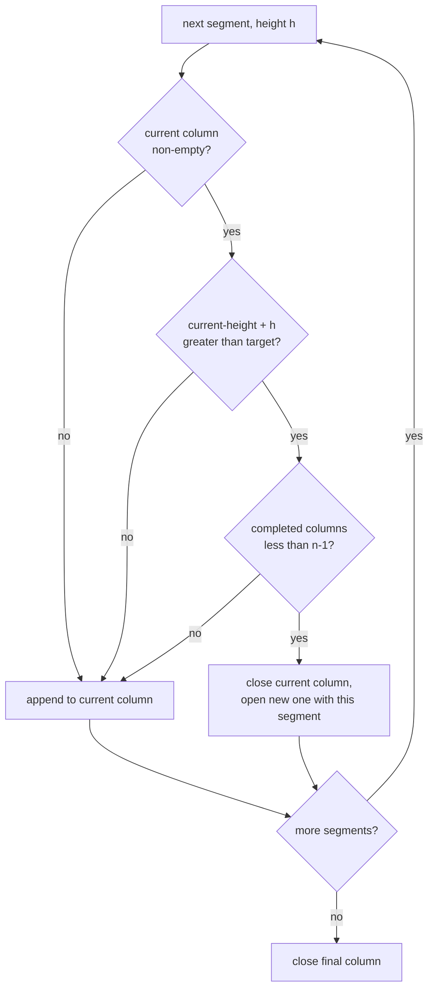

# Overlay category packing — design

Date: 2026-05-21
Status: Draft (awaiting review)

## Problem

The which-key overlay (the panel that appears when a modality is active, e.g.
**Global**) renders category sections in a CSS grid of equal-width columns.
Two things waste space:

1. **Vertical gaps.** Segments are placed into the grid row-major with
   `align-items: start`. A grid *row* is as tall as its tallest cell, so a
   short category sharing a row with a tall one inherits a tall cell and leaves
   dead space below itself. In the **Global** overlay, SEARCH (4 rows) shares
   row 1 with APPS (9 rows) and gets a 9-row-tall cell; AI then starts a fresh
   grid row instead of tucking under SEARCH — roughly five rows of empty space.

2. **Columns too wide.** `grid-template-columns: repeat(N, minmax(14rem, 1fr))`
   forces every column to an equal width with a 14rem (~224px) floor, far wider
   than short labels like "Mail" need.

The overlay window itself is `width: max-content` and `overlay.js` reports its
natural size back to the native panel via a `ResizeObserver`, so tightening the
content tightens the window directly — no Swift or window-sizing changes are
needed.

## Goal

Pack category segments down columns so a short category backfills the empty
space under another short one, and let columns shrink to their content. The
window shrinks to fit.

Confirmed decisions from brainstorming:

- **Packing:** categories flow down columns; short categories backfill gaps.
- **Column width:** all columns share one width, equal to the **widest
  category's** natural width. (Ragged per-column widths were considered and
  dropped — equal columns are acceptable and make the CSS simpler.)
- **No width guard rails:** no per-column min/max; labels never truncate.
- **Order preserved:** categories keep their declared order — the overlay reads
  top-to-bottom down column 1, then column 2.

## Non-goals / scoped out

- **Column-count selection is unchanged.** `overlay-column-count` still chooses
  `N` from the aspect-ratio search. Its `overlay-col-width-px = 200` estimate is
  now a loose proxy (real columns are content-width and narrower); this is an
  accepted imperfection, explicitly out of scope.
- **No deployment-target change.** CSS Grid Lanes (`display: grid-lanes`) would
  do the packing natively, but it requires macOS 26.4+ in a WKWebView; the app
  targets macOS 14. The approach below works on every supported macOS. Grid
  Lanes is a natural future simplification once the macOS floor rises — keeping
  the packing in one small Scheme function makes that swap localised.

## Approach

The packing decision is computed in Scheme and emitted as explicit column
groups; `which-key.js` renders one element per column; CSS makes the columns
equal-width and content-sized. Rejected alternatives: CSS multi-column (forces
equal width but cannot backfill gaps); JS-side packing (moves layout logic out
of Scheme, untestable in the Scheme suite); reorder-the-grid (grid rows still
align — gaps remain).

## Design

### 1. Payload shape (`overlay.scm`)

`which-key-payload-json` currently emits a flat, ordered segment list:

```json
{ "type": "which-key", "cols": 2, "segments": [ <seg>, <seg>, ... ] }
```

It will instead emit segments already grouped into columns, and drop `cols`
(the column count is implicit in `columns.length`):

```json
{ "type": "which-key", "columns": [ [<seg>, ...], [<seg>, ...] ] }
```

Each `<seg>` is unchanged — exactly what `render-segment` produces today
(`{kind:"misc",rows:[…]}` or `{kind:"category",label:…,rows:[…]}`).

`which-key-payload-json` keeps calling `partition-which-key-segments` and
`overlay-column-count`, then passes the segment list and `N` through a new
`distribute-which-key-columns` step before serialising.

`which-key-payload-json` is the single serialiser for both the initial render
and `push-overlay-update`, so incremental updates inherit the new shape for
free.

### 2. Packing — new pure function `distribute-which-key-columns`

Column-major sequential fill. Each segment has a known row height (reuse a
factored-out `segment-row-count`: a misc segment is `(length rows)`, a category
is `1 + (length rows)` — the `+1` is the heading).

```
distribute-which-key-columns(segments, n):
  n'     = min(n, count(segments))      ; never more columns than segments
  if n' <= 1: return [ segments ]
  target = ceil(total-row-count / n')
  walk segments in declared order, accumulating the current column:
    for each segment of height h:
      if current column is non-empty
         AND current-height + h > target
         AND fewer than (n' - 1) columns are already complete:
          → close the current column, open a new one with this segment
      else:
          → append the segment to the current column
  close the final column
  return the list of column groups (n' or fewer, declared order preserved)
```

The "fewer than `n' - 1` columns complete" guard means the last column absorbs
all remaining segments — the result never exceeds `N` columns. A category
taller than `target` simply occupies its column alone. The function is purely
functional (accumulate + reverse) — no `set-cdr!`, consistent with LispKit's
lack of mutable pairs.



**Worked example — the Global category block.** Segments APPS (8 rows + heading
= 9), SEARCH (3 + 1 = 4), AI (2 + 1 = 3); `N = 2`; total = 16; target = ⌈16/2⌉
= 8.

| Step | Segment | Action | Columns so far |
|------|---------|--------|----------------|
| 1 | APPS (9)   | current empty → append            | `[[APPS]]` |
| 2 | SEARCH (4) | 9 + 4 > 8, may open → close, open | `[[APPS], [SEARCH]]` |
| 3 | AI (3)     | 4 + 3 = 7 ≤ 8 → append            | `[[APPS], [SEARCH, AI]]` |

Result `[[APPS], [SEARCH, AI]]` — AI tucks under SEARCH; the window loses ~5
rows of height.

### 3. Renderer (`which-key.js`)

Iterate `block.columns` instead of `block.segments`: for each column build a
`<div class="wk-col">`, append its categories/misc into it, then append the
column to `.wk-columns`. Set `--overlay-cols` from `block.columns.length` (was
`block.cols`). Correct the stale header comment (it describes a CSS-columns
model that no longer applies).

### 4. CSS (`which-key.css`)

`.wk-columns` stays a grid, but each track becomes `1fr` (drop the
`minmax(14rem, 1fr)` and its 14rem floor) and now contains a `.wk-col` wrapper:

```css
.wk-columns {
  display: grid;
  grid-template-columns: repeat(var(--overlay-cols, 1), 1fr);
  column-gap: 1.5rem;
  align-items: start;
}
.wk-col {
  display: flex;
  flex-direction: column;
  gap: 0.6rem;          /* space between stacked categories in a column */
}
```

The old grid used `gap: 0.6rem 1.5rem`, where the `0.6rem` row-gap separated
vertically-stacked categories. Now that each column is a single grid cell, that
0.6rem moves onto `.wk-col` as the gap between its stacked categories; the
column-gap stays at 1.5rem.

Inside the `width: max-content` overlay, equal `1fr` tracks resolve to the
widest category's natural width — satisfying the equal-width-of-widest
constraint with no explicit measurement. Correct the stale header comment
(it describes `column-fill: auto`, which the file has not used since the grid
rewrite).

*Implementation note to verify:* confirm `1fr` tracks inside the `max-content`
overlay resolve to the widest category as expected; if not, fall back to
sizing the tracks `max-content` with a wrapping container that equalises them.

## Testing

`distribute-which-key-columns` and `segment-row-count` are pure — unit-tested in
the Scheme suite (`BlocksWhichKeyLibraryTests` / `OverlayRenderTests`):

- declared order preserved within and across columns;
- the Global gap-fill case → `[[APPS], [SEARCH, AI]]`;
- single segment → one column;
- `N = 1` → all segments in one column;
- `N ≥ segment count` → each segment its own column;
- a segment taller than `target` → occupies its column alone, no overflow;
- last-column-absorbs-remainder (more low segments than remaining columns).

Existing tests asserting the old `cols` / `segments` payload shape are updated
to the `columns` shape.

CSS layout is not unit-testable; final verification is visual — the **Global**
overlay rendered in the running app, checking the gap is gone and columns hug
content.

## Risks

- **`1fr`-in-`max-content` sizing.** Covered by the verification note above; the
  `max-content` track fallback is a known escape hatch.
- **Aspect-ratio drift.** `overlay-column-count` now estimates with a stale
  width constant. Accepted and scoped out; revisit only if column counts look
  visibly wrong after the change.
