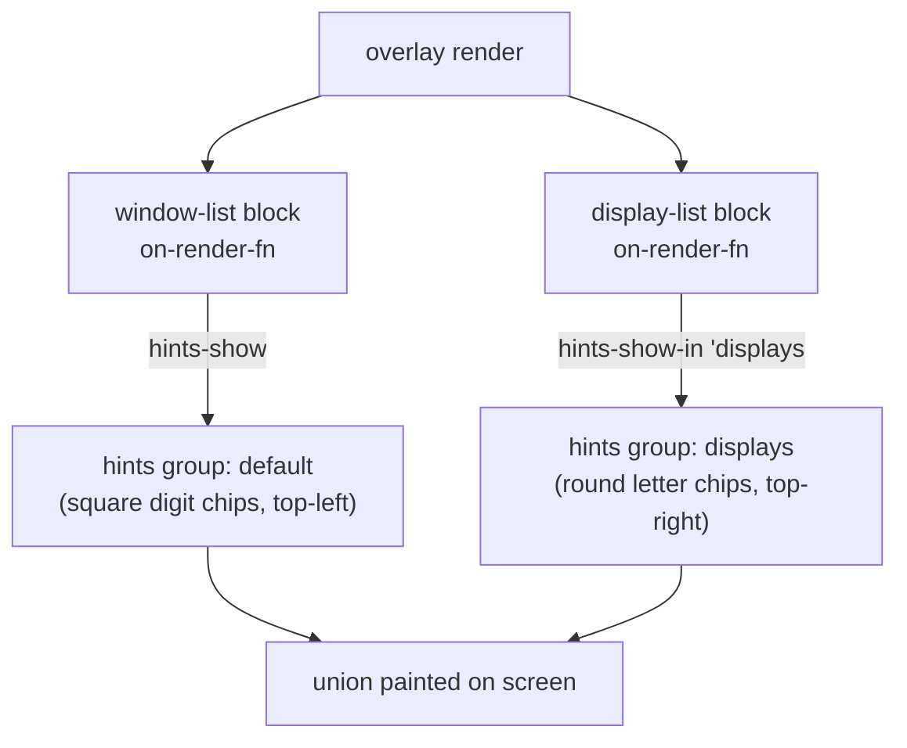

# Display window commands — design

**Date:** 2026-06-30
**Status:** Approved (brainstorming)

## Summary

Add display-aware window management to Modaliser:

1. **Move the focused window to another display**, preserving its size and
   position *relative to the display's visible area* (a window occupying the
   left third of display S lands in the left third of display T, even when the
   two displays differ in size or aspect ratio).
2. **Display chips** — round, top-right overlay chips, one per display, painted
   in the Windows menu alongside the existing per-window chips.
3. **Focus a display** — give keyboard focus to a display so macOS
   Space/Mission-Control keyboard commands act on it.

Interaction model (decided in brainstorming): one chip/letter per display.
Pressing the **plain letter** moves the focused window to that display; pressing
**Shift+letter** focuses that display. Default labels `h j k l n o`, left-to-right,
configurable. Shift+letter needs no new keymap machinery — uppercase bindings are
already the established convention (the layout diagram binds `D F G`).

## Terminology

A physical monitor is a **display**. It is *never* called a "screen": `screen`
is already a reserved word in the overlay DSL (a navigable overlay level — see
`CONTEXT.md`). New Ubiquitous-Language glossary terms to add to `CONTEXT.md`:

- **Display** — a physical monitor (`NSScreen` / `CGDirectDisplayID`).
- **Display chip** — the round, letter-labelled overlay chip painted at a
  display's top-right corner; the sibling of the square, digit-labelled
  **Window chip**. Plain letter = move focused window here; Shift+letter =
  focus this display.

## Architecture

### §1 — Native surface (Swift)

Three new primitives, added to `WindowLibrary` (Scheme name `(modaliser
window)`) with mechanics in `WindowManipulator`. They live alongside the
existing window/geometry code for cohesion — `primary-screen-size` already
sits there, and the focus/move mechanics share AX plumbing with
`moveFocusedWindow`/`focusedWindowAndFrame`.

| Primitive | Contract |
|---|---|
| `(list-displays)` | Returns `((id … x … y … w … h … is-primary …) …)` — one alist per display, left-to-right by `x`. `x y w h` are the display's **visible frame** (menu bar + Dock excluded) in **AX top-left coords** — the same coordinate space `move-window`, `list-current-space-windows`, and `hints-show` use. `id` is the stable `CGDirectDisplayID` (from `deviceDescription[NSScreenNumber]`). `is-primary` is `#t` for `NSScreen.screens[0]`. Powers chip placement **and** the move-remap math. |
| `(set-focused-window-frame x y w h)` | Absolute placement of the focused window in AX coords. The absolute sibling of fractional `move-window`. Resolves the window via the same cold-AX-safe path (`frontmostApplication → kAXFocusedWindow/kAXMainWindow`), wraps the writes in `withResizableApp` (the EUI flip), and calls `saveFrame` first so `restore-window` still works. |
| `(focus-display id)` | Native focus mechanic for display `id`: (1) find the topmost regular window whose bounds-centre lies on the display, walking `CGWindowListCopyWindowInfo` front-to-back (z-order); (2) raise it (`AXRaise` + `AXMain` + `AXFocused`) and `activate` its owning app; (3) warp the mouse to the display centre via a `.mouseMoved` `CGEvent`; (4) if no window was found, warp the mouse and synthesize a `.leftMouseDown`/`.leftMouseUp` desktop click so the display still becomes active. |

`move-window` is **left unchanged** — it remains the single-display fractional
preset engine the layout diagram drives.

**Seam rationale (Scheme-first).** Scheme owns *selection* (which display a
pressed chip maps to) and the *proportional remap arithmetic*; Swift owns only
the irreducibly-native mechanics (AX frame writes, CGWindowList z-order, CGEvent
mouse). `focus-display` is a single native op rather than Scheme-composed mouse
primitives because "topmost window on a display" needs reliable CGWindowList
z-order that the AX-enumerated window list does not guarantee.

### §2 — Chip coexistence: named hint groups

`hints-show` is currently *replace-all*: `HintsLibrary.hintsShowFunction` calls
`closeAllPanels()` before painting. Two independent painters (window chips,
display chips) would therefore clobber each other. Fix by keying panels by
**group**:

- `HintsLibrary` stores `panels: [String: [NSPanel]]` instead of `[NSPanel]`.
- `(hints-show hint-list)` — unchanged signature; manages the `"default"`
  group. **All existing callers (window-list, iTerm panes, ax-hints) are
  untouched.**
- `(hints-show-in group hint-list)` — new; rebuilds only `group`'s panels,
  leaving other groups on screen. The visible chip set is the union of all
  groups.
- `(hints-hide)` — clears **all** groups (whole overlay closing).
- `(hints-hide-in group)` — new; clears one group. (Provided for symmetry /
  future use; the Windows menu's on-leave just calls `hints-hide`.)

The per-paint overlap self-check (`logChipRects`) continues to run per group.
Cross-group overlap (a top-left window chip vs a top-right display chip) is not
deduplicated — the corners differ and the two sets are conceptually independent,
exactly as window chips and iTerm pane chips never coordinate.



### §3 — Portable Scheme layer

New libraries under `lib/modaliser`, depending only on `(scheme …)`, `(srfi …)`,
and `(modaliser …)` (portability contract — `check-portable-surface.sh` must
stay green; avoid the literal parenthesised LispKit token in prose):

- **`(modaliser blocks display-list)`** — mirrors `blocks/window-list`. Builds a
  round display chip per display and renders one overlay row per display.
  - Round chip: `corner-radius = floor(size / 2)`.
  - Distinct style: a new `.chip.display` rule in `base.css`, resolved through
    the existing theming probe by adding a `'display` variant to
    `current-chip-theme` (extends `theming.sld`: a third probe `<div>`, the
    `'display` branch, and the seed default).
  - Placement: top-right of each display's visible frame, inset by
    `(chip-host-padding)`: `chip-x = vf.x + vf.w − chip − pad`, `chip-y = vf.y +
    pad`. Corner configurable via a `'corner` opt (default `'top-right`).
  - Display chips never overlap (≤ a handful of displays, one per distinct
    corner), so **no Stage-B lattice** is needed — placement is direct.
  - Exposes `display-list-current-targets` (label → display alist) the way
    `window-list` exposes its targets, so the action layer can resolve a pressed
    label to a display `id`.
  - Paints via `(hints-show-in 'displays …)`; on-leave calls `(hints-hide)`.

- **`(modaliser display-actions)`** — mirrors `window-actions`. `display-list-block`
  bundles, per display label, two dispatch keys:
  - plain letter → `move-focused-window-to-display(id)` (the remap, §4);
  - Shift letter (uppercase) → `(focus-display id)`.
  Default labels `("h" "j" "k" "l" "n" "o")`, configurable via a `'labels` opt;
  truncated to the display count in left-to-right order. Exposes the pure remap
  function for unit testing (as `window-actions` exports `focused-row-index`).

### §4 — Move semantics (proportional remap)

Pure Scheme. Inputs: focused window rect `(winX winY winW winH)` from
`(focused-window)`; source display `S` and target display `T` visible frames
from `(list-displays)`. `S` = the display whose visible frame contains the
window's centre point (point-in-rect; fall back to primary).

```
fx = (winX − vfS.x) / vfS.w        fy = (winY − vfS.y) / vfS.h
fw =  winW          / vfS.w        fh =  winH          / vfS.h

newX = vfT.x + fx · vfT.w          newY = vfT.y + fy · vfT.h
newW =        fw · vfT.w           newH =        fh · vfT.h
```

`newW`/`newH` are clamped so the window stays within `vfT` (mirrors
`move-window`'s `min(width, 1 − x)` clamp). Independent x/y scaling is what makes
"⅓-width on S ⇒ ⅓-width on T" hold across differing display sizes and aspect
ratios. Result is applied with `(set-focused-window-frame newX newY newW newH)`.

Moving a window to the display it already occupies is a no-op-ish identity remap
(harmless).

### §5 — Config wiring

In `default-config.scm`, add a loose block to the `(open "w" "Windows" …)`
sub-screen:

```scheme
(display:display-list-block 'chips? #t)
```

(with `(prefix (modaliser display-actions) display:)` imported alongside the
existing `window:` prefix). Window chips (digits, top-left, square) and display
chips (letters, top-right, round) then both light up in the Windows menu. Sync
the change to `~/.config/modaliser/config.scm` per the config-sync rule so the
bundled first-run default tracks the live config.

### §6 — Documentation & tests

**Tests** (mirror sources under `Tests/ModaliserTests/`):
- Pure remap unit tests (exact-fraction in → expected rect out, including
  differing-aspect displays and the same-display identity case).
- `WindowLibraryTests`: `list-displays` returns well-formed alists in AX coords;
  `set-focused-window-frame` round-trips; `focus-display` resolves a display id
  without throwing. (Live-window mutation tests must not damage the user's real
  session — per the no-live-env-mutation rule.)
- End-to-end DSL test that `display-list-block` lifts its dispatch keys onto the
  block's `block-children` (parallels the window-list lift test).

**Docs:**
- `docs/reference/libraries.md` — document `(modaliser display-actions)` and the
  new `(modaliser window)` primitives.
- `CONTEXT.md` — add **Display** and **Display chip** glossary terms.
- A short `docs/how-to/` recipe: "Move and focus windows across displays."
- Use Mermaid (never ASCII art) for any diagram.

## Out of scope (YAGNI)

- Directional ("display to the left/right") or cycling ("next/prev display")
  commands — the chip picker covers targeting; a directional variant can be a
  later, separate addition.
- Per-display Space enumeration or programmatic Space switching beyond what
  `focus-display` enables for the existing Ctrl+digit Space bindings.
- Multi-window batch moves; remembering per-display window layouts.

## Open questions

None blocking. The native-primitive home (`WindowLibrary` vs a dedicated
`(modaliser display)` library) was decided in favour of `WindowLibrary` for
cohesion.
