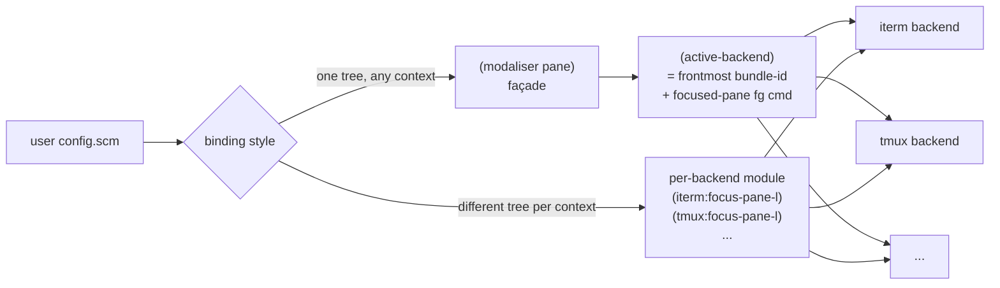

# Terminal-backends abstraction — synthesis sketch

Input: notes/iterm.md, notes/zellij.md, notes/wezterm.md, notes/tmux.md,
notes/kitty.md, notes/ghostty.md, notes/ghostty-current.md,
notes/alacritty.md, notes/alacritty-signed.md, plus root BRIEF.md and
CONTEXT.md.

Hard-to-reverse decisions land in `docs/adr/`. This sketch wires those
into one shape and is the source material for the 090 PRD.

## Convergent shape — at a glance



## Layered decisions

### Decision 1 — Mechanism: hybrid (ADR-0001)

Per-backend named modules already exist (`(modaliser apps iterm)` exports
`iterm:focus-pane-left` &c). Phase 2 keeps them and **adds a thin façade**
`(modaliser pane)` whose 13 procedures call `(active-backend)` and
dispatch to the right module's procedure at call time.

- Users who want **one tree shared across contexts** bind `(pane:focus-pane-l)`.
- Users who want **different trees per context** (current pattern with
  `set-local-context-suffix!` returning `/zellij`) keep calling
  `(iterm:focus-pane-l)` / `(tmux:focus-pane-l)` directly.

Façade is additive; existing configs (incl. user's `config.scm:157-176`)
keep working untouched.

### Decision 2 — Naming: keep direction-words (ADR-0002)

Existing names: `focus-pane-left`, `focus-pane-right`, `focus-pane-up`,
`focus-pane-down` (× focus/split/move). User's recall said "hjkl" — that
denotes the *keys* the user types, not the procedure names. The user's
config already binds 12 procedures × ~20 call sites. Renaming would
break all of them for zero behaviour change.

New backends export the same direction-word names. The façade exposes
`focus-pane-h/j/k/l` aliases ONLY if a future request demands it; until
then, one canonical name per op.

### Decision 3 — Surface: one record, nullable ops

Backends populate a single `<terminal-backend>` record:

```scheme
(define-record-type <terminal-backend>
  (make-terminal-backend bundle-id name
                         detect-foreground-command
                         focus-pane-left focus-pane-right
                         focus-pane-up focus-pane-down
                         split-pane-left split-pane-right
                         split-pane-up split-pane-down
                         move-pane-left  move-pane-right
                         move-pane-up    move-pane-down
                         focus-pane-by-digit)
  terminal-backend?
  ...)
```

- `detect-foreground-command` is always populated (every backend has
  detection — that's the floor).
- Op fields are `#f` when unsupported.
- The façade does `(or (terminal-backend-focus-pane-left b) (error ...))`.

Spectrum populated by phase-2 backends, derived from per-backend notes:

| Backend       | detect | focus×4 | split×4 | move×4 | by-digit | Coverage |
|---------------|:------:|:-------:|:-------:|:------:|:--------:|----------|
| iTerm2        | ✓      | ✓       | ✓       | ✓      | ✓        | 13/13 |
| WezTerm       | ✓      | ✓       | ✓       | #f×4   | ✓        | 9/13 + det (12/13 if move via wezterm.lua keystroke-proxy) |
| Kitty         | ✓      | ✓       | ✓       | ✓      | ✓ (best-effort chip rect) | 13/13 |
| Ghostty 1.3.1 | ✓      | ✓       | ✓       | #f×4   | ✓        | 9/13 + det (12/13 once `move_split` lands upstream) |
| tmux          | ✓      | ✓       | ✓       | ✓      | ✓        | 13/13 |
| zellij        | ✓      | ✓       | ✓       | ✓      | ✓        | 13/13 |
| Alacritty     | ✓      | #f      | #f      | #f     | #f       | det only |

Detection-only and splitting backends share the record type — Alacritty's
record has 12 `#f` fields and a populated `detect-foreground-command`.
No type hierarchy.

### Decision 4 — Mux-host composition: explicit OR implicit (ADR-0003)

Two valid wiring patterns:

1. **Explicit (existing, preferred when trees diverge).**
   `set-local-context-suffix!` returns `/zellij` (or `/tmux`, `/nvim+tmux`,
   …); a tree variant is bound for that suffix; that tree's bindings call
   the relevant backend's named procedures directly. Different *trees*,
   not just different *backends*. The user's current config is built this
   way; phase 2 does not change it.

2. **Implicit (new, façade-driven).** A binding calls `(pane:focus-pane-l)`.
   The façade resolves `(active-backend)` by probing frontmost-app +
   `focused-terminal-foreground-command`, then calls that backend's
   `focus-pane-left`. One tree, works in `iTerm`, `iTerm+tmux`,
   `iTerm+zellij`, `Alacritty+tmux`, etc.

Both work simultaneously. The user picks at the binding site. The same
backend modules underlie both.

## `(active-backend)` resolution

```
1. frontmost-app bundle-id → host backend record (registered via app-id
   table).
2. host backend's `detect-foreground-command` (always defined) returns
   the focused-pane fg command.
3. If that command matches a registered mux backend's "command-name"
   field ("tmux", "zellij"), the mux backend overrides the host for the
   13-op surface. Detection ops always come from the most-specific
   backend that can serve them.
```

Host backends without splits (Alacritty, Ghostty when treated as
detection-only) supply `#f` for the 13 ops — the façade only succeeds
when a splitting backend (the inside-mux or a hopefully-splitting host)
is in scope.

## Module layout

```
(modaliser pane)                  -- new: façade
(modaliser apps iterm)            -- existing
(modaliser apps wezterm)          -- new
(modaliser apps kitty)            -- new
(modaliser apps ghostty)          -- new
(modaliser apps alacritty)        -- new
(modaliser muxes tmux)            -- new (subdir keeps mux vs host visible)
(modaliser muxes zellij)          -- new
```

Each `apps/*` and `muxes/*` module exports:
- the 13 op procedures (with `#f`-replacement allowed via the backend record),
- `<backend>:detect-foreground-command`,
- `<backend>:backend` — the populated `<terminal-backend>` record,
- `<backend>:register!` — installs the dispatch entry (and, optionally,
  the context-suffix handler).

`(modaliser pane)` consumes the backend records via a registry the
`register!` calls populate.

## What 080 chose NOT to do

- **No symbol-dispatch (`(pane-op 'focus-h)`).** Loses static call
  sites, no IDE jump-to-definition, opaque debugging.
- **No type hierarchy (`<splitting-backend>` extending
  `<detection-backend>`).** No win over nullable ops; adds dispatch
  complexity at every façade call.
- **No hjkl rename.** Breakage isn't worth the symmetry. User's typed
  hjkl is about the *keys*, not the names.
- **No keystroke-proxy provisioning analogue for WezTerm.** Document
  the move-pane gap; users who want it write the keybind in
  `wezterm.lua`. A `wezterm:configure-entry` parallel to iTerm's is
  a future-iteration affordance.

## Chip-rendering — the cross-cutting concern

Chips are **always `hints-show` overlays** (CONTEXT.md "Chip").
`focus-pane-by-digit` per backend is responsible for producing the
list of `(label, screen-rect)` pairs `hints-show` consumes.

Mechanism per backend, summarised from notes:

| Backend  | Rect derivation |
|----------|-----------------|
| iTerm    | AX subview frames directly — `ax-find-elements-named ... AXScrollArea AXStaticText` |
| WezTerm  | window AX frame + per-pane `left_col/top_row` + cell-pixel dims from `list --format json` (`pixel_width/cols`, `pixel_height/rows`) |
| Kitty    | window AX frame + topology BFS from `kitty @ ls neighbors` + derived cell-pixel dims (best-effort; AX subviews unverified) |
| Ghostty  | window AX frame + (AX subviews if available, else `perform action goto_split:<dir>` adjacency probe) + derived cell dims |
| tmux     | host AX frame + host cell-pixel dims + tmux `pane_left/pane_top/pane_width/pane_height` |
| zellij   | host AX frame + host cell-pixel dims + zellij `pane_x/pane_y/pane_columns/pane_rows` from `list-panes -j -a` |
| Alacritty| n/a (no panes; mux backend chips when one is hosted) |

The shared cross-cutting concern is **host cell-pixel-dim derivation**.
A separate helper `(host-cell-pixel-dims bundle-id window-id)` lands
in `(modaliser pane)` or a new `(modaliser pane geometry)` — TBD at
implementation time. Each `focus-pane-by-digit` calls it; backends
that need topology BFS run that locally and feed the dims in.

## Boundaries (out of scope for the abstraction)

- `close-pane`, resize, zoom, swap, rotate (per BRIEF "Non-goals").
- Cross-host (SSH).
- Swift-side changes ([[feedback_scheme_first]]).
- Multi-session disambiguation for tmux/zellij (single-session-per-host
  is the documented common case; multi-session is hacky for every
  backend and treated as "undefined").

## PRD (090) — green light

Synthesis converges. 090 writes `docs/prd/terminal-backends.md` from
this sketch + the four decisions above. The PRD is the human-readable
agreement target before any code lands.

Until 090 lands and is accepted, **no `(modaliser pane)` code is
written.** This grove's deliverable is the agreement, not the
implementation. The implementation work is a separate node grown after
the PRD locks (TBD: `020-implement-abstraction/` or split into per-
backend implementation tasks).
